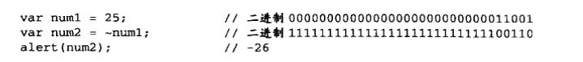
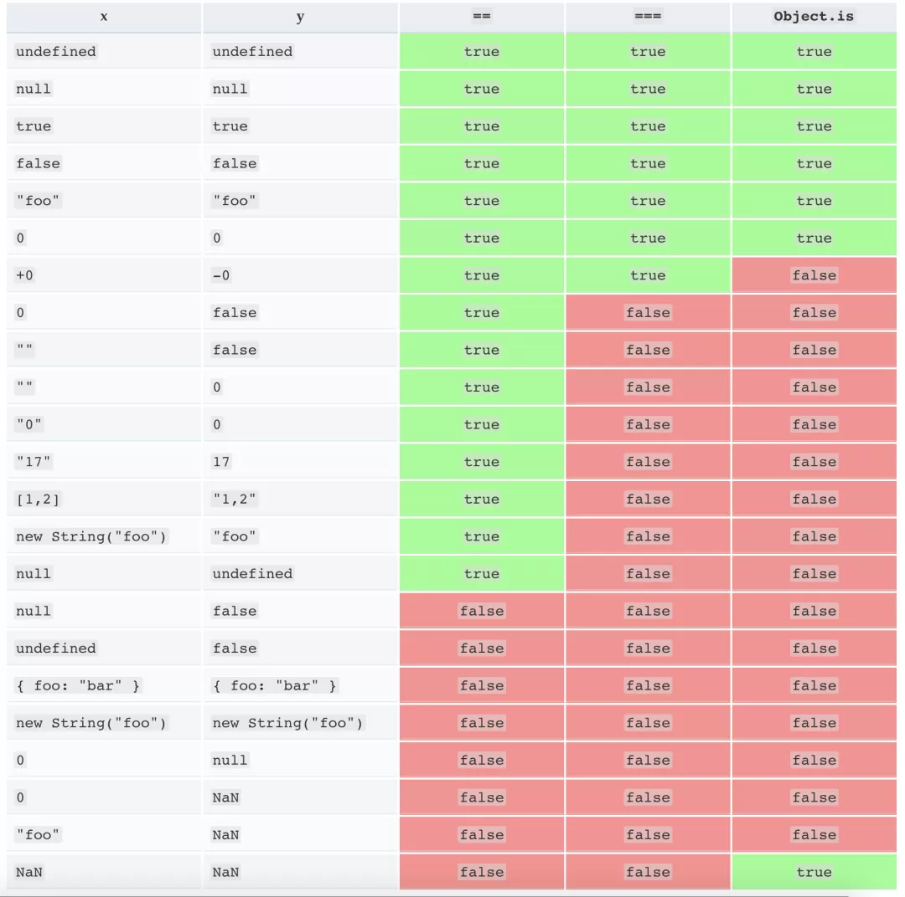

# 操作符

+ 一元操作符
+ 1 + 2 运算式中包含 2 个运算元，因此也称该运算式中的加号  + 为 「二元运算符。」
+ 在 +18 中的加号 + 对应只有一个运算元，则它是 「一元运算符」 。
+ 运算优先级
+ 圆括号，可以用来提高运算优先级，且只能存放表达式，存放语句会报错

## 一元操作符

+ 只能操作一个值的操作符叫做一元操作符

+ 递增和递减 `++   --`
  + 前置和后置
  + 前置先计算在用
  + 后置先用在计算
  + `let a,b=1;  a = b++; //a=1     a = ++b ;  // a = 2`
  + 会将数字字符串先转换为数值在计算
  + 不包含有效数字字符的字符串将转换为 `NaN`
  + 布尔值也会转换为数字计算 `true 为 1  false 为 0 `
  + 应用于对象时，先调用对象的 `valueOf()方法` 取得一个可供操作的值，然会对值应用前述规则，如果是 `NaN` 则在调用 `toString()` 方法后再应用前述规则

```js
  var s1 = "2"; 			s1++;    // 值变成数值3
  var s2 = "z"; 			s1++;    // 值变成数值NaN
  var b = false; 			s1++;    // 值变成数值1
  var f = 1.1; 			f--;    // 值变成0.10000000000000009(由于浮点舍入错误所致)
  var o = {valueOf:function() {return -1;}}; 			o--;    // 值变成数值-2
```

+ 加和减 `+   -`
  + 放在数值前不会产生任何影响
  + 在对非数字应用时，会像 `Number()转型函数`一样对值进行转换

```js
  var s1 = "01"; 			s1 = +s1;    // 值变成数值1
  var s2 = "1.1"; 		s2 = +s2;    // 值变成数值1.1
  var s3 = "z"; 			s3 = +s3;    // 值变成数值NaN
  var b = false; 			b = +b;    // 值变成数值0
  var f = 1.1; 			f = +f;    // 值未变,仍然是1.1
  var o = {valueOf:function() {return -1;}}; 			0 = +o;    // 值变成数值-1
```

+ `-`主要用于表示负数

## 位操作符

+ 位操作符,大多都可以用来进行取整的运算

```js
~~5.5 // 5
4.2 << 0 // 4
4.1 >> 0 // 4
3.5 | 0 
```

---

+ 按位非（NOT）
  + 用一个 `~` 表示，执行的结果就是返回数值的反码
  + 
  + 按位非的本质：操作数的负值减 1 
  + ``let a num1 = 25; let num2 = -num1 - 1;  // num2 = ~26`` 也能得到同样的结果
  + 虽然以上代码能返回同样的结果，但由于按位非是在数值表示的最底层执行操作，因此速度更快
  + `~~` 两个的作用是将操作数转化为 number 整数
    + 相当于取整，直接将小数舍弃
    + 不是数字的字符串会转化为 0

+ 按位与（AND）
  + 用一个和号字符（&）表示，按位与操作就是将两个数值的每一位对齐，然后根据一下规则，相同位置上的两个操作数执行AND操作
  + 相同位置的二进制位中只要有一个位为0，就返回0，否则返回1。
  
+ 按位或 (or)
  + 用一个 `|` 表示
  + `x | 0` 任意值与0进行一次或运算，这个位运算会自动将一个值转为32位整数
  + 这种取整方法不适用超过32位整数最大值2147483647的数。

+ 按位异或（XOR）
  + 用一个插入符号（`^`）表示，也有两个操作数
  + 以下是按位异或的真值表
  + 
  + 连续对两个数进行三次异或运算可以互换他们的值
  + `a^=b; b^=a; a^=b;`
  + `12.9 ^ 0 //12`  可以用来取整

+ 左移
  + 用两个小于号 `（<<）` 表示，这个操作符会将数值的所有位向左移动指定的位数。
  + 列如，如果将数值2（二进制码为10）向做移动5位，结果就是64（二进制码为1000000），
```js
  let oldValue = 2 ;                 //等于二进制的10
  let newValue = oldValue << 5 ;     //等于二进制的1000000，十进制的64
  -13.5 << 0 // 13 取整

4.9 << 0 // 4
-4.8 << 0 // -4
4.9 << 1 // 8
-4.8 << 1 // -8
4.7 << 2 // 16
4.6 << 3 // 32 
// 每一位都相当于多乘一个 2
```
  + 在向左移位后，原数值的右侧多出了5个空位。左移操作会以0来填充这些空位，以便得到的结果是一个完整的32位二进制数
+ 有符号的右移
  + 用两个大于号（>>）表示，这个操作数会将数值向右移动，保留符号位（即正负符号标记）
```js
//右移运算可以模拟 2 的整除运算。
5 >> 1 //2
21 >> 2 //5     21 / 4 = 5  取整
21 >> 3 //2     21 / 8 = 2 
```

+ 无符号右移
  + 无符号右移用3个大于号表示（>>>），这个操作符会将数值的所有32位都向右移动。对正数来说和和有符号右移是相同的
  + 对负数来说，无符号右移是以0来填充空位，而不是向有符号右移那样以符号位来填充空位
  + 头部补零的右移运算符（>>>）与右移运算符（>>）只有一个差别，就是一个数的二进制形式向右移动时，头部一律补零，而不考虑符号位。所以，该运算总是得到正值。对于正数，该运算的结果与右移运算符（>>）完全一致，区别主要在于负数。
```js
4 >>> 1
// 2

-4 >>> 1
// 2147483646
/*
* 因为-4的二进制形式为11111111111111111111111111111100，
* 带符号位的右移一位，得到01111111111111111111111111111110，
* 即为十进制的2147483646。
*/
查看一个负整数在计算机内部的储存形式，最快的方法就是使用这个运算符。
-1 >>> 0 // 4294967295
```

## 布尔操作符

+ 逻辑运算符
  + 逻辑与，AND（`&&`）  逻辑或，OR（`||`）  逻辑非，NOT（`!`）
  + 双重非运（ !! ）相当于进行布尔转换

### 逻辑非（!）
  + 可以应用与任何值，无论这个值是什么数据类型，都会返回一个布尔值，这个操作符会将它的操作数转换成一个布尔值，在求反

```js
  //规则如下
  操作数是一个                  , 	返回	 ,	 原来是
    对象                      ,   false	 ,	 true
    空字符串   	               ,   true	  ,	  false
    非空字符串  	             ,   false	,	  true
    数值0		                  ,   true	 ,	 false
    任意非0数值(包括Infinity)	  ,	  false	 ,	 true
    null	                   ,	 true	  ,	  false
    NaN		                   ,	 true	  ,	  false
    undefined	               ,	 true	  ,   false

  n1 = !true              // !t 返回 false
  n2 = !false             // !f 返回 true
  n3 = !''                // !f 返回 true
  n4 = !'Cat'             // !t 返回 false
```
  + 逻辑非也可以用于将一个值转换位与其对应的布尔值，同时使用两个逻辑非操作符，就会模拟 `Boolean()`转型函数的行为
```js
  !!"blue";	//true
  !!0;     	//false
  !!NaN;   	//false
  !!"";    	//false
  !!12; 	//true
```

### 逻辑与（&&） 且运算符

+ 如果第一个运算子的布尔值为true，则返回第二个运算子的值（注意是值，不是布尔值）；
+ 如果第一个运算子的布尔值为false，则直接返回第一个运算子的值，且不再对第二个运算子求值。
```js
  //操作数不是布尔值的情况
  操作数                  返回
    第一个是对象              第二个操作数
    第二个是对象              只有在第一个求值结果为true的情况才会返回该对象
    两个都是对象              第二个操作数
    有一个是null             null
    有一个是NaN              NaN
    如果有一个是undefined     undefined
  
  //逻辑与（&&） 所有条件都为 true 才返回 true，否则为 false。
  a1 = true  && true      // t && t 返回 true
  a2 = true  && false     // t && f 返回 false
  a3 = false && true      // f && t 返回 false
  a4 = false && (3 == 4)  // f && f 返回 false
  a5 = "Cat" && "Dog"     // t && t 返回 "Dog"
  a6 = false && "Cat"     // f && t 返回 false
  a7 = "Cat" && false     // t && f 返回 false
  a8 = ''    && false     // f && f 返回 ""
  a9 = false && ''        // f && f 返回 false
```
  + 逻辑与属于短路操作，即如果第一个操作数能够决定结果，那么就不会再对第二个操作数求值
  + 返回第一个碰到的求值为false的操作数而不是求出的布尔值
  + 对于逻辑与操作而言，如果第N个操作数是 `false` 则无论而已个操作数是什么值，结果都不再可能是 `true` 了
  + 执行到的操作数未定义则会报错

### 逻辑或（||）
```js
  //操作数不是布尔值的情况
  操作数                  返回
    第一个是对象              第一个操作数
    第一个操作数求值为false    第二个操作数
    两个都是对象              第一个操作数
    两个都是null             null
    两个都是NaN              NaN
    两个都是undefined     undefined

  o1 = true  || true      // t || t 返回 true
  o2 = false || true      // f || t 返回 true
  o3 = true  || false     // t || f 返回 true
  o4 = false || (3 == 4)  // f || f 返回 false
  o5 = "Cat" || "Dog"     // t || t 返回 "Cat"
  o6 = false || "Cat"     // f || t 返回 "Cat"
  o7 = "Cat" || false     // t || f 返回 "Cat"
  o8 = ''    || false     // f || f 返回 false
  o9 = false || ''        // f || f 返回 ""
```
  + 逻辑或也是短路操作符。也就是说，如果第一个操作数的求值位 `true` ，就不会对第二个操作数求值了
  + 可以利用逻辑或的这一行为来避免变量赋 `null 或 undefined` 值

### 短路取值

+ 与运算 `&&` 的优先级比或运算 `||` 要高。所以代码 `a && b || c && d` 完全跟 `&&` 表达式加了括号一样：`(a && b) || (c && d)`。

+ 由于逻辑表达式的运算顺序是从左到右，也可以用以下规则进行"短路"计算：

+ `(some falsy expression) && (_expr)_` 短路计算的结果为假。

+ `(some truthy expression) || _(expr)_` 短路计算的结果为真。短路意味着上述表达式中的expr部分**「不会被执行」**，因此expr的任何副作用都不会生效（举个例子，如果expr是一次函数调用，这次调用就不会发生）。造成这种现象的原因是，整个表达式的值在第一个操作数被计算后已经确定了。看一个例子：
```js
  function A(){ console.log('called A'); return false; }
  function B(){ console.log('called B'); return true; }
  console.log( A() && B() );
  // logs "called A" due to the function call,
  // then logs false (which is the resulting value of the operator)
  console.log( B() || A() );
  // logs "called B" due to the function call,
  // then logs true (which is the resulting value of the operator)
```

## 乘除余运算符

+ ECMAScript定义了3个乘性操作符：乘法、除法和求模,在操作数为非数值的情况下会执行自动的类型转换
+ 如果参与乘法计算的某个操作数不是数值，后台会先调用 `Number()`转型函数将其转换为数值
+ 正无穷或负无穷,与0相乘结果是 `NaN` 其他数位正无穷或负无穷

+ 乘法（*）

+ 除法（/）
  + 最后一条规则同乘法

+ 求模（%）
  + 余数
  + 运算结果的正负号由第一个运算子的正负号决定
  + 为了得到负数正确余数值，可以先求绝对值  `Math.abs(n % 2)`

## 加减运算符

+ 加法
  + `++` 自增
    + 符号在前先加后用，符号在后先用后加
    + 会改变变量的值
  + 有一个操作数为NaN结果就是NaN
  + 正无穷(Infinity)或负无穷
    + 正正为正
    + 负负为负
    + 正负为NaN
  + `+0 + +0 = +0`
  + `-0 + -0 = -0`
  + `+0 + -0 = +0`
  + 字符串
    + 字符串拼接
    + 有一个操作数为字符串则转换另一个为字符串在拼接
    + 对象、数值、布尔值调用`toString()`方法取得相应的字符串，`undefined、null` 调用 `String()` 函数取得转换为字符串

+ 减法
  + `--` 自减
    + 符号在前先减后用，符号在后先用后减
    + 会改变变量的值
  + 有一个操作数为NaN结果就是NaN
  + 正无穷(Infinity)或负无穷
    + 正正为NaN
    + 负负为NaN
    + 正负为正
    + 负正为负
  + `+0 - +0 = +0`
  + `+0 - -0 = -0`
  + `-0 - -0 = +0`
  + 字符串、布尔值、null、undefined，则先在后台调用 `Number()函数`转化为数值，在根据规则运算
  + 对象调用对象的`valueOf()`方法取得该对象的数值，如果对象没有 `valueOf()` 方法就调用 `toString()` 方法并将得到的字符串转化为数值

## 关系操作符

+ `小于（<）、大于（>）、小于等于（<=）、大于等于（>=）`
+ 数值进行比较
+ 与 NaN 比较任何值都返回 false
+ 字符串比较对应的字符编码
+ 有一个数值，就将另一个转换为数值比较
+ 有一个是对象，则调用对象的 `valueOf()` 方法在比较，没有该方法就调用 `toString()` 方法在比较
+ 一个操作数是布尔值，则先将其转换为数值在比较

## 相等操作符

+ 相等和不相等 （==） （!=）

+ 先转换在比较
+ 规则
  + 有布尔值则在比较前转换数值
  + 字符串和数值将字符串转换为数值
  + 一个是对象,则调用对象的 `valueOf()` 方法,得到基本类型在比较
  + `null 、 undefined 相等` 比较前不能将这两个值转换为其他任何值
  + `两个 NaN 不相等`     都是对象比较是不是同一个对象，指向同一个内存
  + 复合类型（对象、数组、函数）的数据比较时，不是比较他们的值是否相等，而是比较他们是否指向同一个地址

+ 全等和不全等 `（===）  （!==）`
  + 仅比较而不转换
  + `null、 undefined` 不全等



## ES6 相等性操作

+ 相等性判断 Object.is()
+ Object.is 方法判断两个值是否相同，语法如下: `Object.is(value1, value2);`
+ 以下任意项成立则两个值相同：

- 两个值都是 `undefined`

- 两个值都是 `null`

- 两个值都是 `true` 或者都是 `false`

- 两个值是由相同个数的字符按照相同的顺序组成的字符串

- 两个值指向同一个对象

- 两个值都是数字并且

- 都是正零 `+0`
- 都是负零 `-0`
- 都是 `NaN`
- 都是除零和 `NaN` 外的其它同一个数字 使用示例：
```js
    Object.is('foo', 'foo');     // true
    Object.is(window, window);   // true
    Object.is('foo', 'bar');     // false
    Object.is([], []);           // false
    var foo = { a: 1 };
    var bar = { a: 1 };
    Object.is(foo, foo);         // true
    Object.is(foo, bar);         // false
    Object.is(null, null);       // true
    // 特例
    Object.is(0, -0);            // false
    Object.is(0, +0);            // true
    Object.is(-0, -0);           // true
    Object.is(NaN, 0/0);         // true

    //兼容性 Polyfill 处理：
    if (!Object.is) {
        Object.is = function (x, y) {
            // SameValue algorithm
            if (x === y) { // Steps 1-5, 7-10
                // Steps 6.b-6.e: +0 != -0
                return x !== 0 || 1 / x === 1 / y;
            } else {
                // Step 6.a: NaN == NaN
                return x !== x && y !== y;
            }
        };
    }
```

## ES2016 指数运算符

+ 指数运算符（**）,前一个运算子是底数，后一个运算子是指数。
```js
2 ** 2 // 4
2 ** 3 // 8
//这个运算符的一个特点是右结合，而不是常见的左结合。多个指数运算符连用时，是从最右边开始计算的。
// 相当于 2 ** (3 ** 2)
2 ** 3 ** 2
// 512

//指数运算符可以与等号结合，形成一个新的赋值运算符（**=）。
let a = 1.5;
a **= 2;
// 等同于 a = a * a;

let b = 4;
b **= 3;
// 等同于 b = b * b * b;
```

## 赋值操作符 （=）18

+ 乘/赋值（*=）
+ 除/赋值（/=）
+ 模/赋值（%=）
+ 加、减、左移、有符号右移、无符号右移
+ `&=    |=   ^=`

## void 运算符

+ void运算符的作用是执行一个表达式，然后不返回任何值，或者说返回undefined。
```js
void 0 // undefined
void(0) // undefined
因为void运算符的优先性很高，如果不使用括号，容易造成错误的结果。比如，void 4 + 7实际上等同于(void 4) + 7。
//这个运算符的主要用途是浏览器的书签工具（Bookmarklet），以及在超级链接中插入代码防止网页跳转。
<script>
function f() {
  console.log('Hello World');
}
</script>
<a href="http://example.com" onclick="f(); return false;">点击</a>
//上面代码中，点击链接后，会先执行onclick的代码，由于onclick返回false，所以浏览器不会跳转到 example.com。
<a href="javascript: void(f())">文字</a>
//提交表单，但是不产生页面跳转
<a href="javascript: void(document.form.submit())">提交</a>
```

## 逗号操作符

+ 使用逗号除了可以在一条语句执行多个操作外
+ 还能用于赋值 ， 总是会返回表达式中的最后一项
+ `let num = (5, 1 ,4 ,8 ,0);  //num 的值为0`

## 运算符优先级

+ 运算符的优先级决定了表达式中运算执行的先后顺序，优先级高的运算符最先被执行。下面的表将所有运算符按照优先级的不同从高（20）到低（1）排列。
```js
  3 > 2 && 2 > 1
  // return true
  3 > 2 > 1
  // 返回 false，因为 3 > 2 是 true，并且 true > 1 is false
  // 加括号可以更清楚：(3 > 2) > 1
```
+ 

| +        | 优先级                      | 运算类型      | 关联性           | 运算符 |
| :------- | :-------------------------- | :------------ | :--------------- |
| 20       | `圆括号`                    | n/a（不相关） | `( … )`          |
| 19       | `成员访问`                  | 从左到右      | `… . …`          |
|          | `需计算的成员访问`          | 从左到右      | `… [ … ]`        |
|          | `new` (带参数列表)          | n/a           | `new … ( … )`    |
|          | 函数调用                    | 从左到右      | `… ( … )`        |
|          | 可选链（Optional chaining） | 从左到右      | `?.`             |
| 18       | new (无参数列表)            | 从右到左      | `new …`          |
| 17       | 后置递增(运算符在后)        | n/a           |                  |
| `… ++`   |                             |               |                  |
|          | 后置递减(运算符在后)        |               | `… --`           |
| 16       | 逻辑非                      | 从右到左      | `! …`            |
|          | 按位非                      |               | `~ …`            |
|          | 一元加法                    |               | `+ …`            |
|          | 一元减法                    |               | `- …`            |
|          | 前置递增                    |               | `++ …`           |
|          | 前置递减                    |               | `-- …`           |
|          | typeof                      |               | `typeof …`       |
|          | void                        |               | `void …`         |
|          | delete                      |               | `delete …`       |
|          | await                       |               | `await …`        |
| 15       | 幂                          | 从右到左      | `… ** …`         |
| 14       | 乘法                        | 从左到右      |                  |
| `… * …`  |                             |               |                  |
|          | 除法                        |               | `… / …`          |
|          | 取模                        |               | `… % …`          |
| 13       | 加法                        | 从左到右      |                  |
| `… + …`  |                             |               |                  |
|          | 减法                        |               | `… - …`          |
| 12       | 按位左移                    | 从左到右      | `… << …`         |
|          | 按位右移                    |               | `… >> …`         |
|          | 无符号右移                  |               | `… >>> …`        |
| 11       | 小于                        | 从左到右      | `… < …`          |
|          | 小于等于                    |               | `… <= …`         |
|          | 大于                        |               | `… > …`          |
|          | 大于等于                    |               | `… >= …`         |
|          | in                          |               | `… in …`         |
|          | instanceof                  |               | `… instanceof …` |
| 10       | 等号                        | 从左到右      |                  |
| `… == …` |                             |               |                  |
|          | 非等号                      |               | `… != …`         |
|          | 全等号                      |               | `… === …`        |
|          | 非全等号                    |               | `… !== …`        |
| 9        | 按位与                      | 从左到右      | `… & …`          |
| 8        | 按位异或                    | 从左到右      | `… ^ …`          |
| 7        | 按位或                      | 从左到右      | `… | …`          |
| 6        | 逻辑与                      | 从左到右      | `… && …`         |
| 5        | 逻辑或                      | 从左到右      | `… || …`         |
| 4        | 条件运算符                  | 从右到左      | `… ? … : …`      |
| 3        | 赋值                        | 从右到左      | `… = …`          |
|          |                             |               | `… += …`         |
|          |                             |               | `… -= …`         |
|          |                             |               | `… *= …`         |
|          |                             |               | `… /= …`         |
|          |                             |               | `… %= …`         |
|          |                             |               | `… <<= …`        |
|          |                             |               | `… >>= …`        |
|          |                             |               | `… >>>= …`       |
|          |                             |               | `… &= …`         |
|          |                             |               | `… ^= …`         |
|          |                             |               | `… |= …`         |
| 2        | yield                       | 从右到左      | `yield …`        |
|          | yield*                      |               | `yield* …`       |
| 1        | 展开运算符                  | n/a           | `...` …          |
| 0        | 逗号                        | 从左到右      | `… , …`          |

# 语句

+ 条件判断语句
+ 循环语句
+ 语句中断
+ with语句
+ label语句

## 条件判断语句

+ if 判断
+ 三元表达式
+ switch 判断

### if 语句

+ 在if语句中始终推荐使用代码块  即：{ code }
+ 会对不是布尔值的判断条件进行隐式转换,调用 `Boolean(条件)` 该方法进行转换
+ 转换规则同该方法一致
+ 数字 `0`、空字符串 `""`、`null`、`undefined` 和 `NaN` 都会被转换成 `false`。因为他们被称为 “falsy” 值。
+ 其他值被转换为 `true`，所以它们被称为 “truthy”。

### 三元表达式

```js
  //A为条件结果为true/false   B:A为true就执行B否则就执行C    
  //	A ？ B ：C (如果A为真执行B否则执行C)
  var A = 1;
  alert(A?B:C);
  alert(A==1?A:"第三");	//输出1
```

### switch 语句

+ 条件与结果为全等
+ **`switch`** 语句至少包含一个 `case` 代码块和一个可选的 `default` 代码块：
+ ECMAScript中switch中可以使用任何数据类型，无论是字符串还是对象
+ 多个`case`也可共用一段执行语句
+ 每一个case的值不一定是常量，可以是变量，甚至是表达式
  + ` case 'Hello' + 'World':{}`

```js
var num = 25;
// 可以这样使用表达式
switch(true){
    case num == 1: //共用执行语句
    case num < 0:{
        break;
    }
    case num >= 0 && num <= 10:{
        break;
    }
    default:{
        break;
    }
}
```
## 循环语句

+ do-while
+ while
+ for
+ for-in

### do-while

+ 至少执行一次

### while

+ 先判断条件在执行
+ **「while 语句**可以在某个条件表达式为真的前提下，循环执行指定的一段代码，直到那个表达式不为真时结束循环

### for语句

+ for循环只是while循环的变体
+ `for` 语句头部圆括号中的所有三个表达式都是可选的。
+ 将循环控制的表达式全部省略就会创建一个无线循环 `for(;;){ code }`
+ 只给控制表达式实际上就把for循环转换成了while循环 `for(;i < count;){ code }`

### for-in

+ `for-in` 语句是一种精确的迭代语句，可以用来枚举对象的属性
+ `for (property in expression) statement`
+ `for(let propName in window){ document.write(propName) }`
+ 在使用`for-in`循环前，先检测确认该对象的值不是`null`或`undefined`

## 语句中断

+ break 和 continue

+ `break 和 continue`语句用于在循环中精确的控制代码的执行
+ `break` 会立即退出当前执行的语句  如 `if、for`
+ `continue` 会退出当前循环过程，返回循环顶部继续执行
  + 只能用于循环内部
  + 判断语句中无法使用

## label语句

+ JavaScript 语言允许，语句的前面有标签（label），相当于定位符，用于跳转到程序的任意位置，标签的格式如下。
+ 标签可以是任意的标识符，但不能是保留字，语句部分可以是任意语句。
+ 标签通常与 break 语句和 continue 语句配合使用，跳出特定的循环。
+ 如果 break 语句后面不使用标签，则只能跳出内层循环，进入下一次的外层循环。
+ continue 也一样
```js
  label:
    语句

  top:
  for (var i = 0; i < 3; i++){
    for (var j = 0; j < 3; j++){
      if (i === 1 && j === 1) break top;
      // if (i === 1 && j === 1) continue  top;
      console.log('i=' + i + ', j=' + j);
    }
  }
  
  foo: {
  console.log(1);
  break foo;
  console.log('本行不会输出');
  }
```

## with语句(过时)

+ 作用是将代码的作用域设置到一个特定的对象中
+ 语法： `with (expression) statement;`
+ 严格模式下不允许使用
+ 大量使用会导致性能下降，同时也会给代码调试造成滚男，因此在开发大型应用程序时，不建议使用

# Set 和 Map 数据结构

## Set 结构

+ ES6 提供了新的数据结构 Set。它类似于数组，但是成员的值都是唯一的，没有重复的值。
+ Set 本身是一个构造函数，用来生成 Set 数据结构。
+ Set函数可以接受一个数组（或者具有 iterable 接口的其他数据结构）作为参数，用来初始化。同样会去除重复的值。
```js
const s = new Set();
[2, 3, 5, 4, 5, 2, 2].forEach(x => s.add(x));
for (let i of s) {
  console.log(i);
}
// 2 3 5 4
//表明 set 结构不会添加重复的值

//例子
const items = new Set([1, 2, 3, 4, 5, 5, 5, 5]);
items.size // 5
// 例三
const set = new Set(document.querySelectorAll('div'));
set.size // 56
// 类似于
const set = new Set();
document.querySelectorAll('div').forEach(div => set.add(div));
set.size // 56

// 去除数组的重复成员
[...new Set(array)]
[...new Set('1223344')].join('');  // "1234"
```

+ 向 Set 加入值的时候，不会发生类型转换，所以 5 和 "5" 是两个不同的值
+ Set 内部判断两个值是否不同，使用的算法叫做 “Same-value-zero equality” 
+ 它类似于精确相等运算符（===），主要的区别是向 Set 加入值时认为 NaN 等于自身，而精确相等运算符认为NaN不等于自身。
+ 两个对象总是不相等的
```js
let set = new Set();
let a = NaN;
let b = NaN;
set.add(a);
set.add(b);
set // Set {NaN}
// 向 Set 实例添加了两次NaN，但是只会加入一个。这表明，在 Set 内部，两个NaN是相等的。

//对象不相等
let set = new Set();

set.add({});
set.size // 1

set.add({});
set.size // 2
```

+ Array.from方法可以将 Set 结构转为数组。
```js
const items = new Set([1, 2, 3, 4, 5]);
const array = Array.from(items);

//数组去重方法
function dedupe(array) {
  return Array.from(new Set(array));
}

dedupe([1, 1, 2, 3]) // [1, 2, 3]
```

### Set 实例的属性和方法

+ Set 结构的实例有以下属性。
  + Set.prototype.constructor：构造函数，默认就是 Set 函数。
  + Set.prototype.size：返回 Set 实例的成员总数。

+ Set 实例的方法分为两大类：操作方法（用于操作数据）和遍历方法（用于遍历成员）

+ 四个操作方法
  + Set.prototype.add(value)：添加某个值，返回 Set 结构本身。
  + Set.prototype.delete(value)：删除某个值，返回一个布尔值，表示删除是否成功。
  + Set.prototype.has(value)：返回一个布尔值，表示该值是否为 Set 的成员。
  + Set.prototype.clear()：清除所有成员，没有返回值。

+ 四个遍历方法
  + Set.prototype.keys()：返回键名的遍历器
  + Set.prototype.values()：返回键值的遍历器
  + Set.prototype.entries()：返回键值对的遍历器
  + Set.prototype.forEach()：使用回调函数遍历每个成员，没有返回值
    + 该函数的参数与数组的 forEach 一致，依次为键值、键名、集合本身
    + Set 结构的键名就是键值
+ Set 的遍历顺序就是插入顺序。这个特性有时非常有用，比如使用 Set 保存一个回调函数列表，调用时就能保证按照添加顺序调用。
+ Set 结构的实例默认可遍历，它的默认遍历器生成函数就是它的 values 方法。
+ 可以省略 values 方法，直接用 for...of 循环遍历 Set。
```js
Set.prototype[Symbol.iterator] === Set.prototype.values
// true

let set = new Set(['red', 'green', 'blue']);

for (let item of set.keys()) {//values()类似
  console.log(item);
}
// red
// green
// blue

for (let item of set.entries()) {
  console.log(item);
}
// ["red", "red"]
// ["green", "green"]
// ["blue", "blue"]
```

### 遍历的应用

+ 扩展运算符（...）内部使用 for...of 循环，所以也可以用于 Set 结构。
```js
let set = new Set(['red', 'green', 'blue']);
let arr = [...set];
// ['red', 'green', 'blue']

//扩展运算符和 Set 结构相结合，就可以去除数组的重复成员。
let arr = [3, 5, 2, 2, 5, 5];
let unique = [...new Set(arr)];
// [3, 5, 2]


- 数组的 map 和 filter 方法也可以间接用于 Set 了。
let set = new Set([1, 2, 3]);
set = new Set([...set].map(x => x * 2));
// 返回Set结构：{2, 4, 6}

let set = new Set([1, 2, 3, 4, 5]);
set = new Set([...set].filter(x => (x % 2) == 0));
// 返回Set结构：{2, 4}


+ 因此使用 Set 可以很容易地实现并集（Union）、交集（Intersect）和差集（Difference）。
let a = new Set([1, 2, 3]);
let b = new Set([4, 3, 2]);

// 并集
let union = new Set([...a, ...b]);
// Set {1, 2, 3, 4}

// 交集
let intersect = new Set([...a].filter(x => b.has(x)));
// set {2, 3}

// （a 相对于 b 的）差集
let difference = new Set([...a].filter(x => !b.has(x)));
// Set {1}
```

+ 如果想在遍历操作中，同步改变原来的 Set 结构，目前没有直接的方法，但有两种变通方法。
+ 一种是利用原 Set 结构映射出一个新的结构，然后赋值给原来的 Set 结构；另一种是利用 Array.from 方法。
```js
// 方法一
let set = new Set([1, 2, 3]);
set = new Set([...set].map(val => val * 2));
// set的值是2, 4, 6

// 方法二
let set = new Set([1, 2, 3]);
set = new Set(Array.from(set, val => val * 2));
// set的值是2, 4, 6
//上面代码提供了两种方法，直接在遍历操作中改变原来的 Set 结构。
```

## WeakSet

+ WeakSet 结构与 Set 类似，也是不重复的值的集合。但是，它与 Set 有两个区别。
  + 首先，WeakSet 的成员只能是对象，而不能是其他类型的值。
  + WeakSet 中的对象都是弱引用，即垃圾回收机制不考虑 WeakSet 对该对象的引用，
  + 也就是说，如果其他对象都不再引用该对象，那么垃圾回收机制会自动回收该对象所占用的内存，不考虑该对象还存在于 WeakSet 之中。

+ 这些特点同样适用于 WeakMap 结构。

### 语法

+ WeakSet 是一个构造函数，可以使用 new 命令，创建 WeakSet 数据结构。
```js
const ws = new WeakSet(); //作为构造函数，WeakSet 可以接受一个数组或类似数组的对象作为参数。
// （实际上，任何具有 Iterable 接口的对象，都可以作为 WeakSet 的参数。）
// 该数组的所有成员，都会自动成为 WeakSet 实例对象的成员。
const a = [[1, 2], [3, 4]];
const ws = new WeakSet(a);
// WeakSet {[1, 2], [3, 4]}
/**
 * a 是一个数组，它有两个成员，也都是数组。将 a 作为 WeakSet 构造函数的参数，a 的成员会自动成为 WeakSet 的成员。
 * 注意，是 a 数组的成员成为 WeakSet 的成员，而不是 a 数组本身。这意味着，数组的成员只能是对象。
*/
const b = [3, 4];
const ws = new WeakSet(b);
// Uncaught TypeError: Invalid value used in weak set(…)
// 数组b的成员不是对象，加入 WeakSet 就会报错。
```

+ WeakSet 结构有以下三个方法。
  + WeakSet.prototype.add(value)：向 WeakSet 实例添加一个新成员。
  + WeakSet.prototype.delete(value)：清除 WeakSet 实例的指定成员。
  + WeakSet.prototype.has(value)：返回一个布尔值，表示某个值是否在 WeakSet 实例之中。
+ WeakSet 没有 size 属性，没有办法遍历它的成员。
```js
const ws = new WeakSet();
ws.add(window);
ws.has(window); // true
ws.delete(window);
ws.has(window);    // false
```

+ WeakSet 的一个用处，是储存 DOM 节点，而不用担心这些节点从文档移除时，会引发内存泄漏。
```js
const fos = new WeakSet()
class Fo {
  constructor() {
    fos.add(this)
  }
  method () {
    if (!fos.has(this)) {
      throw new TypeError('Foo.prototype.method 只能在Foo的实例上调用！');
    }
  }
}
// 上面代码保证了 Foo 的实例方法，只能在 Foo 的实例上调用。
// 这里使用 WeakSet 的好处是，fos 对实例的引用，不会被计入内存回收机制
// 所以删除实例的时候，不用考虑 fos，也不会出现内存泄漏。
```

## Map

+ JavaScript 的对象（Object），本质上是键值对的集合（Hash 结构），但是传统上只能用字符串当作键。
+ 这给它的使用带来了很大的限制。
```js
const data = {};
const element = document.getElementById('myDiv');

data[element] = 'metadata';
data['[object HTMLDivElement]'] // "metadata"
// 上面代码原意是将一个 DOM 节点作为对象data的键，
// 但是由于对象只接受字符串作为键名，所以 element 被自动转为字符串 [object HTMLDivElement] 。
```

+ 为了解决这个问题 ES6 提供的 Map 结构，它类似与对象，也是一个键值对集合，但是键的范围不在局限于字符串
+ 各种类型的值都甚至是对象都可以作为键。
+ 也就是说，Object 结构提供了“字符串—值”的对应，Map 结构提供了“值—值”的对应，是一种更完善的 Hash 结构实现。
+ 如果你需要“键值对”的数据结构，Map 比 Object 更合适。
+ 如果对同一个键多次赋值，后面的值将覆盖前面的值。
+ 如果读取一个未知的键，则返回 undefined。
+ 只有对同一个对象的引用，Map 结构才将其视为同一个键
+ 键值对解构的数据都可以作为参数创建新的 Map 结构
+ 如果 Map 的键是一个简单类型的值（数字、字符串、布尔值），则只要两个值严格相等，Map 将其视为一个键
  + 比如 0 和 -0 就是一个键，布尔值 true 和字符串 true 则是两个不同的键。
  + 另外，undefined 和 null 也是两个不同的键。虽然 NaN 不严格相等于自身，但 Map 将其视为同一个键。
```js
const m = new Map();
const o = {p: 'Hello World'};

m.set(o, 'content')
m.get(o) // "content"

m.has(o) // true
m.delete(o) // true
m.has(o) // false

const map = new Map([ //在新建 Map 实例时，就指定了两个键 name 和 title。
  ['name', '张三'],
  ['title', 'Author']
]);

// Map 构造函数接受数组作为参数，实际上执行的是下面的算法。
const items = [
  ['name', '张三'],
  ['title', 'Author']
];
const map = new Map();
items.forEach(
  ([key, value]) => map.set(key, value)
);
// 不仅仅是数组，任何具有 Iterator 接口、且每个成员都是一个双元素的数组的数据结构
// 都可以当作 Map 构造函数的参数。这就是说，Set 和 Map 都可以用来生成新的 Map。
const set = new Set([
  ['foo', 1],
  ['bar', 2]
]);
const m1 = new Map(set);
m1.get('foo') // 1

const m2 = new Map([['baz', 3]]);
const m3 = new Map(m2);
m3.get('baz') // 3
```

### 实例的属性和操作方法

1. size 属性
   + size 属性返回 Map 结构的成员总数。

2. Map.prototype.set(key, value)
  + set 方法设置键名 key 对应的键值为 value，然后返回整个 Map 结构。
  + 如果 key 已经有值，则键值会被更新，否则就新生成该键。
  + set 方法返回的是当前的 Map 对象，因此可以采用链式写法。
```js
let map = new Map().set(1, 'a').set(2, 'b').set(3, 'c');
```

3. Map.prototype.get(key)
   + get 方法读取 key 对应的键值，如果找不到 key，返回 undefined。

4. Map.prototype.has(key)
   + has 方法返回一个布尔值，表示某个键是否在当前 Map 对象之中。

5. Map.prototype.delete(key)
   + delete 方法删除某个键，返回 true。如果删除失败，返回 false。

6. Map.prototype.clear()
   + clear 方法清除所有成员，没有返回值。

### 遍历方法

+ Map 结构原生提供三个遍历器生成函数和一个遍历方法。
  + Map.prototype.keys()：返回键名的遍历器。
  + Map.prototype.values()：返回键值的遍历器。
  + Map.prototype.entries()：返回所有成员的遍历器。
  + Map.prototype.forEach(value, key, map)：遍历 Map 的所有成员。
+ 需要特别注意的是，Map 的遍历顺序就是插入顺序。

+ Map 结构转为数组结构，比较快速的方法是使用扩展运算符（...）。
+ 结合数组的 map 方法、filter方法，可以实现 Map 的遍历和过滤（Map 本身没有map和filter方法）。
```js
const map = new Map([
  [1, 'one'],
  [2, 'two'],
  [3, 'three'],
]);
[...map.keys()]
// [1, 2, 3]
[...map.values()]
// ['one', 'two', 'three']
[...map.entries()]
// [[1,'one'], [2, 'two'], [3, 'three']]
[...map]
// [[1,'one'], [2, 'two'], [3, 'three']]

const map0 = new Map()
  .set(1, 'a')
  .set(2, 'b')
  .set(3, 'c');
const map1 = new Map(
  [...map0].filter(([k, v]) => k < 3)
);
// 产生 Map 结构 {1 => 'a', 2 => 'b'}
const map2 = new Map(
  [...map0].map(([k, v]) => [k * 2, '_' + v])
    );
// 产生 Map 结构 {2 => '_a', 4 => '_b', 6 => '_c'}
```

+ forEach 方法，与数组的 forEach 方法类似，也可以实现遍历。
+ forEach 方法还可以接受第二个参数，用来绑定 this
```js
map.forEach(function(value, key, map) {
  console.log("Key: %s, Value: %s", key, value);
});

const reporter = {
  report: function(key, value) {
    console.log("Key: %s, Value: %s", key, value);
  }
};

map.forEach(function(value, key, map) {
  this.report(key, value);
}, reporter);// forEach 方法的回调函数的 this，就指向 reporter。
```

### 与其他数据结构的互相转换

1. Map 转为数组
   + 使用扩展运算符（...）。

2. 数组 转为 Map
   + 将数组传入 Map 构造函数，就可以转为 Map。

3. Map 转为对象
   + 如果所有 Map 的键都是字符串，它可以无损地转为对象。
   + 如果有非字符串的键名，那么这个键名会被转成字符串，再作为对象的键名。
   + 创建新对象,遍历添加

4. 对象转为 Map
   + 对象转为 Map 可以通过 Object.entries()。  `new Map(Object.entries(obj))`
   + 自己实现一个转换函数。
```js
function objToStrMap(obj) {
  let strMap = new Map();
  for (let k of Object.keys(obj)) {
    strMap.set(k, obj[k]);
  }
  return strMap;
}

objToStrMap({yes: true, no: false})
// Map {"yes" => true, "no" => false}
```

5. Map 转为 JSON
   + Map 转为 JSON 要区分两种情况。一种情况是，Map 的键名都是字符串，这时可以选择转为对象 JSON。
     + 先转换为对象，然后使用 JSON.stringify() 方法
   + 另一种情况是，Map 的键名有非字符串，这时可以选择转为数组 JSON。
     + JSON.stringify([...map])

6. JSON 转为 Map
   + JSON 转为 Map，正常情况下，所有键名都是字符串。
   + 通过 JSON.parse(jsonStr) 转换为 js 对象，然后在遍历添加

## WeakMap

+ WeakMap 结构与 Map 结构类似，也是用于生成键值对的集合。
```js
// WeakMap 可以使用 set 方法添加成员
const wm1 = new WeakMap();
const key = {foo: 1};
wm1.set(key, 2);
wm1.get(key) // 2

// WeakMap 也可以接受一个数组，
// 作为构造函数的参数
const k1 = [1, 2, 3];
const k2 = [4, 5, 6];
const wm2 = new WeakMap([[k1, 'foo'], [k2, 'bar']]);
wm2.get(k2) // "bar"
```

+ WeakMap 与 Map 的区别有两点。
  + WeakMap 只接受对象作为键名（ null 除外），不接受其他类型的值作为键名。
  + WeakMap 的键名所指向的对象，不计入垃圾回收机制。

+ WeakMap 的设计目的在于，有时我们想在某个对象上面存放一些数据，但是这会形成对于这个对象的引用。请看下面的例子。
```js
const e1 = document.getElementById('foo');
const e2 = document.getElementById('bar');
const arr = [
  [e1, 'foo 元素'],
  [e2, 'bar 元素'],
];
// e1 和 e2 是两个对象，我们通过 arr 数组对这两个对象添加一些文字说明。这就形成了 arr 对 e1 和 e2 的引用。
// 一旦不再需要这两个对象，我们就必须手动删除这个引用，否则垃圾回收机制就不会释放 e1 和 e2 占用的内存。
// 不需要 e1 和 e2 的时候
// 必须手动删除引用
arr [0] = null;
arr [1] = null;
// 上面这样的写法显然很不方便。一旦忘了写，就会造成内存泄露。
```
+ WeakMap 就是为了解决这个问题而诞生的，它的键名所引用的对象都是弱引用，即垃圾回收机制不将该引用考虑在内。
+ 因此，只要所引用的对象的其他引用都被清除，垃圾回收机制就会释放该对象所占用的内存。
+ 也就是说，一旦不再需要，WeakMap 里面的键名对象和所对应的键值对会自动消失，不用手动删除引用。
+ 基本上，如果你要往对象上添加数据，又不想干扰垃圾回收机制，就可以使用 WeakMap。
+ 一个典型应用场景是，在网页的 DOM 元素上添加数据，就可以使用 WeakMap 结构。当该 DOM 元素被清除，其所对应的 WeakMap 记录就会自动被移除。

+ 注意，WeakMap 弱引用的只是键名，而不是键值。键值依然是正常引用。
+ 若果键值引用对象，是正常引用，会造成内存泄漏

### WeakMap 的语法

+ WeakMap 与 Map 在 API 上的区别主要是两个，一是没有遍历操作（即没有 keys()、values() 和 entries() 方法），也没有 size 属性。
+ 因为没有办法列出所有键名，某个键名是否存在完全不可预测，跟垃圾回收机制是否运行相关。
+ 这一刻可以取到键名，下一刻垃圾回收机制突然运行了，这个键名就没了，为了防止出现不确定性，就统一规定不能取到键名。
+ 二是无法清空，即不支持 clear 方法。
+ 因此，WeakMap 只有四个方法可用：get()、set()、has()、delete()。

### WeakMap 的用途

+ 前文说过，WeakMap 应用的典型场合就是 DOM 节点作为键名。
```js
let myWeakMap = new WeakMap();

myWeakMap.set(
  document.getElementById('logo'),
  {timesClicked: 0})
;

document.getElementById('logo').addEventListener('click', function() {
  let logoData = myWeakMap.get(document.getElementById('logo'));
  logoData.timesClicked++;
}, false);

// document.getElementById('logo') 是一个 DOM 节点，每当发生 click 事件，就更新一下状态。
// 我们将这个状态作为键值放在 WeakMap 里，对应的键名就是这个节点对象。一旦这个 DOM 节点删除，该状态就会自动消失，不存在内存泄漏风险。
```

+ WeakMap 的另一个用处是部署私有属性。
```js
const _counter = new WeakMap();
const _action = new WeakMap();

class Countdown {
  constructor(counter, action) {
    _counter.set(this, counter);
    _action.set(this, action);
  }
  dec() {
    let counter = _counter.get(this);
    if (counter < 1) return;
    counter--;
    _counter.set(this, counter);
    if (counter === 0) {
      _action.get(this)();
    }
  }
}

const c = new Countdown(2, () => console.log('DONE'));

c.dec()
c.dec()
// DONE
// Countdown 类的两个内部属性 _counter 和 _action，是实例的弱引用，所以如果删除实例，它们也就随之消失，不会造成内存泄漏。
```

# Iterator

+ JavaScript 原有的表示“集合”的数据结构，主要是数组（Array）和对象（Object）
+ ES6 又添加了 Map 和 Set。
+ 遍历器（Iterator）就是一种统一的接口机制，来处理所有不同的数据结构，
+ 它是一种接口，为各种不同的数据结构提供统一的访问机制。任何数据结构只要部署 Iterator 接口，就可以完成遍历操作。

+ Iterator 的作用有三个
  + 一是为各种数据结构，提供一个统一的、简便的访问接口
  + 二是使得数据结构的成员能够按某种次序排列
  + 三是 ES6 创造了一种新的遍历命令 for...of 循环，Iterator 接口主要供 for...of 消费

+ Iterator 的遍历过程是这样的。
1. 创建一个指针对象，指向当前数据结构的起始位置。也就是说，遍历器对象本质上，就是一个指针对象。
2. 第一次调用指针对象的 next 方法，可以将指针指向数据结构的第一个成员。
3. 第二次调用指针对象的 next 方法，指针就指向数据结构的第二个成员。
4. 不断调用指针对象的 next 方法，直到它指向数据结构的结束位置。
+ 每一次调用 next 方法，都会返回数据结构的当前成员的信息。
+ 具体来说，就是返回一个包含 value 和 done 两个属性的对象。
+ 其中，value 属性是当前成员的值，done 属性是一个布尔值，表示遍历是否结束。
```js
//模拟 next 方法返回值的例子
var it = makeIterator(['a', 'b']);

it.next() // { value: "a", done: false }
it.next() // { value: "b", done: false }
it.next() // { value: undefined, done: true }

function makeIterator(array) {
  var nextIndex = 0;
  return {
    next: function() {
      return nextIndex < array.length ?
        {value: array[nextIndex++], done: false} :
        {value: undefined, done: true};
    }
  };
}

// 对于遍历器对象来说，done: false 和 value: undefined 属性都是可以省略的，
// 因此上面的 makeIterator 函数可以简写成下面的形式。
function makeIterator(array) {
  var nextIndex = 0;
  return {
    next: function() {
      return nextIndex < array.length ?
        {value: array[nextIndex++]} :
        {done: true};
    }
  };
}
```

+ 由于 Iterator 只是把接口规格加到数据结构之上，
+ 所以，遍历器与它所遍历的那个数据结构，实际上是分开的，
+ 完全可以写出没有对应数据结构的遍历器对象，或者说用遍历器对象模拟出数据结构。
```js
// 下面是一个无限运行的遍历器对象的例子。
var it = idMaker();

it.next().value // 0
it.next().value // 1
it.next().value // 2
// ...

function idMaker() {
  var index = 0;

  return {
    next: function() {
      return {value: index++, done: false};
    }
  };
}

// 如果使用 TypeScript 的写法，遍历器接口（Iterable）、指针对象（Iterator）和 next 方法返回值的规格可以描述如下。
interface Iterable {
  [Symbol.iterator]() : Iterator,
}

interface Iterator {
  next(value?: any) : IterationResult,
}

interface IterationResult {
  value: any,
  done: boolean,
}
```

## 默认 Iterator 接口

+ Iterator 接口的目的，就是为所有数据结构，提供了一种统一的访问机制，即 for...of 循环
+ 当使用 for...of 循环遍历某种数据结构时，该循环会自动去寻找 Iterator 接口。

+ 一种数据结构只要部署了 Iterator 接口，我们就称这种数据结构是“可遍历的”（iterable）。

+ ES6 规定，默认的 Iterator 接口部署在数据结构的 Symbol.iterator 属性，
+ 或者说，一个数据结构只要具有 Symbol.iterator 属性，就可以认为是“可遍历的”（iterable）。
+ Symbol.iterator 属性本身是一个函数，就是当前数据结构默认的遍历器生成函数。执行这个函数，就会返回一个遍历器。
+ 至于属性名 Symbol.iterator，它是一个表达式，返回 Symbol 对象的 iterator 属性，这是一个预定义好的、类型为 Symbol 的特殊值，所以要放在方括号内
```js
const obj = {
  [Symbol.iterator] : function () {
    return {
      next: function () {
        return {
          value: 1,
          done: true
        };
      }
    };
  }
};
```

+ ES6 的有些数据结构原生具备 Iterator 接口（比如数组），即不用任何处理，就可以被 for...of 循环遍历。
+ 原因在于，这些数据结构原生部署了 Symbol.iterator 属性，另外一些数据结构没有（比如对象）。
+ 凡是部署了 Symbol.iterator 属性的数据结构，就称为部署了遍历器接口。
+ 调用这个接口，就会返回一个遍历器对象。

+ 原生具备 Iterator 接口的数据结构如下。
  + Array
  + Map
  + Set
  + String
  + TypedArray
  + 函数的 arguments 对象
  + NodeList 对象

+ 下面的例子是数组的 Symbol.iterator 属性。
```js
let arr = ['a', 'b', 'c'];
let iter = arr[Symbol.iterator](); // 得到遍历对象

iter.next() // { value: 'a', done: false }
iter.next() // { value: 'b', done: false }
iter.next() // { value: 'c', done: false }
iter.next() // { value: undefined, done: true }
```

+ 对于原生部署 Iterator 接口的数据结构，不用自己写遍历器生成函数，for...of 循环会自动遍历它们。
+ 除此之外，其他数据结构（主要是对象）的 Iterator 接口，都需要自己在 Symbol.iterator 属性上面部署，这样才会被 for...of 循环遍历。

+ 对象（Object）之所以没有默认部署 Iterator 接口，是因为对象的哪个属性先遍历，哪个属性后遍历是不确定的，需要开发者手动指定。
+ 本质上，遍历器是一种线性处理，对于任何非线性的数据结构，部署遍历器接口，就等于部署一种线性转换。
+ 不过，严格地说，对象部署遍历器接口并不是很必要，因为这时对象实际上被当作 Map 结构使用，ES5 没有 Map 结构，而 ES6 原生提供了。

+ 一个对象如果要具备可被 for...of 循环调用的 Iterator 接口，就必须在 Symbol.iterator 的属性上部署遍历器生成方法（原型链上的对象具有该方法也可）。
```js
class RangeIterator {
  constructor(start, stop) {
    this.value = start;
    this.stop = stop;
  }

  [Symbol.iterator]() { return this; }

  next() {
    var value = this.value;
    if (value < this.stop) {
      this.value++;
      return {done: false, value: value};
    }
    return {done: true, value: undefined};
  }
}

function range(start, stop) {
  return new RangeIterator(start, stop);
}

for (var value of range(0, 3)) {
  console.log(value); // 0, 1, 2
}
```
+ 下面是通过遍历器实现指针结构的例子
```js
function Obj(value) {
  this.value = value;
  this.next = null;
}

Obj.prototype[Symbol.iterator] = function() {
  var iterator = { next: next };

  var current = this;

  function next() {
    if (current) {
      var value = current.value;
      current = current.next;
      return { done: false, value: value };
    } else {
      return { done: true };
    }
  }
  return iterator;
}

var one = new Obj(1);
var two = new Obj(2);
var three = new Obj(3);

one.next = two;
two.next = three;

for (var i of one){
  console.log(i); // 1, 2, 3
}
/**
 * 上面代码首先在构造函数的原型链上部署 Symbol.iterator 方法
 * 调用该方法会返回遍历器对象 iterator，调用该对象的 next 方法
 * 在返回一个值的同时，自动将内部指针移到下一个实例。
*/

// 例子
let obj = {
  data: [ 'hello', 'world' ],
  [Symbol.iterator]() {
    const self = this;
    let index = 0;
    return {
      next() {
        if (index < self.data.length) {
          return {
            value: self.data[index++],
            done: false
          };
        } else {
          return { value: undefined, done: true };
        }
      }
    };
  }
};
```

+ 对于类似数组的对象（存在数值键名和 length 属性），部署 Iterator 接口，
+ 有一个简便方法，就是 Symbol.iterator 方法直接引用数组的 Iterator 接口。
```js
NodeList.prototype[Symbol.iterator] = Array.prototype[Symbol.iterator];
// 或者
NodeList.prototype[Symbol.iterator] = [][Symbol.iterator];

[...document.querySelectorAll('div')] // 可以执行了
```

+ 下面是另一个类似数组的对象调用数组的 Symbol.iterator 方法的例子。
+ 注意，普通对象部署数组的 Symbol.iterator 方法，并无效果。
```js
let iterable = {
  0: 'a',
  1: 'b',
  2: 'c',
  length: 3,
  [Symbol.iterator]: Array.prototype[Symbol.iterator]
};
for (let item of iterable) {
  console.log(item); // 'a', 'b', 'c'
}
```

+ 如果 Symbol.iterator 方法对应的不是遍历器生成函数（即会返回一个遍历器对象），解释引擎将会报错。
```js
var obj = {};
obj[Symbol.iterator] = () => 1;
// 变量 obj 的 Symbol.iterator 方法对应的不是遍历器生成函数，因此报错。
[...obj] // TypeError: [] is not a function
```

+ 有了遍历器接口，数据结构就可以用 for...of 循环遍历，也可以使用 while 循环遍历。

## 自定义迭代器

```js
class Counter {
  constructor(limit) {
    this.limit = limit;
  }

  [Symbol.iterator]() {
    let count = 1, limit = this.limit;
    return {
      next() {
        if (count < limit)
          return { done: false, value: count++ };
        // 迭代结束
        return { done: true, value: undefined };
      },
      // 提前终止迭代,如 break, continue, return, throw 提前退出循环
      return() {
        console.log('Exiting early');
        return { done: true };
      }
  }
  }
}
```

## 调用 Iterator 接口的场合

+ 有一些场合会默认调用 Iterator 接口（即 Symbol.iterator 方法），除了下文会介绍的 for...of 循环，还有几个别的场合。

1. 解构赋值
   + 对数组和 Set 结构进行解构赋值时，会默认调用 Symbol.iterator 方法。

2. 扩展运算符
   + 扩展运算符（...）也会调用默认的 Iterator 接口。
   + 实际上，这提供了一种简便机制，可以将任何部署了 Iterator 接口的数据结构，转为数组。
   + 也就是说，只要某个数据结构部署了 Iterator 接口，就可以对它使用扩展运算符，将其转为数组。
   + ``let arr = [...iterable]``

3. yield*
   + yield* 后面跟的是一个可遍历的结构，它会调用该结构的遍历器接口。

4. 其他场合
   + 由于数组的遍历会调用遍历器接口，所以任何接受数组作为参数的场合，其实都调用了遍历器接口。
   + for...of
   + Array.from()
   + Map(), Set(), WeakMap(), WeakSet()（比如new Map([['a',1],['b',2]])）
   + Promise.all()
   + Promise.race()

## 字符串的 Iterator 接口

+ 字符串是一个类似数组的对象，也原生具有 Iterator 接口。
```js
var someString = "hi";
typeof someString[Symbol.iterator]
// "function"

var iterator = someString[Symbol.iterator]();

iterator.next()  // { value: "h", done: false }
iterator.next()  // { value: "i", done: false }
iterator.next()  // { value: undefined, done: true }

// 可以覆盖原生的 Symbol.iterator 方法，达到修改遍历器行为的目的。
var str = new String("hi");

[...str] // ["h", "i"]

str[Symbol.iterator] = function() {
  return {
    next: function() {
      if (this._first) {
        this._first = false;
        return { value: "bye", done: false };
      } else {
        return { done: true };
      }
    },
    _first: true
  };
};

[...str] // ["bye"]
str // "hi"

// 字符串 str 的 Symbol.iterator 方法被修改了，所以扩展运算符（...）返回的值变成了 bye，而字符串本身还是 hi。
```

## Generator 函数 与 Iterator 接口

+ Symbol.iterator() 方法的最简单实现，还是使用 Generator 函数。
```js
let myIterable = {
  [Symbol.iterator]: function* () {
    yield 1;
    yield 2;
    yield 3;
  }
};
[...myIterable] // [1, 2, 3]

// 或者采用下面的简洁写法

let obj = {
  * [Symbol.iterator]() {
    yield 'hello';
    yield 'world';
  }
};

for (let x of obj) {
  console.log(x);
}
// "hello"
// "world"
```
+ Symbol.iterator() 方法几乎不用部署任何代码，只要用 yield 命令给出每一步的返回值即可。

## 遍历器对象的 return()，throw()

+ 遍历器对象除了具有 next() 方法，还可以具有 return() 方法和 throw() 方法。
+ 如果你自己写遍历器对象生成函数，那么 next() 方法是必须部署的，return() 方法和 throw() 方法是否部署是可选的。

+ return() 方法的使用场合是，如果 for...of 循环提前退出（通常是因为出错，或者有 break 语句），就会调用 return() 方法。
+ 如果一个对象在完成遍历前，需要清理或释放资源，就可以部署 return() 方法。
```js
function readLinesSync(file) {
  return {
    [Symbol.iterator]() {
      return {
        next() {
          return { done: false };
        },
        return() {
          file.close();
          return { done: true };
        }
      };
    },
  };
}
// 函数 readLinesSync 接受一个文件对象作为参数，返回一个遍历器对象，其中除了 next() 方法，
// 还部署了 return() 方法。下面的两种情况，都会触发执行 return() 方法。
// 情况一   输出文件的第一行以后，就会执行 return() 方法，关闭这个文件
for (let line of readLinesSync(fileName)) {
  console.log(line);
  break;
}
// 情况二   会在执行 return() 方法关闭文件之后，再抛出错误。
for (let line of readLinesSync(fileName)) {
  console.log(line);
  throw new Error();
}
```
+ 注意，return() 方法必须返回一个对象，这是 Generator 语法决定的。

+ throw() 方法主要是配合 Generator 函数使用，一般的遍历器对象用不到这个方法。

# for...of 循环

+ ES6 引入了 for...of 循环，作为遍历所有数据结构的统一的方法。
+ 一个数据结构只要部署了 Symbol.iterator 属性，就被视为具有 iterator 接口
+ 就可以用 for...of 循环遍历它的成员。
+ 也就是说，for...of 循环内部调用的是数据结构的 Symbol.iterator 方法。

+ for...of 循环可以使用的范围包括数组、Set 和 Map 结构、某些类似数组的对象（比如 arguments 对象、DOM NodeList 对象）、后文的 Generator 对象，以及字符串。

+ 该循环可以配合 break、continue 和 return 配合使用，控制语句的运转方式。

## 数组

+ 数组原生具备 iterator 接口（即默认部署了 Symbol.iterator 属性），
+ for...of 循环本质上就是调用这个接口产生的遍历器，可以用下面的代码证明。
```js
const arr = ['red', 'green', 'blue'];

for(let v of arr) {
  console.log(v); // red green blue
}

const obj = {};
obj[Symbol.iterator] = arr[Symbol.iterator].bind(arr);

for(let v of obj) {
  console.log(v); // red green blue
}

// 空对象 obj 部署了数组 arr 的 Symbol.iterator 属性，
// 结果 obj 的 for...of 循环，产生了与 arr 完全一样的结果。
```

+ for...of 循环可以代替数组实例的 forEach 方法。
```js
const arr = ['red', 'green', 'blue'];

arr.forEach(function (element, index) {
  console.log(element); // red green blue
  console.log(index);   // 0 1 2
});
```

+ JavaScript 原有的 for...in 循环，只能获得对象的键名，不能直接获取键值。
+ ES6 提供 for...of 循环，允许遍历获得键值。
```js
var arr = ['a', 'b', 'c', 'd'];

for (let a in arr) {
  console.log(a); // 0 1 2 3
}

for (let a of arr) {
  console.log(a); // a b c d
}

/**
 * for...in 循环读取键名，for...of 循环读取键值。
 * 如果要通过 for...of 循环，获取数组的索引，可以借助数组实例的 entries 方法和 keys 方法
*/
```

+ for...of 循环调用遍历器接口，数组的遍历器接口只返回具有数字索引的属性。
+ 这一点跟 for...in 循环也不一样。
```js
let arr = [3, 5, 7];
arr.foo = 'hello';
for (let i in arr) {
  console.log(i); // "0", "1", "2", "foo"
}
// for...of 循环不会返回数组 arr 的 foo属性。
for (let i of arr) {
  console.log(i); //  "3", "5", "7"
}
```

## Set 和 Map 结构

+ Set 和 Map 结构也原生具有 Iterator 接口，可以直接使用 for...of 循环。
```js
var engines = new Set(["Gecko", "Trident", "Webkit", "Webkit"]);
for (var e of engines) {
  console.log(e);
}
// Gecko
// Trident
// Webkit

var es6 = new Map();
es6.set("edition", 6);
es6.set("committee", "TC39");
es6.set("standard", "ECMA-262");
for (var [name, value] of es6) {
  console.log(name + ": " + value);
}
// edition: 6
// committee: TC39
// standard: ECMA-262

/**
 * 遍历的顺序是按照各个成员被添加进数据结构的顺序。
 * 其次，Set 结构遍历时，返回的是一个值，
 * 而 Map 结构遍历时，返回的是一个数组，该数组的两个成员分别为当前 Map 成员的键名和键值。
*/
let map = new Map().set('a', 1).set('b', 2);
for (let pair of map) {
  console.log(pair);
}
// ['a', 1]
// ['b', 2]

for (let [key, value] of map) {
  console.log(key + ' : ' + value);
}
// a : 1
// b : 2
```

## 计算生成的数据结构

+ 有些数据结构是在现有数据结构的基础上，计算生成的。
+ 比如，ES6 的数组、Set、Map 都部署了以下三个方法，调用后都返回遍历器对象。
  + entries() 返回一个遍历器对象，用来遍历[键名, 键值]组成的数组。对于数组，键名就是索引值；对于 Set，键名与键值相同。Map 结构的 Iterator 接口，默认就是调用 entries 方法。
  + keys() 返回一个遍历器对象，用来遍历所有的键名。
  + values() 返回一个遍历器对象，用来遍历所有的键值。
+ 这三个方法调用后生成的遍历器对象，所遍历的都是计算生成的数据结构。
```js
let arr = ['a', 'b', 'c'];
for (let pair of arr.entries()) {
  console.log(pair);
}
// [0, 'a']
// [1, 'b']
// [2, 'c']
```

## 类似数组的对象

+ 类似数组的对象包括好几类。
+ 下面是 for...of 循环用于字符串、DOM NodeList 对象、arguments 对象的例子。
```js
// 字符串
let str = "hello";

for (let s of str) {
  console.log(s); // h e l l o
}
// 对于字符串来说，for...of 循环还有一个特点，就是会正确识别 32 位 UTF-16 字符。
for (let x of 'a\uD83D\uDC0A') {
  console.log(x);
}
// 'a'
// '\uD83D\uDC0A'

// DOM NodeList对象
let paras = document.querySelectorAll("p");

for (let p of paras) {
  p.classList.add("test");
}

// arguments对象
function printArgs() {
  for (let x of arguments) {
    console.log(x);
  }
}
printArgs('a', 'b');
// 'a'
// 'b'
```

+ 并不是所有类似数组的对象都具有 Iterator 接口，一个简便的解决方法，就是使用 Array.from 方法将其转为数组。
```js
let arrayLike = { length: 2, 0: 'a', 1: 'b' };

// 报错
for (let x of arrayLike) {
  console.log(x);
}

// 正确
for (let x of Array.from(arrayLike)) {
  console.log(x);
}
```

## 对象

+ 对于普通的对象，for...of 结构不能直接使用，会报错，必须部署了 Iterator 接口后才能使用。
+ 但是，这样情况下，for...in 循环依然可以用来遍历键名。
```js
let es6 = {
  edition: 6,
  committee: "TC39",
  standard: "ECMA-262"
};

for (let e in es6) {
  console.log(e);
}
// edition
// committee
// standard

for (let e of es6) {
  console.log(e);
}
// TypeError: es6[Symbol.iterator] is not a function
```

+ 一种解决方法是，使用 Object.keys 方法将对象的键名生成一个数组，然后遍历这个数组。
```js
for (var key of Object.keys(someObject)) {
  console.log(key + ': ' + someObject[key]);
}
```
+ 另一个方法是使用 Generator 函数将对象重新包装一下。
```js
function* entries(obj) {
  for (let key of Object.keys(obj)) {
    yield [key, obj[key]];
  }
}

for (let [key, value] of entries(obj)) {
  console.log(key, '->', value);
}
// a -> 1
// b -> 2
// c -> 3
```

## 与其他遍历语法的比较

+ 以数组为例，JavaScript 提供多种遍历语法。最原始的写法就是for循环。
```js
for (var index = 0; index < myArray.length; index++) {
  console.log(myArray[index]);
}
```
+ 这种写法比较麻烦，因此数组提供内置的 forEach 方法。
```js
myArray.forEach(function (value) {
  console.log(value);
});
// 这种写法的问题在于，无法中途跳出 forEach 循环，break 命令或 return 命令都不能奏效。
```
+ for...in 循环可以遍历数组的键名。
+ for...in 循环有几个缺点。
  + 数组的键名是数字，但是 for...in 循环是以字符串作为键名 “0”、“1”、“2” 等等。
  + for...in 循环不仅遍历数字键名，还会遍历手动添加的其他键，甚至包括原型链上的键。
  + 某些情况下，for...in 循环会以任意顺序遍历键名。
+ 总之，for...in 循环主要是为遍历对象而设计的，不适用于遍历数组。

+ for...of 循环相比上面几种做法，有一些显著的优点。
```js
for (let value of myArray) {
  console.log(value);
}
```
+ 有着同 for...in 一样的简洁语法，但是没有 for...in 那些缺点。
+ 不同于 forEach 方法，它可以与 break、continue 和 return 配合使用。
+ 提供了遍历所有数据结构的统一操作接口。
```js
// 使用 break 语句，跳出 for...of 循环的例子。
for (var n of fibonacci) {
  if (n > 1000)
    break;
  console.log(n);
}
```

# 命令

## eval(过时)

+ 代码注入，由于安全风险和不利于 JavaScript 引擎优化执行速度，所以一般不推荐使用。
+ 通常情况下，eval最常见的场合是解析 JSON 数据的字符串，不过正确的做法应该是使用原生的JSON.parse方法。
+ eval命令接受一个字符串作为参数，并将这个字符串当作语句执行。
+ `eval('var a = 1;');`

+ eval 的别名调用
  + 引擎在静态代码分析的阶段，根本无法分辨执行的是eval
  + 别名调用eval命令生成的代码都算是全局作用域
```js
var m = eval;
m('var x = 1');
x // 1
//静态代码分析阶段，引擎分辨不出m('var x = 1')执行的是eval命令。
//为了保证eval的别名不影响代码优化，JavaScript 的标准规定，凡是使用别名执行eval，eval内部一律是全局作用域。
//别名调用
eval.call(null, '...')
window.eval('...')
(1, eval)('...')
(eval, eval)('...')
```