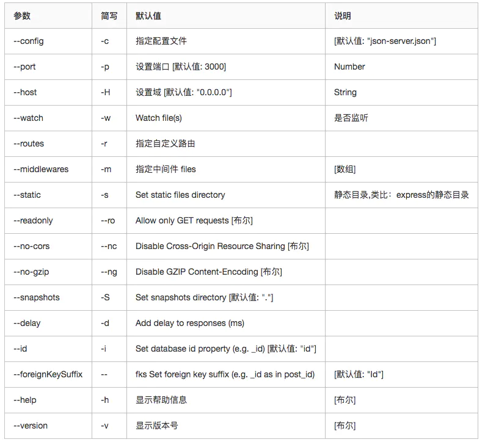

# 通用

+ [npm](https://www.npmjs.com/)
  + [Learn](https://www.npmjs.cn/)

+ [yarn](https://yarnpkg.com/)
  + [Learn](https://yarn.bootcss.com/docs/)

## serve

+ 可以运行一个服务器,可以用来运行打包后的页面,会开启一个虚拟服务器
+ npm i -g serve
+ serve pathName , 执行指定文件夹

## PubSubJS

+ 订阅与发布
+ npm i pubsub-js
+ import PubSub from 'pubsub-js'
+ [链接](https://www.npmjs.com/package/pubsub-js)

## axios

+ 发送网络请求
+ npm i axios

## JSON-Server

+ 网络请求测试服务
+ 安装 : npm install -g json-server
+ 启动 : json-server --watch db.json

+ 

## Nano ID

+ JS 唯一 id 生成器
+ `import { nanoid } from 'nanoid'`
+ yarn nanoid

## Copy to clipboard

+ 复制到剪切板
+ npm i copy-to-clipboard
+ import copy from 'copy-to-clipboard'
+ copy('Text');
+ [链接](https://www.npmjs.com/package/copy-to-clipboard)

# React

+ [精品推荐](https://ant.design/docs/react/recommendation-cn)

## Ant Design

+ [UI 组件库](https://ant.design/docs/react/introduce-cn)
+ yarn add antd

+ [自定义主题](https://ant.design/docs/react/use-with-create-react-app-cn#%E8%87%AA%E5%AE%9A%E4%B9%89%E4%B8%BB%E9%A2%98)
+ [配置文档](https://ant.design/docs/react/customize-theme-cn)

+ 按需引入 antd 样式
+ 安装这两个库
+ react-app-rewired 修改执行规则
+ customize-cra 修改默认的配置
+ yarn add react-app-rewired customize-cra
```js
/* 修改 package.json */
"scripts": {
-   "start": "react-scripts start",
+   "start": "react-app-rewired start",
-   "build": "react-scripts build",
+   "build": "react-app-rewired build",
-   "test": "react-scripts test",
+   "test": "react-app-rewired test",
}
```
+ 在项目根目录创建一个 config-overrides.js 用于修改默认配置。
```js
module.exports = function override(config, env) {
  // do stuff with the webpack config...
  return config;
};
```
+ 安装使用 : babel-plugin-import
+ babel-plugin-import 是一个用于按需加载组件代码和样式的 babel 插件
+ yarn add babel-plugin-import
```js
// 修改 config-overrides.js
const { override, fixBabelImports } = require('customize-cra');
module.exports = override(
   fixBabelImports('import', {
     libraryName: 'antd',
     libraryDirectory: 'es',
     style: 'css',
   }),
);
```

## 虚拟滚动

+ react-window 和 react-virtualized 
+ 在有限的时间内仅渲染有限的内容