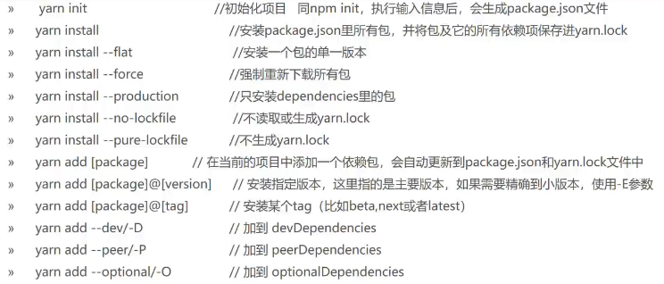

# NodeJS

+ 一个可以在服务器端运行 JavaScript 代码的跨平台 JavaScript 运行环境
+ 采用了 Google 开发的 V8 引擎运行 js 代码
+ I/O -> input/output 磁盘的读写操作

+ 对外暴露使用 module.exports , 只能暴露一个
+ 使用 exports.name 可以暴露多个
+ 加载外部模块使用 require() , 支持对象解构

+ setImmediate(func) 相当于 setTimeout(func,0)

+ cross-env 这个包可以修改 process.env 常量

+ Node.js 有三类模块, 内置模块,第三方模块,自定义的模块

+ 调试 -> node --inspect server.js
  + 谷歌浏览器中网站 -> Chrome://inspect

+ 前端 Frontend
  + 前端工程化环境 Webpack
  + CSS 预处理器 Sass
  + 框架 : React
  + 请求 : axios
  + SPA : single page application
  + 路由 : react-router-dom
  + UI库 : antd

+ 后端 Backend
  + Node.js
  + Express
  + MongoDB (Mongoose)

## 页面 render

+ SSR (Server Side Render)  ->  服务端渲染
+ CSR (Client Side Render)  ->  客户端渲染

## 内置模块

  + `__dirname` 当前文件的所在的物理路径
+ `process.env.npm_package_name` 可以读取 package 中的值
  + 对象需要精确到属性名才能够获取

## url 模块

+ [API文档](http://nodejs.cn/api/url.html#url_url_strings_and_url_objects)
+ `const url = require('url')`
+ 采用了全新的 WHATWG 标准的 URL 接口

## fs 模块

+ [module](http://nodejs.cn/learn/the-nodejs-fs-module)
+ [API](http://nodejs.cn/api/fs.html)
```js
const fs = require('fs')
```
+ 所有的文件系统操作都具有同步的、回调的、以及基于 promise 的形式。

+ npm i mime -> 可以获得文件类型
  + `mime.getType('index.html')` 需要后缀识别

### 常用方法

+ 每一个方法都有一个对应的同步方法 funcName+Sync
+ cb -> callback,  :err -> 参数
+ fs.access() -> 检查文件夹是否存在且 Node.js 有没有访问权
+ fs.mkdir() -> 可以创建新的文件夹。
+ fs.readir() -> 可以读取目录的内容。返回相对路径
+ fs.rename(oldPath,newPath,err=>{}) -> 可以重命名文件夹。
+ fs.readdir(path,options,cb(err,files)); -> 读取目录内容
+ fs.rmdir(path,options,cb:err) -> 可以删除文件夹。
+ fs.unlink(path,cb:err) -> 删除文件
+ fs.stat(path[, options],cb(err,stats)) -> 获取文件状态,且可以判断是否为文件夹
+ fs.lstat(path[, options], cb(err,stats))

+ fs-extra 模块 是 fs 模块的替代品,更能更加齐全

### readFile(path,options,callback(err,data))

+ 还有同步版本 `const data = fs.readFileSync(path, 'utf8')`
```js
fs.readFile('./log.txt', 'utf8', (err, data) => {
   if (err) {
      console.error(err);
      return
   }
   console.log(data)
})
```

### writeFile(path,content,callback(err))

+ 同步的版本 `const data = fs.writeFileSync(path,content)`
+ 默认写入方式为直接替换
+ 修改默认行为,添加配置项 `writeFile(path,content,options,err=>{})`
  + options 属性 flag
    + r+ -> 读写操作
    + w+ -> 读写,定位到数据流的开头,不存在就创建文件
    + a  -> 写入,定位到末尾,不存在就创建
    + a+ -> 读写,定位到末尾,不存在就创建
```js
fs.writeFile('./log.txt', '这样好吗!', err => {
   if (err) {
      console.error(err);
      return
   }
})
```

### appendFile(path,content,err=>{})

+ 同步 `fs.appendFileSync()`
+ 将内容追加到指定文件的末尾

### open(path,mode,callback(err,fd))

```js
/*
  将 r 作为 fs.open() 调用的第二个参数。
  其他常用的标志有：
    r+ 打开文件用于读写。
    w+ 打开文件用于读写，将流定位到文件的开头。如果文件不存在则创建文件。
    a 打开文件用于写入，将流定位到文件的末尾。如果文件不存在则创建文件。
    a+ 打开文件用于读写，将流定位到文件的末尾。如果文件不存在则创建文件。

    fs.openSync 方法打开文件，该方法会返回文件描述符
*/
fs.open('/Users/joe/test.txt', 'r', (err, fd) => {
  //fd 是文件描述符。
})
```

## process 进程

+ process.cwd() -> 得到当前工作目录路径

## os 操作系统模块

+ [module](http://nodejs.cn/learn/the-nodejs-os-module)
+ [API](http://nodejs.cn/api/os.html)

## 事件触发器

+ EventEmitter
```js
// 初始化模块
const EventEmitter = require('events')
const eventEmitter = new EventEmitter()

eventEmitter.on('start', () => {
  console.log('开始')
})

eventEmitter.emit('start')
```
+ 该对象公开了 on 和 emit 方法。
  + emit 用于触发事件。
  + on 用于添加回调函数
+ once(): 添加单次监听器。
+ removeListener() / off(): 从事件中移除事件监听器。
+ removeAllListeners(): 移除事件的所有监听器。

### nextTick()

+ process.nextTick()
+ 会在宏任务结束后微任务开启前执行
+ Promise.then() 在微任务开始时执行
+ setTimeout() 在下一次宏任务开始时执行

## path

+ [module](http://nodejs.cn/learn/the-nodejs-path-module)
+ [API](http://nodejs.cn/api/path.html)
+ path 内置模块
+ 路径属性
  + dirname: 获取文件的所在文件夹。
  + basename: 获取文件名部分。
    + 获取不带文件扩展名的文件名
    + `path.basename(file, path.extname(file))`
  + extname: 获取文件的扩展名。

### 实例方法

1. path.join
   - 用来连接路径或多个片段

2. path.resolve()
   + 获得相对路径的绝对路径计算

3. path.normalize()
   + 对包含 `.、..` 或双斜杠之类的相对说明符时,尝试计算其绝对路径

## console

+ console.log(param)
+ console.clear() -> 清空控制台
+ .count(param) -> 计数,在输出旁边打印指定参数的输出次数
+ .trace() -> 打印堆栈踪迹
+ .time() and .timeEnd() -> 记录所需时间

# 事件

+ 观察者模式
```js
const EventEmitter = require('events');
class MyEmitter extends EventEmitter {}

const myEmitter = new MyEmitter();
// 绑定事件
myEmitter.on('event', () => {
  console.log('触发事件');
});
// 触发指定事件
myEmitter.emit('event');
```

# 服务&请求

## http

```js
const http = require('http');
// 创建一个服务
const server = http.createServer((request, response) => {
  // 判断请求的地址
  request.url === '/api/data'
  // 设置响应状态码
  request.statusCode = 200
  // 设置 Content-Type 响应头
  request.setHeader('Content-Type', 'text/plain')

  // 接收数据
  let data = '';
  req.on('data', chunk => {
    data += chunk;
    console.log(`可用的数据块: ${chunk}`)
  })
  req.on('end', () => {
    //数据结束
    JSON.parse(data).todo // '做点事情'
  })

  // 结束响应
  request.end('你好世界\n')
})

// 启动监听 端口 3000
server.listen(3000, () => {
  // 监听就绪,启用回调
  console.log(`服务器运行在 http://${hostname}:${port}/`)
})
```

## https

+ 发送请求
```js
const https = require('https')
const options = {
  hostname: 'nodejs.cn',
  port: 443,
  path: '/todos',
  method: 'GET', // 请求方式 POST | PUT | DELETE
  headers:{ // 头部信息
    'Content-Type': 'application/json',
    'Content-Length': data.length
  }
}

const request = https.request(options, res => {
  console.log(`状态码: ${res.statusCode}`)

  res.on('data', d => {
    process.stdout.write(d)
  })
})

request.on('error', error => {
  console.error(error)
})
// 发送的数据
request.write(data)
request.end()
```

## 静态服务器

+ 简略版
```js
http.createServer((res, req) => {
   const urlStr = res.url;
   // 读取文件
   const file = fs.readFileSync(`.${urlStr}`);
   // 请求什么文件,就返回什么文件
   req.end(file);
})
```

# 跨域

## jsonp

+ 后端服务 JSONP 基础写法
```js
const http = require('http');

http.createServer((res, req) => {
   let data = 'hell world!';
    // 获取 url
   const urlStr = res.url;
    // 解析 url 得到 url 对象
   const urlObj = new URL(urlStr, 'http://localhost');
    // 获取 回调函数
   const callback = urlObj.searchParams.get('cb') || urlObj.searchParams.get('callback');
   switch (urlObj.pathname) {
      // 返回通过回调函数调用数据
      case '/api': req.write(`${callback}(${data})`); break;
      default: req.write('404 not found'); break;
   }
   req.end()

}).listen(3777,() => {
   log('服务启动了!');
});
```

## CORS

+ 设置跨域请求头 : 'Access-Control-Allow-Origin':'*'
```js
http.createServer((res, req) => {
   req.writeHead(200, {
      'content-type': 'application/json;charset=utf-8',
      // 允许跨域
      'Access-Control-Allow-Origin':'*'
   })
})
```

## proxy

+ npm i http-proxy-middleware

# express

+ npm i express
```js
const express = require('express');
const app = express();

// 不传入 path 表示接受所有的请求
app(middleware);

// 路由匹配规则,由代码注册顺序来执行匹配

// 回调函数被称为中间件  -> 中间件栈
// 中间件可以使用多个  多个可以封装为一个数组
// 根据访问的 url 匹配所有的路由,匹配的路由都会进入到栈中
// 遵循先进先出的执行规则
app.use('/api',(req,res,next)=>{
   res.send('world');
   // 只有调用了 next 才会进入下一个中间件
   next();
},(req,res,next)=>{
  // code ...
  // 在这里执行,下一个路由的中间件同样可以继续执行
  next();
  // 下一个栈中的 app.use('/',中间件可以执行)
})

app.use('/', (req, res) => {
  // 
   res.send('hello');
})
```

## 路由

+ router.all(path,middleware) -> 可以接受所有的请求
```js
// 路由的匹配规则与 use 的规则不同
// 是采用的严格匹配,只匹配路径相符的
// router.js
const express = require('express');

const router = express.Router();

router.get('/user', (req, res) => {
   const query = req.query;
   res.json(query)
})

router.post('/user',(req,res)=>{
   const data = req.body;

   res.send(data);
})

module.exports = router;

// app.js
app.use('/', Router);
```

## 接受数据

+ npm i body-parser
+ 专用来处理表单数据
```js
const bodyParser = require('body-parser');

// 这个中间件会将数据处理后传递到后续的 req.body 中对象的形式
// form parse application/x-www-form-urlencoded
app.use(bodyParser.urlencoded({ extended: false }))
// 对象 req 中会增加 body 属性
// body: [Object: null prototype] { name: '我是谁', age: '18' },

// 被转化后的表单数据可以后续了路由中直接利用 req.body 获取
app.use('/', Router);


// JSON parse application/json
app.use(bodyParser.json())
```

## template

- ejs
- pug
- jade
- art-template

+ art-template
+ [文档](http://aui.github.io/art-template/zh-cn/docs/syntax.html);
```js
yarn add art-template
yarn add express-art-template

const express = require('express');

const app = express();

// view engine setup
app.engine('art', require('express-art-template'));
app.set('view options', {
   escape:false, // 不要编译
   debug: process.env.NODE_ENV !== 'production'
});
// 设置 模板 文件夹
app.set('views', path.join(__dirname, 'view'));
// 设置 模板 文件后缀
app.set('view engine', 'art');


app.get('/list', (req, res, next) => {
   let data = [];
   for (let i = 100; i > 0; i--){
      data.push('line : ' + i);
   }
    // 设置返回的文件类型
   res.type('html');

    // list 为 view 文件夹下的 list.art 文件
    // {data} 为传递给 list.art 的数据
    // render 方法为 express-art-template 给添加进来的
   res.render('list', {
      data
   });
   // 该请求最终返回的是经过模板引擎编译执行过的 html 或 数据
})
```

# koa

+ 主体 yarn add koa
+ 路由 yarn add @koa/router
+ CORS 设置 yarn add @koa/cors
+ 响应体 yarn add koa-bodyparser
+ 静态资源 yarn add koa-static
+ 会话 yarn add koa-session
+ yarn add koa-jwt
+ 视图模板 koa-views
+ 安全 npm i koa-helmet
+ 文件过大压缩传输 npm i koa-compress

```js
// 主体
const Koa = require('koa');

const app = new Koa(); // 创建 APP

// 取出相应数据的 中间件  npm install --save koa-bodyparser@3
const bodyParser = require('koa-bodyparser')
app.use(bodyParser())

// 静态资源
const static = require('koa-static')
app.use(static(path.join( __dirname,  staticPath)))

app.use(async ctx => {
   
   const data = 'name'

    //  body 来相应数据
   cxt.body = data;
})

// 路由  npm install --save koa-router@7
const Router = require('koa-router')
// 创建路由
let home = new Router()
let page = new Router()
// 设置路由
home.get('/', async ( ctx )=>{});
page.get('/', async ( ctx )=>{});
// 装载路由
let router = new Router()
router.use('/', home.routes(), home.allowedMethods())
router.use('/page', page.routes(), page.allowedMethods())
// 使用路由
app.use(router.routes()).use(router.allowedMethods())


const port = 3131;
app.listen(port);
console.log(`服务已经在 : http://localhsot:${port}  启动了!`)
```


## 代理

+ `yarn add koa2-proxy-middleware`

```js
const proxy = require('koa2-proxy-middleware');
const options = {
   targets: {
       // 请求链接 /api?id=5
      '/api': {
          // 目标代理地址
         target: 'http://localhost:3346/test',
         changeOrigin: true,
          // 请求链接地址重写
          // 如果不从写则请求的地址为 'http://localhost:3346/test/api?id=5'
          // 这样请求地址就错了
         pathRewrite: {
             // 从写后 'http://localhost:3346/test?id=5'
            '/api':''
             // 重写目标 : 重写为
         }
      },
   }
}
app.use(proxy(options));
```

# 秘钥生成

+ 打开生成页面 -> openssl
+ 私钥 -> genrsa -out path/name 2048 , 2048 -> 私钥长度
+ 根据私钥生成公钥 -> rsa -in path/name -pubout -out path/name

# npm

+ [网站](https://www.npmjs.com/)
+ 淘宝景象 cnpm 国内的比较快
+ 默认安装目录 `node_modules`
+ `npm install -g name` 为全局安装 
+ 不是全局默认安装在执行命令的文件夹
+ 配置文件设置

## yarn

+ yarn 修复了一些 npm 的 BUG
+ `yarn config get registry` 查看当前镜像源
+ `yarn config set registry https://registry.npm.taobao.org` 切换镜像源
+ `yarn config set registry https://registry.yarnpkg.com` 切换自带
+ yarn upgrade 升级
+ yarn info 显示信息
+ sudo yarn cache clean 清除缓存
+ 

## npm

+ 一些常用的基本命令
``` js
npm -v //查看版本  npm install 可以直接将配置中的包全部下载
// 安装卸载命令  安装默认为 --save
npm install ModuleName  // 安装模块  install 可以简写为 i， npm i name
npm install ModuleName -g // 全局安装
npm update ModuleName // 更新模块版本  没有不会进行更新
npm uninstall ModuleName // 卸载模块
npm i --production // 只安装生产环境依赖
npm install -save ModuleName // -save 在 package 文件的 dependencies 节点写入依赖
npm install -save-dev ModuleName // -save-dev 在 package 文件的 devDependencies 节点写入依赖，dependencies：运行时的依赖，发布后，即生产环境下还需要使用的模块
/* 
devDependencies：开发时的依赖。里面的模块是开发时用的，发布时用不到它，不如项目中使用的 gulp，压缩css、js的模块，这一些是在项目部署的时候不需要的
*/

// 版本控制
npm -g install npm@5.9.1 // @ 符号后跟版本号就可以切换
npm i ModuleName@10  // 安装指定版本的最高版本
npm view ModuleName versions // 查看指定报名的所有可安装版本
npm outdated // 展示 package 中有哪些包是过期的

// 清理 npm 的缓存
npm cache clean --force

// 项目初始化命令
npm init --yes // 生成 package 配置文件 不加 --yes 可以自己来写配置项

// 模块查看命令
npm list -g // 查看全局安装的模块
npm list | grep ModuleName // 查看指定包的依赖关系
npm list name // 查看某个模块的版本号

// 查看全局包文件位置
npm root -g
```

+ 切换景象文件
```js
// 查看镜像的配置结果
npm config get registry 
npm config get disturl

// 将 npm 切换设置为淘宝的镜像
npm config set registry https://registry.npm.taobao.org --global
npm config set disturl https://npm.taobao.org/dist --global

// 使用 npm 工具进行切换
npx nrm use taobao
npx nrm use npm 切换回去
```

## pnpm

```js
pnpm config set store-dir D:\.pnpm-store // pnpm全局仓库路径(类似 .git 仓库)
pnpm config set global-dir D:\nodejs\pnpm\pnpm-global // pnpm全局安装路径
pnpm config set global-bin-dir D:\nodejs // pnpm全局bin路径
pnpm config set state-dir D:\nodejs\pnpm // pnpm创建pnpm-state.json文件的目录
pnpm config set cache-dir D:\nodejs\pnpm\cache // pnpm全局缓存路径
```

## nrm

+ 管理 npm 版本
+ npm ls -> 查看可选源
+ nrm use yarn -> 可以切换源
+ nrm add registry url -> 其中 registry 为源名，url为源的路径。增加一个可选源
+ nrm del registry -> 删除源
+ nrm test npm -> 测试速度

## package

+ 创造自己的 npm 包
+ npm adduser // 登录 npm 仓库 输入账号和密码
+ npm publish // 发布包
+ [文件指南](http://nodejs.cn/learn/the-package-json-guide)
```json
{
    "name":"名字",
    "version":"包的版本",
    "homepage":"官网url", // . 打包为本地项目, 不写默认打包为服务端项目
    "description":"描述",
    "dependencies":{ // 发布时的依赖
        // 主版本.次版本.辅版本
        "antd": "4.12.3", // 不加符号 固定使用的版本
        "antd": "^4.12.3", // ^符号会自动更新 后两位小版本, 次版本和辅版本
        "antd": "~4.12.3", // ~符号会自动更新 最后一位小版本  辅版本
        "antd": "*", // 最新版本
    },
    "devDependencies":{
        // 开发时的依赖，打包时会排除
    },
    "script":{
        "name":"执行命令,利用 npm run name 来执行"
    },
    "main":"指定程序主入口文件", // 暴露主文件 -> 写属于自己的包时使用
    "keywords":[
    	"关键字",
    ],
    "repository":{// 包存放的位置
    	"type":"git",
    	"url":"git"
    },
    "author":"作者姓名",
    "contributors":"其他贡献者名字",
    "license":"MIT" // MIT 代表开源
}
```

# 工具包

## nvm

+ nvm 是 nodejs 的版本管理工具
+ [链接](https://github.com/coreybutler/nvm-windows/releases)

+ 命令
  + `nvm arch` ：显示node是运行在32位还是64位。
  + `nvm install <version> [arch]` ：安装node， version是特定版本也可以是最新稳定版本 latest。可选参数 arch 指定安装32位还是64位版本，默认是系统位数。
  + `nvm list [available]` ：显示已安装的列表。可选参数 available，显示可安装的所有版本。list 可简化为 ls。
  + `nvm on` ：开启 node.js 版本管理。
  + `nvm off` ：关闭 node.js 版本管理。
  + `nvm proxy [url]` ：设置下载代理。不加可选参数url，显示当前代理。将url设置为none则移除代理。
  + `nvm node_mirror [url]` ：设置node镜像。默认是https://nodejs.org/dist/。如果不写url，则使用默认url。设置后可至安装目录settings.txt文件查看，也可直接在该文件操作。
  + `nvm npm_mirror [url]` ：设置npm镜像。https://github.com/npm/cli/archive/。如果不写url，则使用默认url。设置后可至安装目录settings.txt文件查看，也可直接在该文件操作。
  + `nvm uninstall <version>` ：卸载指定版本node。
  + `nvm use [version] [arch]` ：使用制定版本node。可指定32/64位。
  + `nvm root [path]` ：设置存储不同版本node的目录。如果未设置，默认使用当前目录。
  + `nvm version` ：显示nvm版本。version可简化为v。

## 环境助手

+ `npm i -g nodemon`
+ 然后用 `nodemon server.js` 来运行

+ `npm i -g forever` -> 可以在 cmd 或 ssh 链接断开时让项目一直运行并自动重启
  + 启动项目 forever start app.js
  + 停止项目 forever stop app.js
  + 列出所有通过 forever 管理的项目 forever list
  + forever -w start app.js ->监视项目中的文件,当文件有变动时重启项目

+ `npm i -g pm2` -> 应用进程管理器
  + 运行pm2 start app.js
  + 查看运行状态 pm2 list
  + 追踪资源运行情况 pm2 monit
  + 查看日志 pm2 logs
  + 重启应用 pm2 restart appId
  + 停止应用 pm2 stop app.js
  + 开启api访问 pm2 web
  + pm2 start app.js --watch -> 文件改动自动重启
```js
pm2 stop     <app_name|id|'all'|json_conf>
pm2 restart  <app_name|id|'all'|json_conf>
pm2 delete   <app_name|id|'all'|json_conf>
```
+ [官方文档](https://pm2.keymetrics.io/docs/usage/quick-start/)
```json
// 配置文档 ecosystem.json
{
    "name": "test", // 应用名称
    "script": "./bin/www", // 实际启动脚本
    "cwd": "./", // 当前工作路径
    "watch": [ // 监控变化的目录，一旦变化，自动重启
        "bin",
        "routers"
    ],
    "ignore_watch": [ // 从监控目录中排除
        "node_modules",
        "logs",
        "public"
    ],
    "watch_options": {
        "followSymlinks": false
    },
    "max_memory_restart": "100M", //超过最大内存重启
    "error_file": "./logs/app-err.log", // 错误日志路径
    "out_file": "./logs/app-out.log", // 普通日志路径
    "env": {
        "NODE_ENV": "production" // 环境参数，当前指定为生产环境
    }
}
```

## cheerio

+ npm i cheerio
+ 可以将 html 字符串,转换为虚拟 DOM

# CMD

+ 常用命令
  + dir 列出当前目录下的文件列表
  + cd path 移动至目标目录
  + md name 创建文件夹
  + rd name 删除指定文件夹