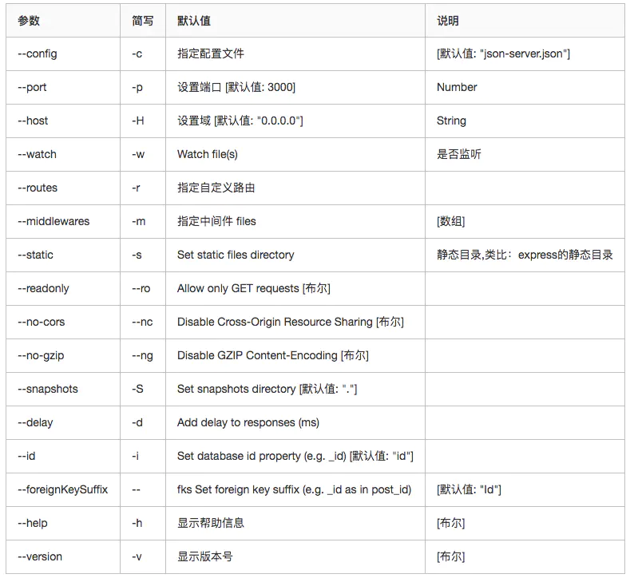

# axios

+ 引用方式 CDN 或 ` yarn add axios ` 导入
+ 发送请求使用 `axios(config)` config 为请求的配置对象
+ 配置对象
  + method : string 请求方式 : GET \ POST \ PUT \ DELETE
  + url : string  请求链接
  + data : object , string 请求体
  + baseURL : string  设置 url 的基础结构,默认地址
  + transformRequest : function(data,headers){} 对请求的数据做一个处理  预处理
  + transformResponse : function(data){} 对请求的结构做一个处理  预处理
  + headers : object 对请求头信息做一个处理
  + params : object
  + paramsSerializer : function(params){}
  + timeout : 超时设置

+ 请求方式 :
  + `axios.request(config)` 使用方式与 axios 函数一致
  + `axios.post(url,data,config)`
  + `axios.get(url,config)`
  + `axios.delete(url,config)`
  + `axios.head(url,config)`
  + `axios.options(url,data,config)`
  + `axios.put(url,data,config)`
  + `axios.patch(url,data,config)`
+ 在使用别名方法时， url、method、data 这些属性都不必在配置中指定。
+ 除了 `axios and axios.request` 其他都属于别名方法

+ 并发请求
  + axios.all(iterable)
  + axios.spread(callback)

+ 返回结果 : response
  + config : 配置对象
  + data : 响应体,返回数据
  + headers : 响应头信息
  + request : 原生的 XMLHttpRequest 对象
  + status : 响应状态码
  + statusText : 响应字符串

+ 创建实例 : axios.create(config);
  + const a = axios.create(默认配置);

+ 实例方法 : a.get(url,config)
  + `axios#request(config)`
  + `axios#post(url,data,config)`
  + `axios#get(url,config)`
  + `axios#delete(url,config)`
  + `axios#head(url,config)`
  + `axios#options(url,data,config)`
  + `axios#put(url,data,config)`
  + `axios#patch(url,data,config)`

## 拦截器

+ 在请求或响应被 then 或 catch 处理前拦截它们。 基于 promise
+ 请求拦截器
  + axios.interceptors.request.use(config=>{},error=>{})
  + 利用 throw 来抛出错误
+ 响应拦截器
  + axios.interceptors.response.use(response=>{},error=>{})
+ 多个拦截器执行顺序
  + 请求拦截器后设置的先执行
  + 响应拦截器先设置的先执行
```js
// 添加请求拦截器
axios.interceptors.request.use(function (config) {
    // 在发送请求之前做些什么
    return config;
  }, function (error) {
    // 对请求错误做些什么
    return Promise.reject(error);
  });

// 添加响应拦截器
axios.interceptors.response.use(function (response) {
    // 对响应数据做点什么
    return response;
	 return response.data; // 这样可以直接在 then 方法中处理数据,而不是一个完整的 response 对象
  }, function (error) {
    // 对响应错误做点什么
    return Promise.reject(error);
  });

// 移除拦截器  自定义的 axios 实例 同样可以使用这个方法
const myInterceptor = axios.interceptors.request.use(function () {/*...*/});
axios.interceptors.request.eject(myInterceptor);
```

## 取消请求

+ 使用 cancel token 取消请求
+ 可以通过传递一个 executor 函数到 CancelToken 的构造函数来创建 cancel token：
```js
const CancelToken = axios.CancelToken;
let cancel;
// 可以使用同一个 cancel token 取消多个请求

axios.get('/user/12345', {
  cancelToken: new CancelToken(function executor(c) {// 得到一个 CancelToken 实例
    // executor 函数接收一个 cancel 函数作为参数
    cancel = c; // 执行这个名为 c 的函数就可以取消请求的发送
  })
});
// 取消请求
cancel();
```

+ 可以使用 CancelToken.source 工厂方法创建 cancel token，像这样：
```js
const CancelToken = axios.CancelToken;
const source = CancelToken.source();

axios.get('/user/12345', {
  cancelToken: source.token
}).catch(function(thrown) {
  if (axios.isCancel(thrown)) {
    console.log('Request canceled', thrown.message);
  } else {
     // 处理错误
  }
});

axios.post('/user/12345', {
  name: 'new name'
}, {
  cancelToken: source.token
})

// 取消请求（message 参数是可选的）
source.cancel('Operation canceled by the user.');
```

## 错误处理

```js
axios.get('/user/12345')
  .catch(function (error) {
    if (error.response) {
      // The request was made and the server responded with a status code
      // that falls out of the range of 2xx
      console.log(error.response.data);
      console.log(error.response.status);
      console.log(error.response.headers);
    } else if (error.request) {
      // The request was made but no response was received
      // `error.request` is an instance of XMLHttpRequest in the browser and an instance of
      // http.ClientRequest in node.js
      console.log(error.request);
    } else {
      // Something happened in setting up the request that triggered an Error
      console.log('Error', error.message);
    }
    console.log(error.config);
  });

// 可以使用 validateStatus 配置选项定义一个自定义 HTTP 状态码的错误范围。
axios.get('/user/12345', {
  validateStatus: function (status) {
    return status < 500; // Reject only if the status code is greater than or equal to 500
  }
})
```

## 默认配置

+ 全局 axios 默认值  默认的请求方式为 GET
+ 所有的配置项都是可以设置默认配置的
  + axios.defaults.baseURL = 'https://api.example.com';
  + axios.defaults.headers.common['Authorization'] = AUTH_TOKEN;
  + axios.defaults.headers.post['Content-Type'] = 'application/x-www-form-urlencoded';

+ 自定义实例默认
```js
// Set config defaults when creating the instance
const instance = axios.create({
  baseURL: 'https://api.example.com'
});

// Alter defaults after instance has been created
instance.defaults.headers.common['Authorization'] = AUTH_TOKEN;

```

+ 配置的优先顺序
  + 配置会以一个优先顺序进行合并。
  + 这个顺序是：在 lib/defaults.js 找到的库的默认值，
  + 然后是实例的 defaults 属性，
  + 最后是请求的 config 参数。
  + 后者将优先于前者。

## 响应结构

+ then(response=>{}) 方法就可以接受到这样一个对象
  + response.data : 请求返回的数据
  + response.status : 状态码
  + response.statusText : 状态字符串
  + response.headers : 服务器响应头
  + response.config : 请求配置信息
+ catch 处理错误
```js
{
  // `data` 由服务器提供的响应
  data: {},

  // `status` 来自服务器响应的 HTTP 状态码
  status: 200,

  // `statusText` 来自服务器响应的 HTTP 状态信息
  statusText: 'OK',

  // `headers` 服务器响应的头
  headers: {},

   // `config` 是为请求提供的配置信息
  config: {},
 // 'request'
  // `request` is the request that generated this response
  // It is the last ClientRequest instance in node.js (in redirects)
  // and an XMLHttpRequest instance the browser
  request: {}
}
```

## config

```js
{
   // `url` 是用于请求的服务器 URL
  url: '/user',

  // `method` 是创建请求时使用的方法
  method: 'get', // default

  // `baseURL` 将自动加在 `url` 前面，除非 `url` 是一个绝对 URL。
  // 它可以通过设置一个 `baseURL` 便于为 axios 实例的方法传递相对 URL
  baseURL: 'https://some-domain.com/api/',

  // `transformRequest` 允许在向服务器发送前，修改请求数据
  // 只能用在 'PUT', 'POST' 和 'PATCH' 这几个请求方法
  // 后面数组中的函数必须返回一个字符串，或 ArrayBuffer，或 Stream
  transformRequest: [function (data, headers) {
    // 对 data 进行任意转换处理
    return data;
  }],

  // `transformResponse` 在传递给 then/catch 前，允许修改响应数据
  transformResponse: [function (data) {
    // 对 data 进行任意转换处理
    return data;
  }],

  // `headers` 是即将被发送的自定义请求头
  headers: {'X-Requested-With': 'XMLHttpRequest'},

  // `params` 是即将与请求一起发送的 URL 参数
  // 必须是一个无格式对象(plain object)或 URLSearchParams 对象
  params: {
    ID: 12345
  },

   // `paramsSerializer` 是一个负责 `params` 序列化的函数
  // (e.g. https://www.npmjs.com/package/qs, http://api.jquery.com/jquery.param/)
  paramsSerializer: function(params) {
    return Qs.stringify(params, {arrayFormat: 'brackets'})
  },

  // `data` 是作为请求主体被发送的数据
  // 只适用于这些请求方法 'PUT', 'POST', 和 'PATCH'
  // 在没有设置 `transformRequest` 时，必须是以下类型之一：
  // - string, plain object, ArrayBuffer, ArrayBufferView, URLSearchParams
  // - 浏览器专属：FormData, File, Blob
  // - Node 专属： Stream
  data: {
    firstName: 'Fred'
  },

  // `timeout` 指定请求超时的毫秒数(0 表示无超时时间)
  // 如果请求话费了超过 `timeout` 的时间，请求将被中断
  timeout: 1000,

   // `withCredentials` 表示跨域请求时是否需要使用凭证
  withCredentials: false, // default

  // `adapter` 允许自定义处理请求，以使测试更轻松
  // 返回一个 promise 并应用一个有效的响应 (查阅 [response docs](#response-api)).
  adapter: function (config) {
    /* ... */
  },

 // `auth` 表示应该使用 HTTP 基础验证，并提供凭据
  // 这将设置一个 `Authorization` 头，覆写掉现有的任意使用 `headers` 设置的自定义 `Authorization`头
  auth: {
    username: 'admin',
    password: '1523456'
  },

   // `responseType` 表示服务器响应的数据类型，可以是 'arrayBuffer', 'blob', 'document', 'json', 'text', 'stream'
  responseType: 'json', // default

  // `responseEncoding` indicates encoding to use for decoding responses
  // Note: Ignored for `responseType` of 'stream' or client-side requests
  responseEncoding: 'utf8', // default

   // `xsrfCookieName` 是用作 xsrf token 的值的cookie的名称
  xsrfCookieName: 'XSRF-TOKEN', // default

  // `xsrfHeaderName` is the name of the http header that carries the xsrf token value
  xsrfHeaderName: 'X-XSRF-TOKEN', // default

   // `onUploadProgress` 允许为上传处理进度事件
  onUploadProgress: function (progressEvent) {
    // Do whatever you want with the native progress event
  },

  // `onDownloadProgress` 允许为下载处理进度事件
  onDownloadProgress: function (progressEvent) {
    // 对原生进度事件的处理
  },

   // `maxContentLength` 定义允许的响应内容的最大尺寸
  maxContentLength: 2000,

  // `validateStatus` 定义对于给定的HTTP 响应状态码是 resolve 或 reject  promise 。如果 `validateStatus` 返回 `true` (或者设置为 `null` 或 `undefined`)，promise 将被 resolve; 否则，promise 将被 rejected
  validateStatus: function (status) {
    return status >= 200 && status < 300; // default
  },

  // `maxRedirects` 定义在 node.js 中 follow 的最大重定向数目
  // 如果设置为0，将不会 follow 任何重定向
  maxRedirects: 5, // default

  // `socketPath` defines a UNIX Socket to be used in node.js.
  // e.g. '/var/run/docker.sock' to send requests to the docker daemon.
  // Only either `socketPath` or `proxy` can be specified.
  // If both are specified, `socketPath` is used.
  // 做数据转发
  socketPath: null, // default

  // `httpAgent` 和 `httpsAgent` 分别在 node.js 中用于定义在执行 http 和 https 时使用的自定义代理。允许像这样配置选项：
  // `keepAlive` 默认没有启用
  httpAgent: new http.Agent({ keepAlive: true }),
  httpsAgent: new https.Agent({ keepAlive: true }),

  // 'proxy' 定义代理服务器的主机名称和端口
  // `auth` 表示 HTTP 基础验证应当用于连接代理，并提供凭据
  // 这将会设置一个 `Proxy-Authorization` 头，覆写掉已有的通过使用 `header` 设置的自定义 `Proxy-Authorization` 头。
  proxy: {
    host: '127.0.0.1',
    port: 9000,
    auth: {
      username: 'admin',
      password: '123456'
    }
  },

  // `cancelToken` 指定用于取消请求的 cancel token
  // （查看后面的 Cancellation 这节了解更多）
  cancelToken: new CancelToken(function (cancel) {
  })
}
```

## 例子

```js
// 设置默认地址
axios.defaults.baseURL = 'http://127.0.0.1:8000';
axios.get('/all', {
	// url 参数
	params: {
		id: 100,
		vip: 7
	},
	// 请求头信息
	headers: {
		name: 'Nice',
		age: 18
	}
}).then(value => {
	console.log(value);
})

axios.post('/all', {
	// 请求体
}, {
	params: {// url 参数
	},
	headers: {// 请求头信息
	}
})

axios({
	method: 'GET',
	url: '/all',
	params: {},
	headers: {},
	data: {}
}).then(response => {
	console.log(response);
})
```

# fetch

```js
fetch('http://127.0.0.1:8000/all', {
	method: 'POST',
	headers: {},
	body: {}
}).then(response => {
	// console.log(response);
	// return response.text();
	return response.json();
}).then(response => {
	console.log(response);
});
```

# AJAX

+ 全称是 Asynchronous JavaScript And XML,异步的 Js 和 XML
+ 可以在浏览器中向服务器发送异步请求,优势就是无刷新获取数据

+ Jquery 发送请求 [文档](https://jquery.cuishifeng.cn/)
```js
$.get(url,dataObj,callback,dataType);
$.post(); // 一样的
$.ajax({
	// 请求链接
	url:'',
	// 参数数据
	data:{},
	// 请求类型
	type:'GET',
	// 响应体结果类型
	dataType:'json',
	success:function(){
		// 成功的回调
	},
	// 超时
	timeout:2000,
	error:function(){
		// 失败的回调
	},
	// 头部信息属于自定义
	header:{
		a:100,
		b:200
	}
});
```

## 基础

```js
// 创建对象
const xhr = new XMLHttpRequest();
// 设置响应体的数据类型
xhr.responseType = 'json';
// 超时设置
xhr.timeout = 2000;
// 超时回调
xhr.ontimeout = function () {
	alert('请求超时!请稍后重试...');
}
// 网络异常
xhr.onerror = function () {
	alert('你的网络似乎出现了一些问题');
}

// 初始化  发送请求的方式与目标链接   GET请求在链接后加问号来发送数据
xhr.open('GET', 'http://127.0.0.1:8000/server?a=100&b=200&c=300');
// 设置请求头  两个参数 第一个位请求体内容的类型  第二位参数查询字符串的类型固定写发
xhr.setRequestHeader('Content-Type', 'application/x-www-form-urlencoded');
// 可以自定义设置请求头信息,但是需要服务端允许

// 发送请求
// POST 请求在这里发送数据 xhr.send('a=100&b=200&c=300');  格式需要与服务端对应
xhr.send();

// 手动取消请求
xhr.abort();

/*
readystate 是 xhr 对象中的属性, 表示状态: 0  1  2  3  4
0 : 表示为初始化
1 : 表示 open 方法调用完毕
2 : 表示 send 方法调用完毕
3 : 表示 服务端返回了部分的结果
4 : 表示服务端返回了所有的结果
*/
// 事件绑定 用来处理服务端返回结果.
// 当状态改变时触发 一共会触发 4 次
xhr.onreadystatechange = function () {
	// 判断是否返回了所有的结果
	if (xhr.readyState === 4) {
		// 判断响应状态码  200  404  403  401  500
		// 以 2xx 开头的都代表成功
		if (xhr.status >= 200 && xhr.status < 300) {
			// 处理结果  行  头  空行  体
			// 1.响应行
			xhr.status; // 状态码
			xhr.statusText; // 状态字符串
			xhr.getAllResponseHeaders(); // 所有响应头
			xhr.response; // 响应体
		} else {

		}
	}
}
```

# 代理

+ 通过中间服务器代理转发来进行跨域

## react

+ 方式一
  + 通过在 package 文件中添加此项
  + "proxy":"http://localhost:5000"
```js
// 本地页面端口 3000
请求发送给自己,也就是 3000 端口
3000 端口没有的资源就会转发到 5000 寻找资源
本地有的资源就不会转发请求
// 服务器端口 5000
```

+ 方式二
  + 在 src 中创建 setupProxy.js 文件
```js
const proxy = require('http-proxy-middleware');
// 发送请求的链接 : http://localhost:8080/api1/data
// 给本地发送请求可以省略协议和域名 : /api1/data
module.exports = function (app) {
   app.use(//接收多个参数,也就是多个代理
      proxy('/api1', { // 遇见 /api1 前缀的请求,才会触发这个代理
         target: 'http://loaclhost:5000', // 请求转发目标
         changeOrigin: true, // 默认 false , 控制服务器收到的请求头中 HOST 字段的值
			/*
				为 false 服务端得到的是 页面的 host
				为 true 服务端得到的是 服务器的 host
			*/
         pathRewrite:{'^/api1':''} // 将 /api1 替换为空字符串,重写请求路径
			/*
			  可以将 : http://localhost:8080/api1/data
			  重写为 : http://localhost:8080/data
			*/
      }),
      proxy('/api2', {
         target: 'http://loaclhost:5001',
         changeOrigin: true,
         pathRewrite:{'^/api1':''}
      })
   )
}
```

# JSON-Server

+ 安装 : npm install -g json-server
+ 启动 : json-server --watch db.json

+ 

# 服务端配置 nodejs

```js
// 引入 express
const express = require('express');
// 创建应用
const app = express();
// 创建路由规则

// 对应 GET 请求
app.get('/get', (request, response) => {
   // 设置响应头   允许跨域
   response.setHeader('Access-Control-Allow-Origin', '*');
   // 设置响应GET
   response.send('HELLO AJAX GET');
});

// 对应 POST 请求
app.post('/psst', (request, response) => {
   // 设置响应头   允许跨域
   response.setHeader('Access-Control-Allow-Origin', '*');
   // 设置响应
   response.send('HELLO AJAX POST');
});

// 延迟响应
app.get('/time', (request, response) => {
   // 设置响应头   允许跨域
   response.setHeader('Access-Control-Allow-Origin', '*');
   // 设置响应
   setTimeout(() => {
      response.send('延迟响应');
   }, 3000)
});

// 所有的请求
app.all('/all', (request, response) => {
   // 设置响应头   允许跨域
   response.setHeader('Access-Control-Allow-Origin', '*');
   // 响应头
   response.setHeader('Access-Control-Allow-Headers', '*');
   // 设置响应数据
   const data = {
      name: 'Jea',
      age: '18',
      sex: '女'
   }
   // 设置响应
   // response.send('HELLO AJAX POST');
   response.send(JSON.stringify(data));
});

// 监听端口服务
app.listen(8000, () => {
   console.log('服务已经启动,8000 端口监听中...');
})
```

# 跨域问题

## 同源策略

+ 协议 , 域名 , 端口号 必须完全相同
+ ajax 默认遵守 同源策略
+ 满足同源策略时发送请求的链接可以简写,只需要 `/pageName`

## 跨域解决方式

### CORS

+ 官方跨域方案
+ 支持 get 和 post 请求
+ 服务端来设置响应头来实现跨域
```js
app.all('/cors',(request, response) =>{
	// 允许寡欲的响应头
	response.setHeader('Access-Control-Allow-Origin','*'); // 允许所有网页
	// response.setHeader('Access-Control-Allow-Origin','http://127.0.0.1:8000'); // 允许指定的网页
	response.setHeader('Access-Control-Allow-Headers','*'); // 允许自定义请求头
	response.setHeader('Access-Control-Allow-Method','*'); // 请求方式
})
```

### JSONP

+ 非官方的跨域解决方案,只支持 get 请求
+ 借助了 html 页面中的 script 标签来实现
+ 在服务端返回函数的调用,然后在前端进行处理
+ 将返回的数据作为函数的参数进行处理
```js
// 创建请求标签
const script = document.createElement('script');
// 设置请求链接
script.src = 'url';
// 加入网页中发送请求
document.body.appendChild(script);

// Jquery 方式    ?callback=?  Jquery固定的写发,发送一个 Jquery 预定义的函数
$.getJSON('url?callback=?', function (data) {
	console.log(data)
})
// 需要在服务端进行处理
app.all('/jsonp',(request, response) =>{
	const data = {name:'Nice'}; // 数据
	let str = JSON.stringify(data); // 转化为字符串
	let cb = request.query,callback; // 前端发送过来的 callback 函数
	response.end(`${cb}(${str})`); // 返回函数调用的代码
})
```

# 注意点

## IE AJAX 缓存问题

+ 因为 IE 会缓存 AJAX 请求,所以在请求时会直接使用上次请求的缓存,而得不到最新的内容
+ 解决
  + 利用在后面加上一个时间戳,让 IE 认为每次都是一个不同的请求
  + `xhr.open('GET', 'http://127.0.0.1:8000/server?t='+Date.now());`

## 重复请求问题

+ 利用判断来避免用户重复点击发送相同的请求
+ 也就是在请求的过程中拒绝重复发送直到完成
+ `xhr.readyState === 4` 不论请求是成功还是失败,只要请求完成就行

# HTTP协议

## 请求报文

+ 重点格式与参数
```js
// 请求行 一共三种
行   GET 请求方式(POST)  /  URL路径 s?ie=utf-8  / HTTP/1.1 http协议的版本
// 格式
头   Host:
     CooKie:
     Content-type:
     User-Agent:
空行
// GET 请求体是为空 | POST请求请求体可以不为空
体   username=admin&password=admin
```

## 响应报文

```js
行   HTTP/1.1 200 OK  协议版本  响应状态码  响应状态字符串
头   Content-Type: text/html;charset=utf-8
     Content-length: 2048
     Content-encoding: gzip

空行
体   <html/>内容
```