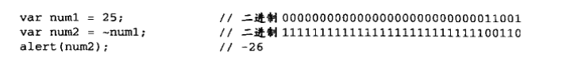

# ECMAScript

+ 规定了语法的组成部分
  + 语法
  + 类型
  + 语句
  + 关键字
  + 保留字
  + 操作符
  + 对象

# 数据类型

+ 基本类型
  + `number` 
  + `bigint` 
  + `string` 
  + `boolean` 
  + `null` 
  + `undefined` 
+ 引用类型
  + `object`
+ 基本包装类型
+ 单体内置对象
+ 数据类型判断

+ 复杂数据类型
  + Array
  + RegExp
  + Date
  + Function

+ `symbol` 

+ JavaScript 是一种 **「弱类型」** 或者说 **「动态语言」**。这意味着你不用提前声明变量的类型，在程序运行过程中，类型会被自动确定。这也意味着你可以使用同一个变量保存不同类型的数据

## 基本类型

+ `Boolean、Number、String、null、undefined`

+ `number` 用于任何类型的数字：整数或浮点数，在 ±2 范围内的整数。
+ `string` 用于字符串：一个字符串可以包含一个或多个字符，所以没有单独的单字符类型。
+ `boolean` 用于 `true` 和 `false`。
+ `null` 用于未知的值 —— 只有一个 `null` 值的独立类型。
+ `undefined` 用于未定义的值 —— 只有一个 `undefined` 值的独立类型。

+ 前三种基本类型都有类型对象，既可以通过类型对象创建对应的数据类型

+ ```js
  let bool = Boolean(true);
  let num = Number(123);
  let str = String("Hello World");
  ```

### Boolean

+ 可以使用`Boolean()`函数将任何类型转换为`Boolean`值 
    + 转换为`true`
        + 任何非空字符串
        + 任何非零数值(包括无穷大)
        + 任何对象
    + 转换为`false`
        + `""` 空字符串  注意空格不属于空字符串
        + `0 和 NaN` 
        + `null`
        + `undefined`

### Number

+ js中可以存在`正零(+0) 和 负零(-0)  `被认为相等  `(1 / +0) === (1 / -0) // false`
+ JavaScript 内部，所有数字都是以64位浮点数形式储存，即使整数也是如此。所以，1 与 1.0 是相同的，是同一个数。
+ JavaScript 语言的底层根本没有整数，所有数字都是小数（64位浮点数）。容易造成混淆的是，某些运算只有整数才能完成，此时 JavaScript 会自动把64位浮点数，转成32位整数，然后再进行运算

+ ```js
  let floatNum = 1.;   // 解析为1
  let floatNum2 = 10.0;  //解析为10
  let floatNum3 = 3.125e7; //等于31250000   e代表科学计数法  10的幂指数
  ```

+ js会将小数点后带有6个零以上的浮点数值转换为以e表示法表示的数值(`0.0000003会被转换成3e-7`)

  + 浮点数值的最高精确度是17位小数,但在计算其精确度是远远不如整数.
    + 例如: `0.1 + 0.2的结果不是0.3,而是0.30000000000000004`
    + 这个舍入误差会导致无法测试特定的浮点数值

```js
  //0.1 + 0.2 === 0.3  false
  //0.3 / 0.1  2.9999999999999996
  //(0.3 - 0.2) === (0.2 - 0.1)  false
  if(a + b == 0.3){
      alert("不要做这样的测试");
  }
  这是使用基于IEEE754数值的浮点计算的通病  64位从最左边开始，是这样组成的。
  第1位：符号位，0表示正数，1表示负数  //任何一个数都有一个对应的负值，就连0也不例外。
  第2位到第12位（共11位）：指数部分
  第13位到第64位（共52位）：小数部分（即有效数字）
```

+ isFinite()
  + 返回一个布尔值，表示某个值是否为正常的数值。
```js
isFinite(Infinity) // false
isFinite(-Infinity) // false
isFinite(NaN) // false
isFinite(undefined) // false
isFinite(null) // true
isFinite(-1) // true
```

#### 数值范围

  + JavaScript 能够表示的数值范围为21024到2-1023（开区间），超出这个范围的数无法表示。
```js
  Math.pow(2, -1075) // 0
  Math.pow(2, 1024) // Infinity
```

  + js能够表示的最小值保存在`Number.MIN_VALUE`中
    + 大多数浏览器中这个值是`5e-324`

  + 能够表示的最大值保存在`Number.MAX_VALUE`中
    + 大多数浏览器中这个值是`1.7976931348623157e+308`

  + 超过范围的数值将被自动转换成特殊的`Infinity`值
    + 负值转换成`-Infinity`(负无穷)
    + 正值转换成`Infinity`(正无穷)
    + `Infinity`不能参与计算 可以比大小
    + 确定一个数是不是位于最大值和最小值之间,可以使用`isFinite()`函数
      + 这个函数在参数位于最小与最大值之间时会返回`true`
    + Infinity与NaN比较，总是返回false

```js
  1 / 0 // Infinity
  let result = Number.MAX_VALUE + Number.MAX_VALUE;
  alert(isFinite(result));  //false
  Infinity === -Infinity // false
  1 / -0 // -Infinity
  -1 / -0 // Infinity
```

+ NaN
  + `NaN 即非数值(Not a Number)`是一个特殊的数值
  + 这个数值用于表示一个本来要返回数值的操作数未返回数值的情况
  + 任何涉及`NaN`的操作都会返回`NaN`  `+、-、*、/...`
  + `isNaN()` 函数接受一个参数,该数值可以是任何类型,
  + 判断NaN更可靠的方法是，利用NaN为唯一不等于自身的值的这个特点，进行判断。
  + `value !== value;`

```js
  //`NaN与任何值都不相等包过本身`    只有在使用`Object.is(NaN,NaN) 时在相等`
  //数组的indexOf方法内部使用的是严格相等运算符，所以该方法对NaN不成立
  [NaN].indexOf(NaN) // -1

  alert(isNaN(NaN));   //true
  alert(isNaN(10));   //false
  alert(isNaN('10'));   //false
  alert(isNaN('blue'));   //true    不能被转化成数值
  alert(isNaN(true));   //false
  isNaN({}) // true  //等同于  isNaN(Number({})) // true
  isNaN(['xzy']) // true  // 等同于  isNaN(Number(['xzy'])) // true
  isNaN([]) // false  // 转化数字为 0 ；
  isNaN([123]) // false
  isNaN(['123']) // false
  Math.acos(2) // NaN
  Math.log(-1) // NaN
  Math.sqrt(-1) // NaN

  //任何数值除以0会返回`NaN`
  0 / 0 // NaN
```

#### 数值类型转换

  + 一元运算符 `+`		`const age = +"22"; // 22`
  + `Number()`
    + `const age = Number("22"); // 22`
    + `Number.parseFloat("22");  // 22`
    + `Number.parseInt("22");  // 22`

    + `Boolean`值,`true和false转换成 1 和 0`
    + 转换日期 `Number(date) 和 date.getTime() 效果一样`
    + 如果是数值,只是简单的传入和返回
    + `null` 返回`0`
    + `undefined` 返回 `NaN`
    + 对象就调用  valueOf()方法    转换为NaN则调用对象的toString() 方法
      + 对象方法返回的不是原始类型的值，会报错
    + 如果是字符串
      + 字符串只包含数字(包括前面带正号或符号的情况),按十进制转换,前导的0会被忽略
      + 小数转换为浮点数
      + 十六进制也会转化为相同大小的十进制数
      + 自动转换 加号连接字符串 ， 减号转化数值计算

```js
  Number("Hello world!");    //NaN
  Number("");				//0
  Number("000011");		//11
  Number(true);			//1
```

  + `parseInt()`
    + 第二个参数决定转化的进制解析  (2 二进制  8 八进制  10 十进制  16 十流进制)
    + 在转换字符串时,会忽略字符串前的空格,直到找到第一个非空格字符.如果第一个字符不是数字字符或负号,就会返回`NaN`
    + `parseInt()`空字符串会返回`NaN` ,`Number()`会返回`0`
    + 如果第一个字符是数字字符,会继续解析第二个,直到解析完字符串或者遇到一个非数字字符
    + 例如:`"1234blue" 会被转换成 1234 ,  blue会被忽略    "22.5"会被转换成 22 因为小数点不是有效的数字字符`

```js
  parseInt('1234blue');   //1234
  parseInt(''); 		//NaN
  parseInt('0xA'); 	//10  十六进制数
  parseInt('22.5'); 	//22
  parseInt('070'); 	//56  八进制
  parseInt('70'); 	//70  十进制
```

  + `parseFloat()`
    + 根  parseInt()  转换规则一样,但是可以转换出浮点数

### String

+ 字符串是不可改变的，在修改某个变量中的字符串时，必须销毁原始的字符串
  + 也就是说，在改变字符串时，实际上是销毁了原来的字符串，在创建了一个新的
+ 字符集
  + Unicode 字符集  `var s = '\u00A9'`
```js
var longString = 'Long \
long \
long \
string';

longString  // 换行书写字符串  ·\·
// "Long long long string"

(function () { /*
line 1
line 2
line 3
*/}).toString().split('\n').slice(1, -1).join('\n')
// "line 1
// line 2
// line 3"

因为js只能识别2字节字符，而这是4字节字符，所以长度会被认为是2
'𝌆'.length // 2
```

+ 字符串数组
  + 字符串可以被视为字符数组，因此可以使用数组的方括号运算符，用来返回某个位置的字符（位置编号从0开始）。
  + length 属性可以获取字符串长度
```js
var s = 'hello';
s[0] // "h"
s[1] // "e"
s[4] // "o"
```

+ 转义符
  + \0 ：null（\u0000）
  + \b ：后退键空格（\u0008）
  + \f ：换页符（\u000C）
  + \n ：换行符（\u000A）
  + \r ：回车键（\u000D）
  + \t ：制表符（\u0009）
  + \v ：垂直制表符（\u000B）
  + \' ：单引号（\u0027）
  + \" ：双引号（\u0022）
  + \\ ：反斜杠（\u005C）
  + `\xnn`  以十六进制代码`nn`表示一个字符
  + `unnnn` 一十六进制代码`nnnn`表示一个`Unicode`(其中n为0~F)

+ 字符串方法
  + `toString()`
    + 数值、布尔值、对象和字符串都有该方法，返回一个字符串的副本
    + 对象可以重写该方法
    + `null和undefined`没有该方法
    + 大多数情况调用该方法不必传参数,但是在数字调用该方法时可以传递一个参数为进制数（如二进制传入 2）
  + `String()`   字符串转化
    + 将 **「其他类型数据（任何类型的数字，字母，布尔值，对象）」** 转换为 String 类型
      + 对象返回一个类型字符串，数组返回该数组的字符串形式
    + 在不知道值是不是 `null 或 undefined` 时可以调用该函数
    + 这个函数能将任何类型的值转换为字符串 
    + 规则如下:
      + 如果值有 `toString()`方法,则调用该方法(没有参数)并返回相应的结果
      + `valueOf() 、 toString()` 都返回对象则报错
      + 如果是null 就返回 "null"
      + 如果是undefined 则返回 "undefined"
```js
  String(123);   // "123"
  // Number方法toString()/toExponential()/toFixed()/toPrecision() 也有同样效果。
  String(false); // "false"
  // Boolean方法 toString() 也有同样效果。
  String(new Date()); // "Sun Jun 07 2020 21:44:20 GMT+0800 (中国标准时间)"
  // Date方法 toString() 也有同样效果。
```

### null 与 undefined

+ null 表示一个空对象指针
  + 使用： 推荐对将来要保存对象的变量使用 null 进行初始化

+ 对于其他比较，它们会先转换位数字：`null` 转换为 `0` ， `undefined` 转换为 `NaN` 。
+ `null 等于 undefined 但是不全等`

+ undefined类型		(变量或对象以声明但 	未被赋值 | 初始化	| 对象属性不存在)

## 引用类型

+ Object
+ Array
+ Date
+ RegExp
+ Function

### Object 单独记录

### Array类型 单独记录

### Date类型

+ Date类型使用UTC 1970年1月1日午夜（零时）开始经过的毫秒数来保存日期
+ Date类型保存的日期能精确到1970年1月1日之前或之后的285616年
+ `let now = new Date()`

+ `Date.parse()`接受表示日期的字符串,如果字符串不能表示日期则返回`NaN`
  + `let someDate = new Date(Date.parse("2015-5-5"))`
  + 直接像`Date()`构造函数传递参数,也会在后台调用`Date.parse()`方法

+ `Date.UTC()` 方法同样返回毫秒数,但是月份、每月中的日期、小时数都是从0开始计数
  + 同样的`2015-5-5` 用`Date.UTC`表示为`new Date(2015,4,4)` 小时分秒都用逗号隔开向后输入

+ `Date.now()`返回调用这个方法时的日期时间的毫秒数
  + 可以在脚本运行时取一次，脚本结束时取一次，相减就可以得出脚本的运行消耗时间

+ 日期的运算
  + 减法运算，返回的是它们间隔的毫秒数
  + 加法运算，拼接字符串

+ 继承的方法
  + 与其他引用类型一样，Date类型也重写了`toLocaleString()、toString()和valueOf()`方法

  + `toLocaleString()` 方法会按照与浏览器设置的地区相适应的格式返回日期和时间
  + `toString()` 方法通常返回带有时区信息的日期和时间
  + `valueOf()` 返回日期的毫秒表示，因此可以方便使用比较操作符来比较日期值

+ to 类方法
  + Date.prototype.toString()
    - toString方法返回一个完整的日期字符串。
  + Date.prototype.toUTCString()
    - toUTCString方法返回对应的 UTC 时间，也就是比北京时间晚8个小时。
  + Date.prototype.toISOString()
    - toISOString方法返回对应时间的 ISO8601 写法。
  + Date.prototype.toJSON()
    - toJSON方法返回一个符合 JSON 格式的 ISO 日期字符串，与toISOString方法的返回结果完全相同。
  + Date.prototype.toDateString()
    - toDateString方法返回日期字符串（不含小时、分和秒）。
  + Date.prototype.toTimeString()
    - toTimeString方法返回时间字符串（不含年月日）。

+ get 类方法
  + Date对象提供了一系列get*方法，用来获取实例对象某个方面的值。
  + getTime()：返回实例距离1970年1月1日00:00:00的毫秒数，等同于valueOf方法。
  + getDate()：返回实例对象对应每个月的几号（从1开始）。
  + getDay()：返回星期几，星期日为0，星期一为1，以此类推。
  + getFullYear()：返回四位的年份。
  + getMonth()：返回月份（0表示1月，11表示12月）。
  + getHours()：返回小时（0-23）。
  + getMilliseconds()：返回毫秒（0-999）。
  + getMinutes()：返回分钟（0-59）。
  + getSeconds()：返回秒（0-59）。
  + getTimezoneOffset()：返回当前时间与 UTC 的时区差异，以分钟表示，返回结果考虑到了夏令时因素。
  + get*方法返回的都是当前时区的时间，Date对象还提供了这些方法对应的 UTC 版本，用来返回 UTC 时间。

+ set 类方法
  + Date对象提供了一系列set*方法，用来设置实例对象的各个方面。
  + setDate(date)：设置实例对象对应的每个月的几号（1-31），返回改变后毫秒时间戳。
  + setFullYear(year [, month, date])：设置四位年份。
  + setHours(hour [, min, sec, ms])：设置小时（0-23）。
  + setMilliseconds()：设置毫秒（0-999）。
  + setMinutes(min [, sec, ms])：设置分钟（0-59）。
  + setMonth(month [, date])：设置月份（0-11）。
  + setSeconds(sec [, ms])：设置秒（0-59）。
  + setTime(milliseconds)：设置毫秒时间戳。
  + set*系列方法除了setTime()，都有对应的 UTC 版本，即设置 UTC 时区的时间。

### RegExP类型

+ 创建方法
  + 构造函数
    + ` let regex = new RegExp('xyz','i'); `
  + 正则字面量
    + ` let regex = /xyz/i `

+ ECMAScript 通过 RegExp类型来支持正则表达式
  + `let expression = / pattern / flags;`
  + 每个正则表达式都可带有一个或多个标指（`flags`）
    + 表达式的匹配支持下列3个标指
    + g : 表示全局（global）模式，即模式将被应用于所有字符串，而非在发现第一个匹配项时立刻停止
    + i : 表示不区分大小写（case-insensitive）模式
    + m : 表示多行（multiline）模式 ， 即在到达一行文本末尾时还会继续查找下一行中是否存在于模式匹配的项
  + `let pattern1 = /at/g;`  匹配字符串中所有“at”的实例
  + `let pattern2 = /[bc]at/i;`  匹配第一个“bat”或"cat"，不区分大小写
  + `let pattern3 = /.at/gi;`   匹配所有以“at”结尾的3个字符的组合，不区分大小写

+ 与其他语言中的正则表达式类似，模式中使用的所有元字符都必须转义，元字符包括：
  + 转义符号 （'\'）
  + `( [ { \ ^ $ | ) ? * + . ] }`
+ 如果想匹配字符串中包含的这些字符，就必需对它们进行转义
+ `let pattern2 = /\[bc\]at/i;` 匹配第一个“[bc]at”,不区分大小写
+ `let pattern3 = /\.at/gi;` 匹配所有以“.at”，不区分大小写
+ 以RegExp构造函数创建正则表达式，它接受两个参数，一个是要匹配的字符串模式，另一个是可选的标志字符串
  + `let pattern2 = new RegExp("[bc]at","i");` 因为参数是字符串，所以在转义元字符时需要双重转义

#### RegExp实例属性

+ 正则对象的实例属性分成两类。

+ 一类是修饰符相关，用于了解设置了什么修饰符。
  + RegExp.prototype.ignoreCase：返回一个布尔值，表示是否设置了i修饰符。
  + RegExp.prototype.global：返回一个布尔值，表示是否设置了g修饰符。
  + RegExp.prototype.multiline：返回一个布尔值，表示是否设置了m修饰符。
  + RegExp.prototype.flags：返回一个字符串，包含了已经设置的所有修饰符，按字母排序。
  + 上面四个属性都是只读的。

+ 另一类是与修饰符无关的属性，主要是下面两个。
  + RegExp.prototype.lastIndex：返回一个整数，表示下一次开始搜索的位置。该属性可读写，但是只在进行连续搜索时有意义，详细介绍请看后文。
  + RegExp.prototype.source：返回正则表达式的字符串形式（不包括反斜杠），该属性只读。

#### RegExp 实例方法

+ RegExp.prototype.test()
  + 正则实例对象的 test 方法返回一个布尔值，表示当前模式是否能匹配参数字符串。
  + 如果正则表达式带有g修饰符，则每一次test方法都从上一次结束的位置开始向后匹配。
```js
var r = /x/g;
var s = '_x_x';

r.lastIndex // 0
r.test(s) // true

r.lastIndex // 2
r.test(s) // true

r.lastIndex // 4
r.test(s) // false
//带有g修饰符时，可以通过正则对象的lastIndex属性指定开始搜索的位置。
//注意，带有g修饰符时，正则表达式内部会记住上一次的lastIndex属性，这时不应该更换所要匹配的字符串，否则会有一些难以察觉的错误。
//lastIndex属性只对同一个正则表达式有效
```

+ RegExp.prototype.exec()
  + 正则实例对象的exec()方法，用来返回匹配结果。
  + 如果发现匹配，就返回一个数组，成员是匹配成功的子字符串，否则返回null。
  + exec()方法的返回数组还包含以下两个属性：
    + input：整个原字符串。
    + index：模式匹配成功的开始位置（从0开始计数）。
  + 如果正则表达式加上g修饰符，则可以使用多次exec()方法，下一次搜索的位置从上一次匹配成功结束的位置开始。

#### 字符串的实例方法

+ String.prototype.match()：返回一个数组，成员是所有匹配的子字符串。
+ String.prototype.search()：按照给定的正则表达式进行搜索，返回一个整数，表示匹配开始的位置。
+ String.prototype.replace()：按照给定的正则表达式进行替换，返回替换后的字符串。
+ String.prototype.split()：按照给定规则进行字符串分割，返回一个数组，包含分割后的各个成员。

+ String.prototype.match()
  + 字符串实例对象的match方法对字符串进行正则匹配，返回匹配结果。
  + 字符串的match方法与正则对象的exec方法非常类似：匹配成功返回一个数组，匹配失败返回null。
  + 如果正则表达式带有g修饰符，则该方法与正则对象的exec方法行为不同，会一次性返回所有匹配成功的结果。
  + 设置正则表达式的lastIndex属性，对match方法无效，匹配总是从字符串的第一个字符开始。

+ String.prototype.search()
  + 字符串对象的search方法，返回第一个满足条件的匹配结果在整个字符串中的位置。如果没有任何匹配，则返回-1。

+ String.prototype.replace()
  + 字符串对象的replace方法可以替换匹配的值。它接受两个参数，第一个是正则表达式，表示搜索模式，第二个是替换的内容。
  + 正则表达式如果不加g修饰符，就替换第一个匹配成功的值，否则替换所有匹配成功的值。
  + replace方法的第二个参数可以使用美元符号$，用来指代所替换的内容。
    + $&：匹配的子字符串。
    + $`：匹配结果前面的文本。
    + $'：匹配结果后面的文本。
    + $n：匹配成功的第n组内容，n是从1开始的自然数。
    + $$：指代美元符号$。
  + replace方法的第二个参数还可以是一个函数，将每一个匹配内容替换为函数返回值。
```js
//replace方法的一个应用，就是消除字符串首尾两端的空格。
var str = '  #id div.class  ';

str.replace(/^\s+|\s+$/g, '')
// "#id div.class"
```

+ String.prototype.split()
  + 字符串对象的split方法按照正则规则分割字符串，返回一个由分割后的各个部分组成的数组。
  + 该方法接受两个参数，第一个参数是正则表达式，表示分隔规则，第二个参数是返回数组的最大成员数。

+ RegExp实例继承的`toLocaleString() 和 toString()` 方法都会返回正则表达式的字面量，与创建的方式无关

#### RegExp 构造函数属性

#### 模式的局限性
+ 不支持的特性：
  + 匹配字符串开始和结尾的\A 和\Z 但是支持以插入符号（^）和美元符号（$)来匹配字符串的开始和结尾
  + 向后查找（lookbehind） 但支持向前查找（lookahead）
  + 并集和交集类
  + 原子组（atomic grouping）
  + Unicode 支持 （单个支付除外，如\uFFFF）
  + 命名的捕获组   但支持编号的捕获组
  + S(single, 单行) 和 x(free-spacing,无间隔) 匹配模式
  + 条件匹配
  + 正则表达式注释

### Function 函数部分

## 基本包装类型

+ 总结一下，这三个对象作为构造函数使用（带有new）时，可以将原始类型的值转为对象；
+ 作为普通函数使用时（不带有new），可以将任意类型的值，转为原始类型的值。

+ 特殊的引用类型：`Boolean、Number、String`
  + 每读取一个基本类型值的时候，后台就创建一个对应的基本类型的包装类型的对象，从而能够调用一些方法来操作这些数据
```js
  let s1 = "some text";
  let s2 = "s1.substring(2)"
  /*在第二行访问s1时，是一种读取模式，也就是从内存中读取这个字符串的值，在读取模式访问字符串是，后台都会自动完成下列读取模式
  * 1.创建String类型的一个实例；
  * 2.在实例上调用指定方法
  * 3.销毁这个实例
  * let s1 = new String("some text");
  * let s2 = s1.substring(2);
  * s1 = null;
  * 以上三个步骤也适用与 Boolean 和 Number 类型对应的数字值和布尔值
  */
```
+ 引用类型和基本包装类型的主要区别就是生存期
  + 使用new操作符创建的引用类型的实例，在执行流离开当前作用域之前都一直保存在内存中
  + 而基本包装类型只存在于一行代码执行的瞬间，然后立即被销毁，  不能在运行时为基本类型添加属性和方法， 因为就算添加，也会在添加完后被立即销毁
  + 可以显示的调用基本包装类型,但是应该在绝对必要的情况下再这样做,因为这样做很容易弄混
  + 对基本包装类型的实例调用 typeof 会返回 "object", 而且所有基本包装类型的对象都会被转换为布尔值true
  + object 构造函数也会想工厂方法一样,根据传入值的类型返回相应基本包装类型的实例
    + `let obj = new Object("some text"); alert(obj instanceof String); //true`

### Boolean 类型 不建议使用(new)

+ 当成函数调用可以进行布尔类型的转换

### Number 类型

#### 静态属性

+ Number对象拥有以下一些静态属性（即直接定义在Number对象上的属性，而不是定义在实例上的属性）。
+ Number.POSITIVE_INFINITY：正的无限，指向Infinity。
+ Number.NEGATIVE_INFINITY：负的无限，指向-Infinity。
+ Number.NaN：表示非数值，指向NaN。
+ Number.MIN_VALUE：表示最小的正数（即最接近0的正数，在64位浮点数体系中为5e-324），相应的，最接近0的负数为-Number.MIN_VALUE。
+ Number.MAX_SAFE_INTEGER：表示能够精确表示的最大整数，即9007199254740991。
+ Number.MIN_SAFE_INTEGER：表示能够精确表示的最小整数，即-9007199254740991。
```js
Number.POSITIVE_INFINITY // Infinity
Number.NEGATIVE_INFINITY // -Infinity
Number.NaN // NaN

Number.MAX_VALUE
// 1.7976931348623157e+308
Number.MAX_VALUE < Infinity
// true

Number.MIN_VALUE
// 5e-324
Number.MIN_VALUE > 0
// true

Number.MAX_SAFE_INTEGER // 9007199254740991
Number.MIN_SAFE_INTEGER // -9007199254740991
```

#### 实例方法

+ Number.prototype.toString()
  + Number对象部署了自己的toString方法，用来将一个数值转为字符串形式。
  + toString方法可以接受一个参数，表示输出的进制。
  + 如果省略这个参数，默认将数值先转为十进制，再输出字符串；
  + 否则，就根据参数指定的进制，将一个数字转化成某个进制的字符串。

+ Number.prototype.toFixed()
  + toFixed()方法先将一个数转为指定位数的小数，然后返回这个小数对应的字符串。
  + `let num = 10; num.toFixed(2); //"10.00" ` 转化为有两位小数的字符串
  + 小数位多时能自动舍入

+ Number.prototype.toExponential()
  + toExponential方法用于将一个数转为科学计数法形式。
  + `(10).toExponential()  // "1e+1"`
  + `(10).toExponential(2) // "1.00e+1"`
  + toExponential方法的参数是小数点后有效数字的位数，范围为0到100
  + 超出这个范围，会抛出一个 RangeError 错误。

+ Number.prototype.toPrecision()
  + Number.prototype.toPrecision()方法用于将一个数转为指定位数的有效数字。
```js
(12.34).toPrecision(1) // "1e+1"
(12.34).toPrecision(2) // "12"
(12.34).toPrecision(3) // "12.3"
(12.34).toPrecision(4) // "12.34"
(12.34).toPrecision(5) // "12.340"
```

+ Number.prototype.toLocaleString() 
  + Number.prototype.toLocaleString()方法接受一个地区码作为参数，返回一个字符串，表示当前数字在该地区的当地书写形式。

### String 类型

+ String类型的实例，都有一个length属性，表示字符串中包含多少个字符

#### 实例方法

##### charAt()、charCodeAt()

+ String.prototype.charAt()
  + charAt方法返回指定位置的字符，参数是从0开始编号的位置。
```js
var s = new String('abc');
s.charAt(1) // "b"
s.charAt(s.length - 1) // "c"
'abc'.charAt(1) // "b"
'abc'[1] // "b"
```

+ String.prototype.charCodeAt()
  + charCodeAt()方法返回字符串指定位置的 Unicode 码点（十进制表示）
  + 相当于String.fromCharCode()的逆操作。
```js
'abc'.charCodeAt(1) // 98
//上面代码中，abc的1号位置的字符是b，它的 Unicode 码点是98。
```

##### concat()、split()、join()、replace()

+ String.prototype.concat()
  + concat 方法用于连接两个字符串，返回一个新字符串，不改变原字符串。
  + 该方法可以接受多个参数。
  + 如果参数不是字符串，concat方法会将其先转为字符串，然后再连接。
  + `let str = "hello ";   let result = str.concat("world","!");`

+ String.prototype.split(',') 
  + split 方法按照给定规则分割字符串，返回一个由分割出来的子字符串组成的数组。
  + 传入一个字符串，按照传入的字符串将使用方法的字符串分割为数组并返回
  + 如果省略参数，则返回数组的唯一成员就是原字符串。
  + split方法还可以接受第二个参数，限定返回数组的最大成员数。

  + `join`
    + 传入一个字符,按照传入的字符将数组连接为字符串
  + `replace` 替换
    + `replaceAll` 替换所有

##### slice()、substring()、substr()

+ String.prototype.slice()
  + slice() 方法用于从原字符串取出子字符串并返回，不改变原字符串。
  + 它的第一个参数是子字符串的开始位置，第二个参数是子字符串的结束位置（不含该位置）。
  + 省略第二个参数，则表示子字符串一直到原字符串结束。
  + 参数是负值，表示从结尾开始倒数计算的位置，即该负值加上字符串长度。
  + 第一个参数大于第二个参数（正数情况下），slice()方法返回一个空字符串。

+ String.prototype.substring()
  + substring 方法用于从原字符串取出子字符串并返回，不改变原字符串，跟slice方法很相像。
  + 它的第一个参数表示子字符串的开始位置，第二个位置表示结束位置（返回结果不含该位置）。
  + 省略第二个参数，则表示子字符串一直到原字符串的结束。
  + 第一个参数大于第二个参数，substring方法会自动更换两个参数的位置。
  + 参数是负数，substring方法会自动将负数转为0。

+ String.prototype.substr()
  + substr 方法用于从原字符串取出子字符串并返回，不改变原字符串
  + 跟 slice 和 substring 方法的作用相同。
  + substr 方法的第一个参数是子字符串的开始位置（从0开始计算），第二个参数是子字符串的长度。
  + 省略第二个参数，则表示子字符串一直到原字符串的结束。
  + 第一个参数是负数，表示倒数计算的字符位置。
  + 如果第二个参数是负数，将被自动转为0，因此会返回空字符串。

##### indexOf()、lastIndexOf()、trim()

+ String.prototype.indexOf()、String.prototype.lastIndexOf()
  + `indexOf() 和 lastIndexOf()`  查找指定字符串，返回索引位置，没找到返回`-1`
  + indexOf 方法用于确定一个字符串在另一个字符串中第一次出现的位置
  + 返回结果是匹配开始的位置。
  + indexOf 方法还可以接受第二个参数，表示从该位置开始向后匹配。
  + lastIndexOf() 从尾部开始匹配

+ String.prototype.trim()
  + trim 方法用于去除字符串两端的空格，返回一个新字符串，不改变原字符串。
  + 该方法去除的不仅是空格，还包括制表符（\t、\v）、换行符（\n）和回车符（\r）。

##### toLowerCase()、toUpperCase()

+ String.prototype.toLowerCase()，String.prototype.toUpperCase()
  + toLowerCase 方法用于将一个字符串全部转为小写，
  + toUpperCase 则是全部转为大写。它们都返回一个新字符串，不改变原字符串。
  + `toLocaleLowerCase()`   针对特定地区实现
  + `toLocaleUpperCase()`   针对特定地区实现

##### match()、search()、replace()

+ String.prototype.match()
  + match 方法用于确定原字符串是否匹配某个子字符串，返回一个数组，成员为匹配的第一个字符串。
  + 如果没有找到匹配，则返回null。
  + 返回的数组还有 index 属性和 input 属性，分别表示匹配字符串开始的位置和原始字符串。
  + 可以利用正则匹配
```js
'cat, bat, sat, fat'.match('at') // ["at"]
'cat, bat, sat, fat'.match('xt') // null

var matches = 'cat, bat, sat, fat'.match('at');
matches.index // 1
matches.input // "cat, bat, sat, fat"
```

+ String.prototype.search()，String.prototype.replace()
  + search 方法的用法基本等同于 match，但是返回值为匹配的第一个位置。
  + 如果没有找到匹配，则返回-1。
  + 可以利用正则匹配
  + replace 方法用于替换匹配的子字符串，一般情况下只替换第一个匹配（除非使用带有g修饰符的正则表达式）。


+ `localeCompare()` 方法
  + 比较两个字符串,并返回下列值中的一个
  + 如果字符串在字母表中应该排在字符串参数之前,则返回一个负数(大多情况下是 -1 )
  + 如果字符串等于字符串参数,则返回 0;
  + 如果字符串在字母表中应该排在字符串参数之后,则返回一个正数(大多情况下是 1 )
  + `let str = "yellow"; str.localeCompare("brick");  // 1 `

#### 实例属性

+ String.prototype.length
  + 字符串实例的length属性返回字符串的长度。

#### 静态方法

+ String.fromCharCode()
  + 接收一个或多个字符编码，转换为一个字符串

+ Base64 转码
  + 有时，文本里面包含一些不可打印的符号，比如 ASCII 码0到31的符号都无法打印出来，这时可以使用 Base64 编码，将它们转成可以打印的字符
  + 所谓 Base64 就是一种编码方法，可以将任意值转成 0～9、A～Z、a-z、+和/这64个字符组成的可打印字符。使用它的主要目的，不是为了加密，而是为了不出现特殊字符，简化程序的处理。
  + `btoa()` 任意值转为 Base64 编码
  + `atob()` Base64 编码转为原来的值
  + 这两个方法不适合非 ASCII 码的字符，会报错。 `btoa('你好') // 报错`
```js
function b64Encode(str) {
  return btoa(encodeURIComponent(str));
}

function b64Decode(str) {
  return decodeURIComponent(atob(str));
}

b64Encode('你好') // "JUU0JUJEJUEwJUU1JUE1JUJE"
b64Decode('JUU0JUJEJUEwJUU1JUE1JUJE') // "你好"
```

### 实例方法

+ valueOf()
  + valueOf()方法返回包装对象实例对应的原始类型的值。
+ toString()
  + toString()方法返回对应的字符串形式。
```js
new Number(123).valueOf()  // 123
new String('abc').valueOf() // "abc"
new Boolean(true).valueOf() // true

new Number(123).toString() // "123"
new String('abc').toString() // "abc"
new Boolean(true).toString() // "true"
```


## 单体内置对象

+ Global 对象
+ Math 对象

### Global 对象

+ URI 编码方法
+ `eval()` 方法
  + 接收一个参数： 要执行的js代码字符串
  + `eval("alert('hi')");`

+ Global 对象属性
  + 特殊值
    + undefined
    + NaN
    + Infinity
  + 构造函数
    + Object
    + Array
    + Function
    + Boolean
    + String
    + Number
    + Date
    + RegExp
    + Error
    + EvalError
    + RangError
    + ReferenceError
    + SyntaxError
    + TypeError
    + URIError

+ window 对象

### Math 对象

+ Math 对象的属性
  + Math.E             自然对数的底数,即常量e的值
  + Math.LN10          10的自然对数
  + Math.LN2           2的自然对数
  + Math.LOG2E         以2为低e的对数
  + Math.LOG10E        以10为低e的对数
  + Math.PI            派的值
  + Math.SQRT1_2       1/2的平方根(即2的平方根的倒数)
  + Math.SQRT2         2的平方根

+ `min() 和 max()` 方法

  + 取出一组数值的最大值或最小值
+ 舍入方法

  + `Math.ceil() 、Math.floor() 、 Math.round()`
  + `Math.ceil()` 向上舍入
  + `Math.floor()` 向下舍入
  + `Math.round()` 四舍五入

+ `random()` 方法
  + 返回介于0和1之间一个随机数，不包括0和1
  + 随机值 `值 = Math.floor(Math.random() * 可能的值总数 + 第一个可能的值);`
  + `值 = Math.floor(Math.random() * 96 + 5);` 取5到100的数
  + 封装
```js
  function selectFrom(lowerValue,upperValue){
    let choices = upperValue - lowerValue + 1;
    return Math,floor(Math.random() * choices + lowerValue);
  }
  //数组随机排序
  arr.sort(function () { return 0.5 - Math.random() });
```

+ 其他方法
  + Math.abs(num)           返回num的绝对值
  + Math.exp(num)           返回Math.E的num次幂
  + Math.log(num)           返回num的自然对数
  + Math.pow(num,power)     返回num的power次幂
  + Math.sqrt(num)          返回num的平方根
  + Math.acos(x)            返回x的反余弦值
  + Math.asin(x)            返回x的反正弦值
  + Math.atan(x)            返回x的反正切值
  + Math.atan2(y,x)         返回y/x的反正切值
  + Math.cos(x)             返回x的余弦值
  + Math.sin(x)             返回x的正弦值
  + Math.tan(x)             返回x的正切值

# Object类型

+ 创建对象 `let o = new Object();`  没有参数就是创建空对象
  + 空对象同等与 `Object(undefined) 、Object(null)`
  + 如果参数是原始类型的值，Object方法将其转为对应的包装对象的实例
  + 如果是对象则返回对象
  + 使用new关键字   Object的构造函数 Object 本身也是一个函数
+ `let person = { };`       使用对象字面量
  + 括号里不写属性方法，可以定义包含默认属性和方法的对象
  + 对象是键值对的集合：对象是由属性和方法构成的 (ps：也有说法为：对象里面皆属性，认为方法也是一个属性)
  + 在使用字面量创建时不会调用object构造函数
+ 数值的键名会被转化为字符串 symbol 值也可以作为键名
  + 对象的每个键又称为 `property`

+ 让对象保持被解释为表达式而不是语句块
  + `({foo:123})` 将对象包裹在圆括号里， 因为圆括号的里面，只能是表达式

+ `Constructor` 属性保存着创建当前对象的构造函数

+ 清空对象
  + person={};      //person对象不再具有任何属性
  + person=null;    //表示将person变量的值赋为null，从此以后person是一个空的对象指针

+ 属性是否存在： in 运算符
+ 属性的遍历：for...in 循环

## 对象属性操作

+ 方式一:  . 语法
  + student.name      获取到name属性的值，为："李白"
  + student.say       获取到一个函数
  + 数值键名不能使用点语法

+ 方式二:  [] 语法
  + student["name"]   等价于student.name
  + student["say"]    等价于student.say

+ 两种方法的差异
  - .语法更方便，但是坑比较多(有局限性)，比如：
  - .后面不能使用js中的关键字、保留字、变量(class、this、function。。。)
    - 用 `obj.this` 没报错
  - .后面不能使用数字  使用会发生语法错误

  - []使用更广泛
  - [变量name] 可以使用变量 
  - ["class"]、["this"]都可以随意使用 `obj["this"]=10`
  - [0]、[1]、[2]也可以使用
    - `obj[3]=50 == obj["3"]=50`
    - 上面相等是因为,对象的属性都是字符串,数字也会被转化为字符串去找对象的属性
    - 因为:  3并不是变量,而是一个值,可以互相转换
  - 甚至还可以这样用：["[object Array]"]
    - jquery里面就有这样的实现
  - 也可以这样用：["{abc}"]
    - `obj["abc"] = 值;`
    - 给对象添加了{abc}属性

+ `student["gender"]="男"`    等价于：    `student.gender="男"`
  - 含义：如果student对象中没有gender属性，就添加一个gender属性，值为"男"
  - 如果student对象中有gender属性，就修改gender属性的值为"男"

## 删除属性

+ delete student["gender"]
+ delete student.gender
+ delete 只能删除对象中的属性,不能删除变量
+ 只有一种情况，delete命令会返回false，那就是该属性存在，且不得删除。

## Object 的静态方法

+ Object 对象的本身方法
  + 就是直接定义在 Object 对象的方法

+ 由于 JavaScript 没有提供计算对象属性个数的方法，所以可以用这两个方法代替。
  + `Object.keys(obj).length`
  + `Object.getOwnPropertyNames(obj).length`

+ 对象属性模型的相关方法
  + Object.getOwnPropertyDescriptor()：获取某个属性的描述对象。
  + Object.defineProperty()：通过描述对象，定义某个属性。
  + Object.defineProperties()：通过描述对象，定义多个属性。

+ 控制对象状态的方法
  + Object.preventExtensions()：防止对象扩展。
  + Object.isExtensible()：判断对象是否可扩展。
  + Object.seal()：禁止对象配置。
  + Object.isSealed()：判断一个对象是否可配置。
  + Object.freeze()：冻结一个对象。
  + Object.isFrozen()：判断一个对象是否被冻结。

+ 原型链相关方法
  + Object.create()：该方法可以指定原型对象和属性，返回一个新的对象。
  + Object.getPrototypeOf()：获取对象的Prototype对象。

### Object.keys()

+ Object.keys() 查看一个对象本身的所有属性
  + 该方法的参数是一个对象，返回一个数组。该数组的成员都是该对象自身的（而不是继承的）所有属性名。
  + 只返回可枚举的属性

### Object.getOwnPropertyNames(obj)

+ Object.getOwnPropertyNames 方法用来遍历对象的属性。
  + 接受一个对象作为参数，返回一个数组，包含了该对象自身的所有属性名。
  + 该方法返回不可枚举的属性名。

+ 静态方法 `Reflect.ownKeys(obj)` 返回一个由目标对象自身的属性键组成的数组。
  + 如果目标不是对象则抛出错误

## Object的实例方法

+ Object 的实例方法
  + 就是定义在 Object 原型对象 Object.prototype 上的方法
  + 它可以被Object实例直接使用。

+ Object实例对象的方法，主要有以下六个
  + Object.prototype.valueOf()
  + Object.prototype.toString()
  + Object.prototype.toLocaleString()
    - 返回当前对象对应的本地字符串形式。
  + Object.prototype.hasOwnProperty(propertyName)
    - 判断某个属性是否为当前对象自身的属性，而不是继承自原型对象的属性。
  + Object.prototype.isPrototypeOf(object)
    - 判断当前对象是否为另一个对象的原型。
  + Object.prototype.propertyIsEnumerable(propertyName)
    - 判断某个属性是否可枚举。
    - 用于检查给定属性是否能够使用 `for-in`语句来枚举,属性必须是字符串

### valueOf()

+ valueOf方法的作用是返回一个对象的“值”，默认情况下返回对象本身。
+ valueOf方法的主要用途是，JavaScript 自动类型转换时会默认调用这个方法
+ 返回当前对象对应的值。
  - 返回对象的字符串、数值或布尔值表示。通常与`toString()`方法的返回值一样

### toString()

+ toString方法的作用是返回一个对象的字符串形式，默认情况下返回类型字符串。
+ 数组、字符串、函数、Date 对象都分别部署了自定义的toString方法，覆盖了Object.prototype.toString方法。

+ Object.prototype.toString方法返回对象的类型字符串，因此可以用来判断一个值的类型。
+ 由于实例对象可能会自定义toString方法，覆盖掉Object.prototype.toString方法，
+ 所以为了得到类型字符串，最好直接使用Object.prototype.toString方法。
+ 通过函数的call方法，可以在任意值上调用这个方法，帮助我们判断这个值的类型。
```js
var obj = {};
obj.toString() // "[object Object]"
//结果返回一个字符串object Object，其中第二个Object表示该值的构造函数

Object.prototype.toString.call(value)
数值：返回[object Number]。
字符串：返回[object String]。
布尔值：返回[object Boolean]。
undefined：返回[object Undefined]。
null：返回[object Null]。
数组：返回[object Array]。
arguments 对象：返回[object Arguments]。
函数：返回[object Function]。
Error 对象：返回[object Error]。
Date 对象：返回[object Date]。
Math 对象：返回[object Math]。
RegExp 对象：返回[object RegExp]。
其他对象：返回[object Object]。

Object.prototype.toString.call(undefined) === '[object Undefined]' // true

let type = function (o){
  let s = Object.prototype.toString.call(o);
  return s.match(/\[object (.*?)\]/)[1].toLowerCase();
}
console.log(type(/abcd/));  // "regexp"

在上面这个type函数的基础上，还可以加上专门判断某种类型数据的方法。

['Null',
 'Undefined',
 'Object',
 'Array',
 'String',
 'Number',
 'Boolean',
 'Function',
 'RegExp'
].forEach(function (t) {
  type['is' + t] = function (o) {
    return type(o) === t.toLowerCase();
  };
});

type.isObject({}) // true
type.isNumber(NaN) // true
type.isRegExp(/abc/) // true
```

### toLocaleString()

+ Object.prototype.toLocaleString方法与toString的返回结果相同，也是返回一个值的字符串形式。
+ 这个方法的主要作用是留出一个接口，让各种不同的对象实现自己版本的toLocaleString，用来返回针对某些地域的特定的值。

+ 目前，主要有三个对象自定义了toLocaleString方法。
  + Array.prototype.toLocaleString()
  + Number.prototype.toLocaleString()
  + Date.prototype.toLocaleString()

### hasOwnProperty()

+ Object.prototype.hasOwnProperty方法接受一个字符串作为参数，返回一个布尔值，表示该实例对象自身是否具有该属性。

## 属性描述对象

+ 每个属性都有自己对应的属性描述对象，保存该属性的一些元信息。每个属性都有一个 [[Prototype]]

```js
//属性描述对象提供6个元属性。
{
  // 属性描述对象的各个属性称为“元属性”，因为它们可以看作是控制属性的属性.
  value: 123,
  writable: false,
  enumerable: true,
  configurable: false,
  get: undefined,
  set: undefined
}
```

+ 对象属性的描述
  + `configurable:false` 
    - configurable是一个布尔值，表示可配置性，
    - 默认为true。
    - 如果设为false，将阻止某些操作改写该属性，比如无法删除该属性，也不得改变该属性的属性描述对象（value属性除外）。
    - 也就是说，configurable属性控制了属性描述对象的可写性。
  + `enumerable:false`  
    - enumerable是一个布尔值，表示该属性是否可遍历，
    - 默认为true。
    - 如果设为false，会使得某些操作（比如for...in循环、Object.keys()、JSON.stringify方法）跳过该属性。
  + `writable:false`  
    - writable是一个布尔值，表示属性值（value）是否可改变（即是否可写），
    - 默认为true。
  + `value:'小明'`  
    - value是该属性的属性值，
    - 默认为undefined。
  + `get`
    - get是一个函数，表示该属性的取值函数（getter），
    - 默认为undefined。
  + `set`
    - set是一个函数，表示该属性的存值函数（setter），
    - 默认为undefined。

+ 注意，一旦定义了取值函数get（或存值函数set），就不能将writable属性设为true，或者同时定义value属性，否则会报错。

+ 存取器
  - 除了直接定义以外，属性还可以用存取器定义。
  - 其中，存值函数称为setter，使用属性描述对象的set属性；
  - 取值函数称为getter，使用属性描述对象的get属性。
  - 一旦对目标属性定义了存取器，那么存取的时候，都将执行对应的函数
```js
var obj = Object.defineProperty({}, 'p', {
  get: function () {
    return 'getter';
  },
  set: function (value) {
    console.log('setter: ' + value);
  }
});

obj.p // "getter"
obj.p = 123 // "setter: 123"

// 写法二
var obj = {
  get p() {
    return 'getter';
  },
  set p(value) {
    console.log('setter: ' + value);
  }
};

上面两种写法，虽然属性p的读取和赋值行为是一样的，但是有一些细微的区别。
第一种写法，属性p的configurable和enumerable都为false，从而导致属性p是不可遍历的；
第二种写法，属性p的configurable和enumerable都为true，因此属性p是可遍历的。
实际开发中，写法二更常用。

注意，取值函数get不能接受参数，存值函数set只能接受一个参数（即属性的值）。

存取器往往用于，属性的值依赖对象内部数据的场合。
var obj ={
  $n : 5,
  get next() { return this.$n++ },
  set next(n) {
    if (n >= this.$n) this.$n = n;
    else throw new Error('新的值必须大于当前值');
  }
};
obj.next // 5
obj.next // 6
obj.next = 5;
// Uncaught Error: 新的值必须大于当前值
```

### Object.getOwnPropertyDescriptor()

+ `Object.getOwnPropertyDescriptor(obj,property)` 
  - 只能用于对象自身的属性，不能用于继承的属性。
  - 可以获取属性描述对象。它的第一个参数是目标对象，第二个参数是一个字符串，对应目标对象的某个属性名。
```js
var obj = { p: 'a' };

Object.getOwnPropertyDescriptor(obj, 'p')
// Object { value: "a",
//   writable: true,
//   enumerable: true,
//   configurable: true
// }
```

+ `Object.getOwnPropertySymbols(obj);` 在给定对象自身上找到的所有 Symbol 属性的数组

### Object.prototype.propertyIsEnumerable()

+ 实例对象的propertyIsEnumerable()方法返回一个布尔值，用来判断某个属性是否可遍历。
+ 注意，这个方法只能用于判断对象自身的属性，对于继承的属性一律返回false。

### Object.defineProperty()，Object.defineProperties()

+ `Object.defineProperties();`  方法直接在一个对象上定义新的属性或修改现有属性，并返回该对象。
  + `Object.defineProperties(obj, props)`
  + 参数： 目标对象 ， 一个或多个属性名称以及描述

+ `Object.defineProperty();`   作用同上
  + `Object.defineProperty(obj, prop, descriptor)`
  + 参数： 目标对象 ， 属性名称 ， 属性描述对象

```js
var obj = {};
Object.defineProperties(obj, {
  'property1': {
    value: true,
    writable: true
  },
  'property2': {
    value: 'Hello',
    writable: false
  }
  '其他描述属性'：{
    configurable:false,//能否使用delete、能否需改属性特性、或能否修改访问器属性、，false为不可重新定义，默认值为false
    enumerable:false,//对象属性是否可通过for-in循环，false为不可循环，默认值为false
    writable:false,//对象属性是否可修改,false为不可修改，默认值为false
    value:'小明', //对象属性的默认值，默认值为undefined
    get(){ return bValue;},
      // es6缩写，等价于 get:function(){ return bValue;}
    set(newValue){ bValue = newValue;}
    /*
    * get 和 set 默认值都为 undefined
    * get : 当访问该属性时会调用此函数，会传入 this 对象， 由于继承关系， 这里的 this 并不一定是定义该属性的对象
    * set : 当属性被修改时会调用此函数，接收一个参数（也就是被赋予的新值），会传入赋值时的 this 对象
    */
  }
});


const object1 = {};

Object.defineProperty(object1, 'property1', {
  value: 42,
  writable: false
});

object1.property1 = 77;
// throws an error in strict mode

console.log(object1.property1); //42
```

## 对象的拷贝

```js
var extend = function (to, from) {
  for (var property in from) {
    if (!from.hasOwnProperty(property)) continue;
    Object.defineProperty(
      to,
      property,
      Object.getOwnPropertyDescriptor(from, property)
    );
  }

  return to;
}

extend({}, { get a(){ return 1 } })
// { get a(){ return 1 } })

//上面代码中，hasOwnProperty那一行用来过滤掉继承的属性，否则可能会报错，
//因为Object.getOwnPropertyDescriptor读不到继承属性的属性描述对象。
```

## 控制对象状态 防篡改对象

+ 手工设置对象的属性

```js
  [[Configurable]]
  [[Writable]]
  [[Enumerable]]
  [[Value]]
  [[Get]]
  [[Set]]
```

+ 冻结对象的读写状态，防止对象被改变。JavaScript 提供了三种冻结方法，
+ 最弱的一种是Object.preventExtensions，其次是Object.seal，最强的是Object.freeze。

+ 一旦把对象设定为防篡改就无法撤销

+ 不可扩展对象
  + `Object.preventExtensions(obj)` 方法可以禁止给对象添加属性和方法
  + 在严格模式下给不可扩展对象添加属性或方法会报错
  + 但可以修改和删除已经存在的对象成员
  + `Object.isExtensible()` 确定对象是否可扩展
    + 检测密封对象也会返回 `false`  因为密封对象不可扩展

+ 密封的对象
  + 密封对象,将已有的成员的 `[[Configurable]]`  属性设置为`false`, 这意味着不能删除属性和方法,因为不能使用`Object.defineProperty()`把数据属性修改为访问器属性,或者相反,属性值是可以修改的.
  + 密封对象 `Object.seal(obj)`方法
  + 在严格模式下添加删除都会报错
  + 使用`Object.isSealed()` 确定对象是否被密封

+ 冻结的对象
  + 最严格的防篡改级别是冻结对象( frozen object),冻结的对象既不可扩展，又是密封的，而且对象数据属性的`[[Writable]]`特性会被设置为`false`。
  + 如果定义`[[Set]]`函数,访问器属性仍然是可写的。
  + EC5定义的`object.freeze(obj)`方法可以用来冻结对象。
  + `Object.isFrozen()` 方法用于检测冻结对象

+ 局限性
  + 可以通过改变原型对象，来为对象增加属性。
  + 另外一个局限是，如果属性值是对象，上面这些方法只能冻结属性指向的对象，而不能冻结对象本身的内容。
```js
var obj = {
  foo: 1,
  bar: ['a', 'b']
};
Object.freeze(obj);

obj.bar.push('c');
obj.bar // ["a", "b", "c"]
//无法改变指向其他值，但是可以改变其指向的数组
```

# Array类型 

+ ECMAScript中数组是动态可调的，可以随着数据的添加自动增长以容纳新增数据

+ 创建方法
  + `let colors = new Array()`  也可省略new关键字
    + 构造函数创建传参
      - 不传参创建空数组
      - 整数创建整数长度的空数组，小数报错
      - 单个非数值或多个参数（包括整数）都是返回新数组成员
  + `let colors = ["red","blue","green"]` 使用数组字面量表示法
    + 在使用字面量创建时不会调用Array构造函数
  + 任何类型的数据都可以放入数组

+ 数组的本质
  + 本质上，数组属于一种特殊的对象。typeof运算符会返回数组的类型是object。
  + Object.keys(arr); 可以获取数组的键
  + 数组的键名其实也是字符串
  + 对于数值的键名不能使用点结构
```js
var a = [];
a[1.00] = 6;  //由于1.00转成字符串是1，所以通过数字键1可以读取值。
a[1] // 6
arr.0 // SyntaxError
```

+ 特点
  + 使用超过数组长度的索引时数组会自动增加到对应的长度
  + length属性不是只读的，可以向数组末尾移除向或添加新项
    + `arr.length = 4;` 设置数组的长度会把多的项删除，少的话就会新增空项undefined值
    + 数组的数字键不需要连续，length属性的值总是比最大的那个整数键大1
    + 如将只有三个值的数组，第四个键值设置为 10 那么 数组的长度就是 11 而不是数组包含值的真实个数
    + 如果数组的键名是添加超出范围的数值，该键名会自动转为字符串。
    + 清空数组的有效方法就是将 length 属性设置为0
  + 数组最多可以包含4294967295个项

+ 数组的空位，空元素也不会影响 length 属性， 最后一个元素后面有逗号也一样
+ delete 命令删除数组元素会形成空位， 空位返回 undefined
+ forEach 方法、for-in 结构、Object.keys 方法 进行遍历数组，空位都会跳过
+ 如果某个位置是 undefined 遍历的时候不会被跳过

+ in 操作符也适用于数组
+ for-in 循环会遍历数组的所有键，包括非数字的键

+ 类数组对象   本质上还是对象而不是数组
  + 典型的“类似数组的对象”是 函数的 arguments 对象， 以及大多数 DOM 元素集，还有字符串。
  + 数组的slice方法可以将“类似数组的对象”变成真正的数组。
```js
var obj = {
  0: 'a',
  1: 'b',
  2: 'c',
  length: 3
};

var arr = Array.prototype.slice.call(arrayLike);
//也可以通过call直接调用数组的方法，但是这种方法比数组原生的要慢
//所以最好先将之转化为数组，在调用数组的方法
```

## 静态方法

+ 检测数组
+ 对于一个网页或者一个全局作用域， `instanceof`操作符就能得到结果
  + 但对于2个或以上，因为存在不同版本的Array构造函数就得不到想要的结果
+ Array.isArray()
  + 该方法检测某个值到底是不是数组，而不管是在那个全局环境创建的
  + `Array.isArray(value)`
  + Array.isArray方法返回一个布尔值，表示参数是否为数组。它可以弥补typeof运算符的不足。

## 实例方法


### valueOf()，toString()、toLocaleString()

+ 数组的valueOf方法返回数组本身。
+ 数组的toString方法返回数组的字符串形式,每个值以逗号分隔。
+ `toLocaleString()`方法返回类似 toString()

### push()、pop()、shift()、unshift()

+ 栈方法
  + ECMAScript为数组提供了 `push() 和 pop()`方法
  + 栈的访问规则是LIFO(Last-In-First-Out,后进先出)的数据结构，也就是最新添加的项最早被移除,栈中项的插入（叫做推入）和移除（叫做弹出），只发生在一个位置——栈的顶部
  + `push()` 可以接受任意数量的参数，把他们添加到数组结尾，并返回修改后数组的长度
  + `pop()` 方法则从数组末尾移除最后一项，减少数组的length值，返回返回移除的项
+ 队列方法
  + 队列的数据结构访问规则是FIFO(First-In-First-Out,先进先出)。队列在列表的末端添加项，从列表的前端移除项
  + `shift()` 方法移除数组的第一个元素，并返回该元素
  + `unshift()` 方法能在数组前端添加任意个项并返回数组长度。
  + 同时使用`unshift() 和 pop()` 方法可以从相反的方向来模拟队列
+ 这四个方法都会改变原数组

### join()、concat()

+ join(',') 
  + join 方法以指定参数作为分隔符，将所有数组成员连接为一个字符串返回。
  + 如果不提供参数，默认用逗号分隔。
  + 如果数组成员是undefined或null或空位，会被转成空字符串。
  + 通过 call() 方法这可方法可以用于字符串或类似数组的对象。

+ `concat()` 
  + concat 方法用于多个数组的合并。
  + 它将新数组的成员，添加到原数组成员的后部，然后返回一个新数组，原数组不变。
  + 如果数组成员包括对象，concat方法返回当前数组的一个浅拷贝。
  + 所谓“浅拷贝”，指的是新数组拷贝的是对象的引用。
```js
var obj = { a: 1 };
var oldArray = [obj];
var newArray = oldArray.concat();
obj.a = 2;
newArray[0].a // 2
```

### slice()、splice()

+ slice()
  + slice()方法用于截取目标数组的一部分，返回一个新数组，原数组不变。
  + `arr.slice(start,end)`
  + 第一个参数为起始位置（从0开始，会包括在返回的新数组之中）
  + 第二个参数为终止位置（但该位置的元素本身不包括在内）
  + 如果省略第二个参数，则一直返回到原数组的最后一个成员。
  + 如果第一个参数大于等于数组长度，或者第二个参数小于第一个参数，则返回空数组。
```js
//如果slice()方法的参数是负数，则表示倒数计算的位置。
var a = ['a', 'b', 'c'];
a.slice(-2) // ["b", "c"]
a.slice(-2, -1) // ["b"]

//slice()方法的一个重要应用，是将类似数组的对象转为真正的数组。
Array.prototype.slice.call({ 0: 'a', 1: 'b', length: 2 })
// ['a', 'b']
Array.prototype.slice.call(document.querySelectorAll("div"));
Array.prototype.slice.call(arguments);
```

+ splice()  删除、插入、替换
  + `splice(index,delete,插入或替换的一个或多个参数)`方法
  + 返回被删除的项
  + 第一个参数是删除的起始位置（从0开始）
  + 第二个参数是被删除的元素个数,如果后面还有更多参数，则表示这些就是要被插入数组的新元素
  + 替换,起始位置,删除个数,插入的一个或多个参数
  + 删除，将删除个数设置为0

### sort()、reverse()、filter()

+ 重排序

+ sort()
  + sort方法对数组成员进行排序，默认是按照字典顺序排序。
  + 排序后，原数组将被改变。
  + 数值会被转换为字符串后在按照字典顺序进行比较
  + 自定义方式排序
    + 可以传入一个函数作为参数。
    + sort的参数函数本身接受两个参数，表示进行比较的两个数组成员
    + 如果该函数的返回值大于0，表示第一个成员排在第二个成员后面
    + 其他情况下，都是第一个元素排在第二个元素前面。
```js
  `sort()` 方法会调用每个数组项的 `toString()`转型方法，然后比较得到的字符串，即使数组的每一项都是数值，该方法比较的也是字符串
  升序排列
  arr.sort(function(a,b){return a - b});
  降序排列
  arr.sort(function(a,b){return b - a});

  //升序函数
  function(a,b){
    if(a < b){
      return -1;
    }else if(a > b){
      return 1;
    }else{
      return 0;
    }
  }
```

+ reverse()
  + reverse 方法用于颠倒排列数组元素，返回改变后的数组。
  + 注意，该方法将改变原数组。

### 迭代方法

+ map()
  + map 方法将数组的所有成员依次传入参数函数，然后把每一次的执行结果组成一个新数组返回。
  + map 方法接受一个函数作为参数。
    + 该函数调用时，map方法向它传入三个参数：当前成员、当前位置和数组本身。
  + 空位会被跳过
```js
[1, 2, 3].map(function(item, index, arr) {
  return item * index;
});    // [0, 2, 6]

//map方法还可以接受第二个参数，用来绑定回调函数内部的this变量
var arr = ['a', 'b', 'c'];

[1, 2].map(function (e) {
  return this[e];
}, arr);    // ['b', 'c']
//上面代码通过map方法的第二个参数，将回调函数内部的this对象，指向arr数组。
```

+ forEach()
  + forEach 同 map 方法相似，但是没有返回值
  + forEach 方法无法中断执行，总是会将所有成员遍历完。
  + 如果希望符合某种条件时，就中断遍历，要使用for循环。
  + 空位会被跳过
```js
function log(element, index, array) {
  console.log('[' + index + '] = ' + element);
}
[2, 5, 9].forEach(log);
// forEach方法也可以接受第二个参数，绑定参数函数的this变量。
var out = [];
[1, 2, 3].forEach(function(elem) {
  this.push(elem * elem);
}, out);
out // [1, 4, 9]
//上面代码中，空数组out是forEach方法的第二个参数，结果，回调函数内部的this关键字就指向out。
```

+ filter()
  + filter 方法用于过滤数组成员，满足条件的成员组成一个新数组返回。
  + 它的参数是一个函数，所有数组成员依次执行该函数，返回结果为true的成员组成一个新数组返回。
  + 该方法不会改变原数组。
```js
[1, 2, 3, 4, 5].filter(function (elem) {
  return (elem > 3);
});    // [4, 5]
arr.filter(Boolean);    //filter方法返回数组arr里面所有布尔值为true的成员。

//filter方法的参数函数可以接受三个参数：当前成员，当前位置和整个数组。
[1, 2, 3, 4, 5].filter(function (elem, index, arr) {
  return index % 2 === 0;
});    // [1, 3, 5]

// filter方法还可以接受第二个参数，用来绑定参数函数内部的this变量。
var obj = { MAX: 3 };
var myFilter = function (item) {
  if (item > this.MAX) return true;
};

var arr = [2, 8, 3, 4, 1, 3, 2, 9];
arr.filter(myFilter, obj) // [8, 4, 9]
```

+ some()，every()
  + 这两个方法类似“断言”（assert），返回一个布尔值，表示判断数组成员是否符合某种条件。
  + `every()` 如果该函数对每一项都返回 true , 则返回 true
  + `some()` 如果该函数任意一项返回 true , 则返回 true
  + 它们接受一个函数作为参数，所有数组成员依次执行该函数。该函数接受三个参数：当前成员、当前位置和整个数组，然后返回一个布尔值。
  + 同样接受第二个函数来绑定内部 this 变量

+ reduce()，reduceRight()
  + reduce方法和reduceRight方法依次处理数组的每个成员，最终累计为一个值。
  + 一个从头开始迭代，一个从末尾开始迭代
  + reduce方法和reduceRight方法的第一个参数都是一个函数。该函数接受以下四个参数。
    1. 累积变量，默认为数组的第一个成员
    2. 当前变量，默认为数组的第二个成员
    3. 当前位置（从0开始）
    4. 原数组
    - 这四个参数之中，只有前两个是必须的，后两个则是可选的。
  - 第一次迭代的累计变量为索引0的值   当前变量为索引 1 的值
  + 往后的迭代累计变量为上次的返回值,如无返则为`undefined
```js
//reduce() 方法求和
let values = [1, 2, 3, 4, 5, 6];
let sum = values.reduce(function(prev, cur, index, array){
  return prev + cur;
});   // 21

[1, 2, 3, 4, 5].reduce(function (a, b) {
  console.log(a, b);
  return a + b;
})
// 1 2
// 3 3
// 6 4
// 10 5
//最后结果：15

//如果要对累积变量指定初值，可以把它放在reduce方法和reduceRight方法的第二个参数。
[1, 2, 3, 4, 5].reduce(function (a, b) {
  return a + b;
}, 10);    // 25
//上面的第二个参数相当于设定了默认值，处理空数组时尤其有用。
function add(prev, cur) {
  return prev + cur;
}

[].reduce(add)
// TypeError: Reduce of empty array with no initial value
[].reduce(add, 1)
// 1
```

### 位置方法

+ indexOf()，lastIndexOf()
  + 两个方法都接收两个参数：要查找的项和（可选的）查找的起点位置
  + 返回给定元素在数组中第一次出现的位置，如果没有出现则返回-1。

# 自动转换

+ 有三种情况 js 会完成自动转换
  + 第一种情况，不同类型的数据互相运算。
  + 第二种情况，对非布尔值类型的数据求布尔值。
  + 第三种情况，对非数值类型的值使用一元运算符（即 + 和 - ）。

+ 自动转换规则
  + 预期什么类型的值，就调用该类型的转换函数
  + 比如，某个位置预期为字符串，就调用String函数进行转换
  + 由于自动转换具有不确定性，而且不易除错，
  + 在预期为布尔值、数值、字符串的地方，全部使用Boolean、Number和String函数进行显式转换。

## 数据类型判断

+ typeof
  + 主要用于判断基本类型
+ instanceof

### typeof

+ **typeof** 操作符 **检测数据类型**
+ 两种形式：`typeof x` 或者 `typeof(x)`。		以字符串的形式返回类型名称，例如 `"string"`。
+ `typeof null` 会返回 `"object"` —— 这是 JavaScript 编程语言的一个错误，实际上它并不是一个 `object`。
  + 适用于基本数据类型判断
  + `undefined` 如果这个值未定义  对未初始化的变量使用也会返回  `undefined` 
  + `boolean` 如果这个值是布尔值
  + `string` 如果这个值是字符串
  + `number` 如果这个值是数值
  + `object` 如果这个值是对象或是null
  + `function` 如果这个值是函数
  + `Symbol` 符号

```js
  NaN 会返回 number
  typeof 10n   // "bigint"
  typeof Symbol("id") // "symbol"
  typeof [1,2,3,4]    // "object"
  typeof Math  // "object"  (1) Math 是一个提供数学运算的内建 object。
  typeof null  // "object"  (2) JavaScript 语言的一个错误，null 不是一个 object。null 有自己的类型，它是一个特殊值。
  typeof alert // "function"  (3) alert 在 JavaScript 语言中是一个函数。
```


+ `null` 表示一个空的对象指针, 这也是使用`typeof` 检测会返回`object`的原因

+ 如果定义的对象在将来准备用来保存对象,那么将该变量初始化未`null`而不算其他值,这样只要检测`null`值就可以知道相应的变量是否已经保存了一个对象的引用

```js
  null == undefined  /* true */
```

### instanceof

+ 判断对象的构造函数 来确定类型
+ `result = target instanceof constructor`
+ 如果变量给定引用类型的实例，那么`instanceof`操作符就会返回`true`
+ 所有引用类型的值都是 Object 的实例， 所以判断 Object 是构造函数时都会返回 true
+ 判断基本类型始终会返回 false 因为基本类型不是对象
+ 但有两个全局作用域的情况判断不会很准确

# 操作符

+ 一元操作符
+ 1 + 2 运算式中包含 2 个运算元，因此也称该运算式中的加号  + 为 「二元运算符。」
+ 在 +18 中的加号 + 对应只有一个运算元，则它是 「一元运算符」 。
+ 运算优先级
+ 圆括号，可以用来提高运算优先级，且只能存放表达式，存放语句会报错

## 一元操作符

+ 只能操作一个值的操作符叫做一元操作符

+ 递增和递减 `++   --`

  + 前置和后置
  + 前置先计算在用
  + 后置先用在计算
  + `let a,b=1;  a = b++; //a=1     a = ++b ;  // a = 2`
  + 会将数字字符串先转换为数值在计算
  + 不包含有效数字字符的字符串将转换为 `NaN`
  + 布尔值也会转换为数字计算 `true 为 1  false 为 0 `
  + 应用于对象时，先调用对象的 `valueOf()方法` 取得一个可供操作的值，然会对值应用前述规则，如果是 `NaN` 则在调用 `toString()` 方法后再应用前述规则

```js
  var s1 = "2"; 			s1++;    // 值变成数值3
  var s2 = "z"; 			s1++;    // 值变成数值NaN
  var b = false; 			s1++;    // 值变成数值1
  var f = 1.1; 			f--;    // 值变成0.10000000000000009(由于浮点舍入错误所致)
  var o = {valueOf:function() {return -1;}}; 			o--;    // 值变成数值-2
```

+ 加和减 `+   -`
  + 放在数值前不会产生任何影响
  + 在对非数字应用时，会像 `Number()转型函数`一样对值进行转换

```js
  var s1 = "01"; 			s1 = +s1;    // 值变成数值1
  var s2 = "1.1"; 		s2 = +s2;    // 值变成数值1.1
  var s3 = "z"; 			s3 = +s3;    // 值变成数值NaN
  var b = false; 			b = +b;    // 值变成数值0
  var f = 1.1; 			f = +f;    // 值未变,仍然是1.1
  var o = {valueOf:function() {return -1;}}; 			0 = +o;    // 值变成数值-1
```

+ `-`主要用于表示负数

## 位操作符

+ 按位非（NOT）
  + 用一个 `~` 表示，执行的结果就是返回数值的反码
  + 
  + 按位非的本质：操作数的负值减 1 
  + ``let a num1 = 25; let num2 = -num1 - 1;  // num2 = ~26`` 也能得到同样的结果
  + 虽然以上代码能返回同样的结果，但由于按位非是在数值表示的最底层执行操作，因此速度更快
  + `~~` 两个的作用是将操作数转化为 number 整数
    + 相当于取整，直接将小数舍弃
    + 不是数字的字符串会转化为 0

+ 按位与（AND）
  + 用一个和号字符（&）表示，按位与操作就是将两个数值的每一位对齐，然后根据一下规则，相同位置上的两个操作数执行AND操作
  + 相同位置的二进制位中只要有一个位为0，就返回0，否则返回1。
  + 

+ 按位或 (or)
  + 用一个 `|` 表示
  + `x | 0` 任意值与0进行一次或运算，这个位运算会自动将一个值转为32位整数
  + 这种取整方法不适用超过32位整数最大值2147483647的数。

+ 按位异或（XOR）
  + 用一个插入符号（`^`）表示，也有两个操作数
  + 以下是按位异或的真值表
  + 
  + 连续对两个数进行三次异或运算可以互换他们的值
  + `a^=b; b^=a; a^=b;`
  + `12.9 ^ 0 //12`  可以用来取整

+ 左移
  + 用两个小于号（<<）表示，这个操作符会将数值的所有位向左移动指定的位数。
  + 列如，如果将数值2（二进制码为10）向做移动5位，结果就是64（二进制码为1000000），
```js
  let oldValue = 2 ;                 //等于二进制的10
  let newValue = oldValue << 5 ;     //等于二进制的1000000，十进制的64
  -13.5 << 0 // 13 取整
```
  + 在向左移位后，原数值的右侧多出了5个空位。左移操作会以0来填充这些空位，以便得到的结果是一个完整的32位二进制数
  + 

+ 有符号的右移
  + 用两个大于号（>>）表示，这个操作数会将数值向右移动，保留符号位（即正负符号标记）
  + 
```js
//右移运算可以模拟 2 的整除运算。
5 >> 1 //2
21 >> 2 //5     21 / 4 = 5  取整
21 >> 3 //2     21 / 8 = 2 
```

+ 无符号右移
  + 无符号右移用3个大于号表示（>>>），这个操作符会将数值的所有32位都向右移动。对正数来说和和有符号右移是相同的
  + 对负数来说，无符号右移是以0来填充空位，而不是向有符号右移那样以符号位来填充空位
  + 
  + 头部补零的右移运算符（>>>）与右移运算符（>>）只有一个差别，就是一个数的二进制形式向右移动时，头部一律补零，而不考虑符号位。所以，该运算总是得到正值。对于正数，该运算的结果与右移运算符（>>）完全一致，区别主要在于负数。
```js
4 >>> 1
// 2

-4 >>> 1
// 2147483646
/*
* 因为-4的二进制形式为11111111111111111111111111111100，
* 带符号位的右移一位，得到01111111111111111111111111111110，
* 即为十进制的2147483646。
*/
查看一个负整数在计算机内部的储存形式，最快的方法就是使用这个运算符。
-1 >>> 0 // 4294967295
```

## 布尔操作符

+逻辑运算符

+ 逻辑与，AND（`&&`）  逻辑或，OR（`||`）  逻辑非，NOT（`!`）
+ `null`；     `NaN`；     `0`；
+ 空字符串（`""` or `''` or ````）；
+ `undefined`。尽管 `&&` 和 `||` 运算符能够使用非布尔值的操作数, 但它们依然可以被看作是布尔操作符，因为它们的返回值总是能够被转换为布尔值。
+ 如果要显式地将它们的返回值（或者表达式）转换为布尔值，请使用双重非运算符（即`!!`）或者Boolean构造函数。JavaScript 里有三个逻辑运算符：`||`（或），`&&`（与），`!`（非）。
+ 双重非运（ !! ）相当于进行布尔转换

### 逻辑非（!）
  + 可以应用与任何值，无论这个值是什么数据类型，都会返回一个布尔值，这个操作符会将它的操作数转换成一个布尔值，在求反

```js
  //规则如下
  操作数是一个                  , 	返回	 ,	 原来是
    对象                      ,   false	 ,	 true
    空字符串   	               ,   true	  ,	  false
    非空字符串  	             ,   false	,	  true
    数值0		                  ,   true	 ,	 false
    任意非0数值(包括Infinity)	  ,	  false	 ,	 true
    null	                   ,	 true	  ,	  false
    NaN		                   ,	 true	  ,	  false
    undefined	               ,	 true	  ,   false

  n1 = !true              // !t 返回 false
  n2 = !false             // !f 返回 true
  n3 = !''                // !f 返回 true
  n4 = !'Cat'             // !t 返回 false
  ```
  + 逻辑非也可以用于将一个值转换位与其对应的布尔值，同时使用两个逻辑非操作符，就会模拟 `Boolean()`转型函数的行为
```js
  alert(!!"blue");	//true
  alert(!!0);     	//false
  alert(!!NaN);   	//false
  alert(!!"");    	//false
  alert(!!12345); 	//true
  ```

### 逻辑与（&&） 且运算符

+ 如果第一个运算子的布尔值为true，则返回第二个运算子的值（注意是值，不是布尔值）；如果第一个运算子的布尔值为false，则直接返回第一个运算子的值，且不再对第二个运算子求值。
```js
  //操作数不是布尔值的情况
  操作数                  返回
    第一个是对象              第二个操作数
    第二个是对象              只有在第一个求值结果为true的情况才会返回该对象
    两个都是对象              第二个操作数
    有一个是null             null
    有一个是NaN              NaN
    如果有一个是undefined     undefined
  
  //逻辑与（&&） 所有条件都为 true 才返回 true，否则为 false。
  a1 = true  && true      // t && t 返回 true
  a2 = true  && false     // t && f 返回 false
  a3 = false && true      // f && t 返回 false
  a4 = false && (3 == 4)  // f && f 返回 false
  a5 = "Cat" && "Dog"     // t && t 返回 "Dog"
  a6 = false && "Cat"     // f && t 返回 false
  a7 = "Cat" && false     // t && f 返回 false
  a8 = ''    && false     // f && f 返回 ""
  a9 = false && ''        // f && f 返回 false
```
  + 逻辑与属于短路操作，即如果第一个操作数能够决定结果，那么就不会再对第二个操作数求值
  + 返回第一个碰到的求值为false的操作数而不是求出的布尔值
  + 对于逻辑与操作而言，如果第N个操作数是 `false` 则无论而已个操作数是什么值，结果都不再可能是 `true` 了
  + 执行到的操作数未定义则会报错

### 逻辑或（||）
```js
  //操作数不是布尔值的情况
  操作数                  返回
    第一个是对象              第一个操作数
    第一个操作数求值为false    第二个操作数
    两个都是对象              第一个操作数
    两个都是null             null
    两个都是NaN              NaN
    两个都是undefined     undefined

  o1 = true  || true      // t || t 返回 true
  o2 = false || true      // f || t 返回 true
  o3 = true  || false     // t || f 返回 true
  o4 = false || (3 == 4)  // f || f 返回 false
  o5 = "Cat" || "Dog"     // t || t 返回 "Cat"
  o6 = false || "Cat"     // f || t 返回 "Cat"
  o7 = "Cat" || false     // t || f 返回 "Cat"
  o8 = ''    || false     // f || f 返回 false
  o9 = false || ''        // f || f 返回 ""
```
  + 逻辑或也是短路操作符。也就是说，如果第一个操作数的求值位 `true` ，就不会对第二个操作数求值了
  + 可以利用逻辑或的这一行为来避免变量赋 `null 或 undefined` 值

### 短路取值

+ 与运算 `&&` 的优先级比或运算 `||` 要高。所以代码 `a && b || c && d` 完全跟 `&&` 表达式加了括号一样：`(a && b) || (c && d)`。

+ 由于逻辑表达式的运算顺序是从左到右，也可以用以下规则进行"短路"计算：

+ `(some falsy expression) && (_expr)_` 短路计算的结果为假。

+ `(some truthy expression) || _(expr)_` 短路计算的结果为真。短路意味着上述表达式中的expr部分**「不会被执行」**，因此expr的任何副作用都不会生效（举个例子，如果expr是一次函数调用，这次调用就不会发生）。造成这种现象的原因是，整个表达式的值在第一个操作数被计算后已经确定了。看一个例子：
```js
  function A(){ console.log('called A'); return false; }
  function B(){ console.log('called B'); return true; }
  console.log( A() && B() );
  // logs "called A" due to the function call,
  // then logs false (which is the resulting value of the operator)
  console.log( B() || A() );
  // logs "called B" due to the function call,
  // then logs true (which is the resulting value of the operator)
```

## 乘除余运算符

+ ECMAScript定义了3个乘性操作符：乘法、除法和求模,在操作数为非数值的情况下会执行自动的类型转换
+ 如果参与乘法计算的某个操作数不是数值，后台会先调用 `Number()`转型函数将其转换为数值
+ 正无穷或负无穷,与0相乘结果是 `NaN` 其他数位正无穷或负无穷

+ 乘法（*）

+ 除法（/）
  + 最后一条规则同乘法

+ 求模（%）
  + 余数
  + 运算结果的正负号由第一个运算子的正负号决定
  + 为了得到负数正确余数值，可以先求绝对值  `Math.abs(n % 2)`

## 加减运算符

+ 加法
  + `++` 自增
    + 符号在前先加后用，符号在后先用后加
    + 会改变变量的值
  + 有一个操作数为NaN结果就是NaN
  + 正无穷(Infinity)或负无穷
    + 正正为正
    + 负负为负
    + 正负为NaN
  + `+0 + +0 = +0`
  + `-0 + -0 = -0`
  + `+0 + -0 = +0`
  + 字符串
    + 字符串拼接
    + 有一个操作数为字符串则转换另一个为字符串在拼接
    + 对象、数值、布尔值调用`toString()`方法取得相应的字符串，`undefined、null` 调用 `String()` 函数取得转换为字符串

+ 减法
  + `--` 自减
    + 符号在前先减后用，符号在后先用后减
    + 会改变变量的值
  + 有一个操作数为NaN结果就是NaN
  + 正无穷(Infinity)或负无穷
    + 正正为NaN
    + 负负为NaN
    + 正负为正
    + 负正为负
  + `+0 - +0 = +0`
  + `+0 - -0 = -0`
  + `-0 - -0 = +0`
  + 字符串、布尔值、null、undefined，则先在后台调用 `Number()函数`转化为数值，在根据规则运算
  + 对象调用对象的`valueOf()`方法取得该对象的数值，如果对象没有 `valueOf()` 方法就调用 `toString()` 方法并将得到的字符串转化为数值

## 关系操作符

+ 小于（<）、大于（>）、小于等于（<=）、大于等于（>=）
+ 数值进行比较
+ 与 NaN 比较任何值都返回 false
+ 字符串比较对应的字符编码
+ 有一个数值，就将另一个转换为数值比较
+ 有一个是对象，则调用对象的 `valueOf()` 方法在比较，没有该方法就调用 `toString()` 方法在比较
+ 一个操作数是布尔值，则先将其转换为数值在比较

## 相等操作符

+ 相等和不相等 （==） （!=）

+ 先转换在比较
+ 规则
  + 有布尔值则在比较前转换数值
  + 字符串和数值将字符串转换为数值
  + 一个是对象,则调用对象的 `valueOf()` 方法,得到基本类型在比较
  + `null 、 undefined 相等` 比较前不能将这两个值转换为其他任何值
  + `两个 NaN 不相等`     都是对象比较是不是同一个对象，指向同一个内存
  + 复合类型（对象、数组、函数）的数据比较时，不是比较他们的值是否相等，而是比较他们是否指向同一个地址

+ 全等和不全等 `（===）  （!==）`
  + 仅比较而不转换
  + `null、 undefined` 不全等


## 指数运算符

+ 指数运算符（**）完成指数运算，前一个运算子是底数，后一个运算子是指数。
  + `2 ** 4 // 16`
  + 指数运算符是右结合，而不是左结合
```js
// 相当于 2 ** (3 ** 2)
2 ** 3 ** 2
// 512
```

## 赋值操作符 （=）18

+ 乘/赋值（*=）
+ 除/赋值（/=）
+ 模/赋值（%=）
+ 加、减、左移、有符号右移、无符号右移
+ `&=    |=   ^=`

## void 运算符

+ void运算符的作用是执行一个表达式，然后不返回任何值，或者说返回undefined。
```js
void 0 // undefined
void(0) // undefined
因为void运算符的优先性很高，如果不使用括号，容易造成错误的结果。比如，void 4 + 7实际上等同于(void 4) + 7。
//这个运算符的主要用途是浏览器的书签工具（Bookmarklet），以及在超级链接中插入代码防止网页跳转。
<script>
function f() {
  console.log('Hello World');
}
</script>
<a href="http://example.com" onclick="f(); return false;">点击</a>
//上面代码中，点击链接后，会先执行onclick的代码，由于onclick返回false，所以浏览器不会跳转到 example.com。
<a href="javascript: void(f())">文字</a>
//提交表单，但是不产生页面跳转
<a href="javascript: void(document.form.submit())">提交</a>
```

## 逗号操作符

+ 使用逗号除了可以在一条语句执行多个操作外
+ 还能用于赋值 ， 总是会返回表达式中的最后一项
+ `let num = (5, 1 ,4 ,8 ,0);  //num 的值为0`

## 运算符优先级

+ 运算符的优先级决定了表达式中运算执行的先后顺序，优先级高的运算符最先被执行。下面的表将所有运算符按照优先级的不同从高（20）到低（1）排列。
```js
  3 > 2 && 2 > 1
  // return true
  3 > 2 > 1
  // 返回 false，因为 3 > 2 是 true，并且 true > 1 is false
  // 加括号可以更清楚：(3 > 2) > 1
```
+ 

| +        | 优先级                      | 运算类型      | 关联性           | 运算符 |
| :------- | :-------------------------- | :------------ | :--------------- |
| 20       | `圆括号`                    | n/a（不相关） | `( … )`          |
| 19       | `成员访问`                  | 从左到右      | `… . …`          |
|          | `需计算的成员访问`          | 从左到右      | `… [ … ]`        |
|          | `new` (带参数列表)          | n/a           | `new … ( … )`    |
|          | 函数调用                    | 从左到右      | `… ( … )`        |
|          | 可选链（Optional chaining） | 从左到右      | `?.`             |
| 18       | new (无参数列表)            | 从右到左      | `new …`          |
| 17       | 后置递增(运算符在后)        | n/a           |                  |
| `… ++`   |                             |               |                  |
|          | 后置递减(运算符在后)        |               | `… --`           |
| 16       | 逻辑非                      | 从右到左      | `! …`            |
|          | 按位非                      |               | `~ …`            |
|          | 一元加法                    |               | `+ …`            |
|          | 一元减法                    |               | `- …`            |
|          | 前置递增                    |               | `++ …`           |
|          | 前置递减                    |               | `-- …`           |
|          | typeof                      |               | `typeof …`       |
|          | void                        |               | `void …`         |
|          | delete                      |               | `delete …`       |
|          | await                       |               | `await …`        |
| 15       | 幂                          | 从右到左      | `… ** …`         |
| 14       | 乘法                        | 从左到右      |                  |
| `… * …`  |                             |               |                  |
|          | 除法                        |               | `… / …`          |
|          | 取模                        |               | `… % …`          |
| 13       | 加法                        | 从左到右      |                  |
| `… + …`  |                             |               |                  |
|          | 减法                        |               | `… - …`          |
| 12       | 按位左移                    | 从左到右      | `… << …`         |
|          | 按位右移                    |               | `… >> …`         |
|          | 无符号右移                  |               | `… >>> …`        |
| 11       | 小于                        | 从左到右      | `… < …`          |
|          | 小于等于                    |               | `… <= …`         |
|          | 大于                        |               | `… > …`          |
|          | 大于等于                    |               | `… >= …`         |
|          | in                          |               | `… in …`         |
|          | instanceof                  |               | `… instanceof …` |
| 10       | 等号                        | 从左到右      |                  |
| `… == …` |                             |               |                  |
|          | 非等号                      |               | `… != …`         |
|          | 全等号                      |               | `… === …`        |
|          | 非全等号                    |               | `… !== …`        |
| 9        | 按位与                      | 从左到右      | `… & …`          |
| 8        | 按位异或                    | 从左到右      | `… ^ …`          |
| 7        | 按位或                      | 从左到右      | `… | …`          |
| 6        | 逻辑与                      | 从左到右      | `… && …`         |
| 5        | 逻辑或                      | 从左到右      | `… || …`         |
| 4        | 条件运算符                  | 从右到左      | `… ? … : …`      |
| 3        | 赋值                        | 从右到左      | `… = …`          |
|          |                             |               | `… += …`         |
|          |                             |               | `… -= …`         |
|          |                             |               | `… *= …`         |
|          |                             |               | `… /= …`         |
|          |                             |               | `… %= …`         |
|          |                             |               | `… <<= …`        |
|          |                             |               | `… >>= …`        |
|          |                             |               | `… >>>= …`       |
|          |                             |               | `… &= …`         |
|          |                             |               | `… ^= …`         |
|          |                             |               | `… |= …`         |
| 2        | yield                       | 从右到左      | `yield …`        |
|          | yield*                      |               | `yield* …`       |
| 1        | 展开运算符                  | n/a           | `...` …          |
| 0        | 逗号                        | 从左到右      | `… , …`          |

# 语句

+ 条件判断语句
+ 循环语句
+ 语句中断
+ with语句
+ label语句

## 条件判断语句

+ if 判断
+ 三元表达式
+ switch 判断

### if 语句

+ 在if语句中始终推荐使用代码块  即：{ code }
+ 会对不是布尔值的判断条件进行隐式转换,调用 `Boolean(条件)` 该方法进行转换
+ 转换规则同该方法一致
+ 数字 `0`、空字符串 `""`、`null`、`undefined` 和 `NaN` 都会被转换成 `false`。因为他们被称为 “falsy” 值。
+ 其他值被转换为 `true`，所以它们被称为 “truthy”。

### 三元表达式

```js
  //A为条件结果为true/false   B:A为true就执行B否则就执行C    
  //	A ？ B ：C (如果A为真执行B否则执行C)
  var A = 1;
  alert(A?B:C);
  alert(A==1?A:"第三");	//输出1
```

### switch 语句

+ 条件与结果为全等
+ **`switch`** 语句至少包含一个 `case` 代码块和一个可选的 `default` 代码块：
+ ECMAScript中switch中可以使用任何数据类型，无论是字符串还是对象
+ 多个`case`也可共用一段执行语句
+ 每一个case的值不一定是常量，可以是变量，甚至是表达式
  + ` case 'Hello' + 'World':{}`

```js
var num = 25;
// 可以这样使用表达式
switch(true){
    case num == 1: //共用执行语句
    case num < 0:{
        break;
    }
    case num >= 0 && num <= 10:{
        break;
    }
    default:{
        break;
    }
}
```
## 循环语句

+ do-while
+ while
+ for
+ for-in

### do-while

+ 至少执行一次

### while

+ 先判断条件在执行
+ **「while 语句**可以在某个条件表达式为真的前提下，循环执行指定的一段代码，直到那个表达式不为真时结束循环

### for语句

+ for循环只是while循环的变体
+ `for` 语句头部圆括号中的所有三个表达式都是可选的。
+ 将循环控制的表达式全部省略就会创建一个无线循环 `for(;;){ code }`
+ 只给控制表达式实际上就把for循环转换成了while循环 `for(;i < count;){ code }`

### for-in

+ `for-in` 语句是一种精确的迭代语句，可以用来枚举对象的属性
+ `for (property in expression) statement`
+ `for(let propName in window){ document.write(propName) }`
+ 在使用`for-in`循环前，先检测确认该对象的值不是`null`或`undefined`

## 语句中断
+ break和continue

+ `break和continue`语句用于在循环中精确的控制代码的执行
+ `break` 会立即退出当前执行的语句  如 `if、for`
+ `continue` 会退出当前循环过程，返回循环顶部继续执行
  + 只能用于循环内部
  + 判断语句中无法使用

## label语句

+ JavaScript 语言允许，语句的前面有标签（label），相当于定位符，用于跳转到程序的任意位置，标签的格式如下。
+ 标签可以是任意的标识符，但不能是保留字，语句部分可以是任意语句。
+ 标签通常与break语句和continue语句配合使用，跳出特定的循环。
+ 如果break语句后面不使用标签，则只能跳出内层循环，进入下一次的外层循环。
+ continue 也一样
```js
  label:
    语句

  top:
  for (var i = 0; i < 3; i++){
    for (var j = 0; j < 3; j++){
      if (i === 1 && j === 1) break top;
      // if (i === 1 && j === 1) continue  top;
      console.log('i=' + i + ', j=' + j);
    }
  }
  foo: {
  console.log(1);
  break foo;
  console.log('本行不会输出');
  }
```
+ 

## with语句

+ 作用是将代码的作用域设置到一个特定的对象中
+ 语法： `with (expression) statement;`
+ 
+ 严格模式下不允许使用
+ 大量使用会导致性能下降，同时也会给代码调试造成滚男，因此在开发大型应用程序时，不建议使用

# 函数


+ 理解参数
+ 没有重载

+ 严格模式对函数有一些限制
+ 函数和参数都不能命名为 `eval、arguments`, 参数不能同名
+ 每个函数都是Function类型的实例，和其他引用类型一样都具有属性和方法
+ 由于函数是对象，因此函数名实际上也是一个指向函数对象的指针
+   `let func = function(){};`
+ 没有重载，同名函数会被覆盖，相当于给变量函数名重新赋值

+ 函数是 JavaScript 的第一等公民

+ 在ECMAScript中函数在定义时不必指定是否返回值
+ 函数的返回值
  + 函数在执行完 return 语句后会立刻停止退出 ， 位于之后的代码都不会被执行
  + 在函数任意位置，指定 `return` 指令来停止函数的执行，并返回函数指定的返回值。
  + 默认空值的 return 或没有 return 的函数返回值为 undefined 。

+ 函数声明方式
```js
  //函数声明定义      函数声明会提升      提升到作用域顶部
  function print(s){
    console.log(s);
  }
  //函数表达式    函数表达式不会，所以不能在声明前调用
  var print = function(s){
    console.log(s);
  }；   //通过函数表达式声明函数，要像声明变量一样以分号结尾
  //构造函数    函数声明，还能通过`Function`的构造函数声明  但是不推荐
  var add = new Function(
    'x',
    'y',
    'return x + y'
  );
  //方便递归
  let fun = function f(){
    return n < 3 ? 1 : n * f(n - 1);
  }
```

+ 函数内部也会发生变量和函数的提升

+ 立即调用的函数表达式 IIFE
+ 立即调用 在声明函数后立即调用
  + `(function $(a){})(a);`  这里需要用括号括起来，因为语句不应该以圆括号结尾所以会报错
  + `let $ = function(a){}(a);`  这里不报错是因为这里是作为表达式被解析的 （函数定义被引擎当做一个值）
  + 通常情况下，只对匿名函数使用这种“立即执行的函数表达式”。它的目的有两个：一是不必为函数命名，避免了污染全局变量；二是 IIFE 内部形成了一个单独的作用域，可以封装一些外部无法读取的私有变量。
  + 推而广之，任何让解释器以表达式来处理函数定义的方法，都能产生同样的效果，
```js
var i = function(){ return 10; }();
true && function(){ /* code */ }();
0, function(){ /* code */ }();
!function () { /* code */ }();
~function () { /* code */ }();
-function () { /* code */ }();
+function () { /* code */ }();
// 写法一
var tmp = newData;
processData(tmp);
storeData(tmp);
// 写法二
(function () {
  var tmp = newData;
  processData(tmp);
  storeData(tmp);
}());
```

## 函数本身的作用域

+ 函数本身也是一个值，也有自己的作用域。它的作用域与变量一样，就是其声明时所在的作用域，与其运行时所在的作用域无关。
+ 总之，函数执行时所在的作用域，是定义时的作用域，而不是调用时所在的作用域。

## 作为值的函数
  + 因为ECMAScript中的函数名本身就是变量，所以函数也可以作为值来使用，
  + 不仅可以将函数作为参数传递，还能作为返回结果

## 函数内部属性
  + 函数内部有两个特殊对象： `arguments 和 this`
  + `arguments` 是一个类数组对象，里面包含传入函数的参数
    + 对象还有一个callee的属性，是一个指针，指向拥有这个`arguments`对象的函数
    + 在递归时使用 `arguments.callee` 可以指向函数本身, 这样无论函数名怎么变化都可以完成递归操作
  + `this` 引用的是函数-据以执行的环境对象，——this的值（当在网页的全局作用域中调用函数this对象引用的就是window）
  + 函数调用位置的环境对象
  + 因为函数名仅仅是一个指针，所以尽管如此调用，仍然用的是同一个函数
  + ES5 规范的函数对象属性： caller  保存着调用当前函数的函数的引用，在全局作用域中调用当前函数，他的值为null
  + 在严格模式中无法使用 arguments以及其属性

## 函数属性和方法

+ name 属性 返回函数名， 匿名函数表达式返回变量名

+ 每个函数都包含两个属性： `length 和 prototype`

+ `length` 表示希望接收的命名参数的个数  `function sum(sum1,sum2){}   // sum.length  的值为2`
+ `prototype` 属性对于ES中的引用类型而言，是保存他们所有实例方法的真正所在
  + 该属性不可枚举的  ， 因此无法使用 for-in 发现
+ 每个函数都包含两个非继承而来的方法：`apply()  和  call()`
  + 这两个方法的用途都是在特定的作用域中调用函数，实际上等于设置函数体内this对象的值
  + `apply()` 方法接收两个参数：一个是在其中运行函数的作用域，另一个是参数数组，可以是`Array`的实例也可以是`arguments`对象
  + `call()`  方法接收的参数, 第一个为在其中运行函数的作用域, 其他为传入参数
+ ES5还定义了一个 `bind()` 方法, 这个方法会创建一个函数的实例,其 this 值会被绑定到传给 `bind()` 函数的值
  + `func.bind(o);`

+ toString() 返回函数的字符串，值为函数的源码
```js
//利用这个实现多行字符串
var multiline = function (fn) {
    console.log(fn.toString());
    var arr = fn.toString().split('\n');
    console.log(arr);
    return arr.slice(1, arr.length - 1).join('\n');
};
function f() {/*
    这是一个
    多行注释
*/}
console.log(multiline(f));
```

## 理解参数

+ 函数的原始类型参数是按值传递(数值，字符串，布尔值)
  + 这意味着，在函数体内修改参数值，不会影响到函数外部。
+ 复合类型的值(数组，对象，其他函数)，传递方式是传址传递
  + 也就是说，传入函数的原始值的地址，因此在函数内部修改参数，将会影响到原始值。
```js
//按值传递
var p = 2;
function f(p) {
  p = 3;
}
f(p); // p // 2
//传址传递
var obj = { p: 1 };
function f(o) {
  o.p = 2;
}
f(obj);  //obj.p // 2
//注意，如果函数内部修改的，不是参数对象的某个属性，而是替换掉整个参数，这时不会影响到原始值。
```
+ 如果有同名的参数，则取最后出现的那个值。

+ ECMAScript函数不介意传递的参数有多少个，或是什么类型
+ 即便定义的函数只接收两个参数，在调用时未必一定要传两个参数，可以传递一个、三个甚至不传，而不会出现解析错误
+ 因为在ECMAScript中的参数在内部是用一个数组来表示的，函数接收的始终都是这个数组，而不关心数组中包含哪些参数

+ 在函数内部可以通过 `arguments`对象来访问这个数组，从而获取传递给函数的每一个参数
  + `arguments`对象只是与数组类似,并不是`array`的实例,因为可以使用方括号语法访问它的每一个元素,使用`length`属性来确定传进来多少个参数
  + callee 属性 指向自身函数 在严格模式禁用

+ `arguments`可以和命名参数一起使用
  + 值永远同对应的命名参数保持一致
  + 但是对应的内存空间是独立的,并不是同一个内存空间
  + 如果只传入一个参数,`arguments[1]`设置的值并不会反应到命名参数中,因为`arguments`对象的长度是由传入参数个数决定的,不是由定义函数时的命名参数的个数决定的
  + 没有传递值的命名参数将自动被赋予`undefined`值

+ 严格模式对`arguments`对象做出了限制
  + arguments对象与函数参数不具有联动关系。也就是说，修改arguments对象不会影响到实际的函数参数。
  + 赋值无效
  + 重写值会导致语法错误

## 没有重载

+ 在两个函数名相同参数不同的情况下并不会有重载
+ 而是后定义的函数覆盖先前定义的函数

# 命令

+ eval 不推荐使用

## eval

+ 代码注入，由于安全风险和不利于 JavaScript 引擎优化执行速度，所以一般不推荐使用。
+ 通常情况下，eval最常见的场合是解析 JSON 数据的字符串，不过正确的做法应该是使用原生的JSON.parse方法。
+ eval命令接受一个字符串作为参数，并将这个字符串当作语句执行。
+ `eval('var a = 1;');`

+ eval 的别名调用
  + 引擎在静态代码分析的阶段，根本无法分辨执行的是eval
  + 别名调用eval命令生成的代码都算是全局作用域
```js
var m = eval;
m('var x = 1');
x // 1
//静态代码分析阶段，引擎分辨不出m('var x = 1')执行的是eval命令。
//为了保证eval的别名不影响代码优化，JavaScript 的标准规定，凡是使用别名执行eval，eval内部一律是全局作用域。
//别名调用
eval.call(null, '...')
window.eval('...')
(1, eval)('...')
(eval, eval)('...')
```


