## Number

+ js中可以存在`正零(+0) 和 负零(-0)  `被认为相等

+ ```js
  let floatNum = 1.;   // 解析为1
  let floatNum2 = 10.0;  //解析为10
  let floatNum3 = 3.125e7; //等于31250000   e代表科学计数法  10的幂指数
  ```

+ js会将小数点后带有6个零以上的浮点数值转换为以e表示法表示的数值(`0.0000003会被转换成3e-7`)

  + 浮点数值的最高精确度是17位小数,但在计算其精确度是远远不如整数.

    + 例如: `0.1 + 0.2的结果不是0.3,而是0.30000000000000004`

    + 这个舍入误差会导致无法测试特定的浮点数值

      ```js
      if(a + b == 0.3){
          alert("不要做这样的测试");
      }
      这是使用基于IEEE754数值的浮点计算的通病
      ```

+ 数值范围

  + js能够表示的最小值保存在`Number.MIN_VALUE`中

    + 大多数浏览器中这个值是`5e-324`

  + 能够表示的最大值保存在`Number.MAX_VALUE`中

    + 大多数浏览器中这个值是`1.7976931348623157e+380`

  + 超过范围的数值将被自动转换成特殊的`Infinity`值

    + 负值转换成`-Infinity`(负无穷)

    + 正值转换成`Infinity`(正无穷)

    + `Infinity`不能参与计算

    + 确定一个数是不是位于最大值和最小值之间,可以使用`isFinite()`函数

      + 这个函数在参数位于最小与最大值之间时会返回`true`

      + ```js
        let result = Number.MAX_VALUE + Number.MAX_VALUE;
        alert(isFinite(result));  //false
        ```

  + NaN

    + `NaN 即非数值(Not a Number)`是一个特殊的数值
    + 这个数值用于表示一个本来要返回数值的操作数未返回数值的情况
    + 任何数值除以0会返回`NaN`
    + 任何涉及`NaN`的操作都会返回`NaN`
    + `NaN与任何值都不相等包过本身`    只有在使用`Object.is(NaN,NaN) 时在相等`
    + `isNaN()` 函数接受一个参数,该数值可以是任何类型,
    + 

### 数值转换

+ `Number()`

  + `Boolean`值,`true和false转换成 1 和 0`

  + 如果是数值,只是简单的传入和返回

  + `null` 返回`0`

  + `undefined` 返回 `NaN`

  + 如果是字符串

    .png)

  + 例子.png)

+ `parseInt()`

  + 在转换字符串时,会忽略字符串前的空格,直到找到第一个非空格字符.如果第一个字符不是数字字符或负号,就会返回`NaN`

  + `parseInt()`空字符串会返回`NaN` ,`Number()`会返回`0`

  + 如果第一个字符是数字字符,会继续解析第二个,直到解析完字符串或者遇到一个非数字字符

  + 例如:`"1234blue" 会被转换成 1234 ,  blue会被忽略    "22.5"会被转换成 22 因为小数点不是有效的数字字符`

  +  .png)

    

+ `parseFloat()`
  
  + .png)

## String
+  字符字面量
    + `\n`  换行
    + `\t`  制表
    + `\b`  空格
    + `\r`  回车
    + `\f`  进纸
    + `\\`  斜杠
    + **\\`** 单引号
    + **\\"** 双引号
    + `\xnn`  以十六进制代码`nn`表示一个字符
    + `unnnn` 一十六进制代码`nnnn`表示一个`Unicode`(其中n为0~F)
### 转换字符串

+ `toString()`
    + 数值、布尔值、对象和字符串都有该方法，返回一个字符串的副本
    + `null和undefined`没有该方法
    + 大多数情况调用该方法不必传参数,但是在数字调用该方法时可以传递一个参数为进制数
+ `String()`
    + 在不知道值是不是 `null 或 undefined` 时可以调用该函数
    + 这个函数能将任何类型的值转换为字符串 
    + 规则如下:
        + 如果值有 `toString()`方法,则调用该方法(没有参数)并返回相应的结果
        + 如果是null 就返回 "null"
        + 如果是undefined 则返回 "undefined"
+ `split()`
    + 传入一个字符串，按照传入的字符串将使用方法的字符串分割为数组并返回
+ `join`
    + 传入一个字符,按照传入的字符将数组连接为字符串
+ `replace` 替换
    + `replaceAll` 替换所有
## Object类型

+ 创建对象 `let o = new Object();`
    + `Constructor` 保存着创建当前对象的构造函数
    + `hasOwnproprety(propertyName)` 用于检车给定属性在当前对象的示例中是否存在,属性必须是字符串
    + `isPrototypeOf(object)` 用于检查传入的对象是否是另一个对象的原型
    + `propertyIsEnumerable(propertyName)` 用于检查给定属性是否能够使用 `for-in`语句来枚举,属性必须是字符串
    + `toLocaleString()` 返回对象的字符串表达式,该字符串与执行环境的地区对应
    + `toString()` 返回对象的字符串表示
    + `valueOf()` 返回对象的字符串、数值或布尔值表示。通常与`toString()`方法的返回值一样
    
# 操作符

## 一元操作符
+ 只能操作一个值的操作符叫做一元操作符
+ 递增和递减 `++   --`
    + 前置和后置
    + 前置先计算在用
    + 后置先用在计算
    + `let a,b=1;  a = b++; //a=1     a = ++b ;  // a = 2`
    + 会将数字字符串先转换为数值在计算
    + 不包含有效数字字符的字符串将转换为 `NaN`
    + 布尔值也会转换为数字计算 `true 为 1  false 为 0 `
    + 应用于对象时，先调用对象的 `valueOf()方法` 取得一个可供操作的值，然会对值应用前述规则，如果是 `NaN` 则在调用 `toString()` 方法后再应用前述规则
    + 
+ 加和减 `+   -`
    + 放在数值前不会产生任何影响
    + 在对非数字应用时，会像 `Number()转型函数`一样对值进行转换
    + 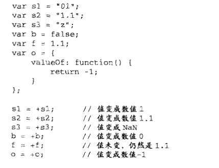
    + `-`主要用于表示负数
    + 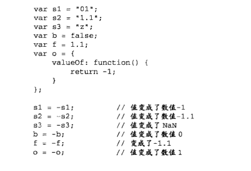
    

## 位操作符

+ 按位非（NOT）
    + 用一个 `~` 表示，执行的结果就是返回数值的反码
    + 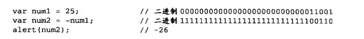
    + 按位非的本质：操作数的负值减 1 
    + ``let a num1 = 25; let num2 = -num1 - 1;  // num2 = -26`` 也能得到同样的结果
    + 虽然以上代码能返回同样的结果，但由于按位非是在数值表示的最底层执行操作，因此速度更快
+ 按位与（AND）
    + 用一个和号字符（&）表示，按位与操作就是将两个数值的每一位对齐，然后根据一下规则，相同位置上的两个操作数执行AND操作
    + 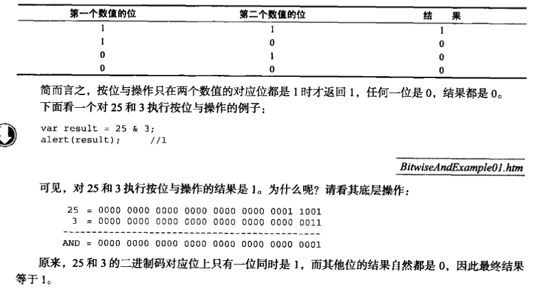
+ 按位异或（XOR）
    + 用一个插入符号（`^`）表示，也有两个操作数
    + 以下是按位异或的真值表
    + 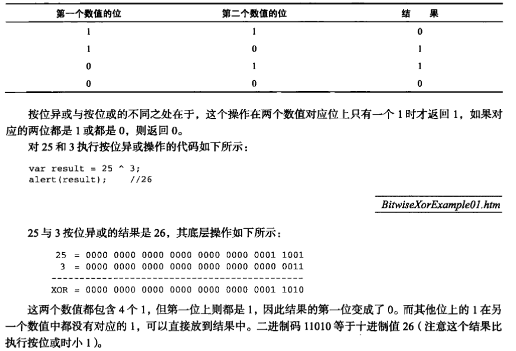
+ 左移
    + 用两个小于号（<<）表示，这个操作符会将数值的所有位向左移动指定的位数。
    + 列如，如果将数值2（二进制码为10）向做移动5位，结果就是64（二进制码为1000000），
    + ```js
        let oldvalue = 2 ;                 //等于二进制的10
        let newvalue = oldvalue << 5 ;     //等于二进制的1000000，十进制的64
        ```
    + 在向左移位后，原数值的右侧多出了5个空位。左移操作会以0来填充这些空位，以便得到的结果是一个完整的32位二进制数
    + 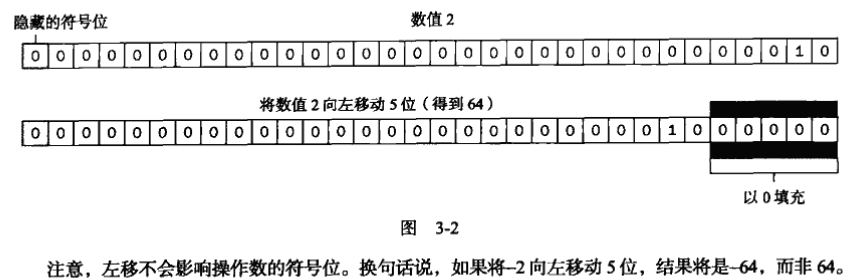
+ 有符号的右移
    + 用两个大于号（>>）表示，这个操作数会将数值向右移动，保留符号位（即正负符号标记）
    + 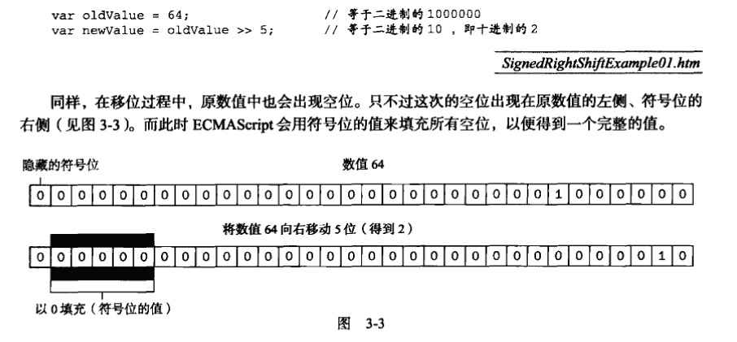
+ 无符号右移
    + 无符号右移用3个大于号表示（>>>），这个操作符会将数值的所有32位都向右移动。对正数来说和和有符号右移是相同的
    + 对负数来说，无符号右移是以0来填充空位，而不是向有符号右移那样以符号位来填充空位
    + 
    
## 布尔操作符
+ 逻辑非（!）
    + 可以应用与任何值，无论这个值是什么数据类型，都会返回一个布尔值，这个操作符会将它的操作数转换成一个布尔值，在求反
    + 规则如下
    + 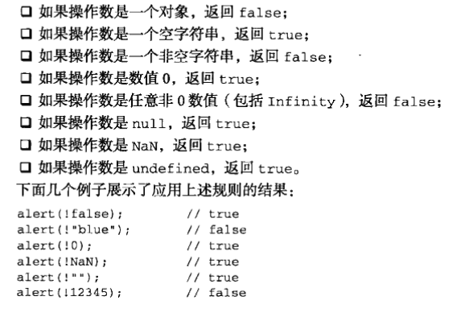
    + 逻辑非也可以用于将一个值转换位与其对应的布尔值，同时使用两个逻辑非操作符，就会模拟 `Boolean()`转型函数的行为
    + 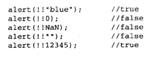
+ 逻辑与（&&）
    + 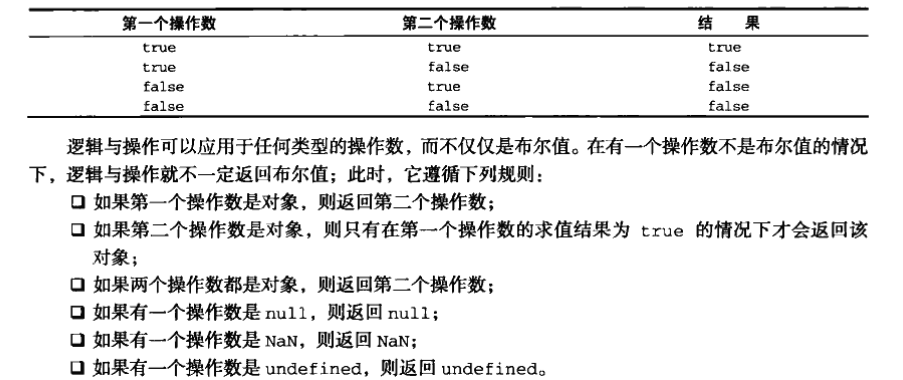
    + 逻辑与属于短路操作，即如果第一个操作数能够决定结果，那么就不会再对第二个操作数求值
    + 对于逻辑与操作而言，如果第个操作数是 `false` 则无论而已个操作数是什么值，结果都不再可能是 `true` 了
    + ```js
        let found = true;
        let result = (found && someUndefinedletiable);  //这里会发生错误
        alert(result);   //这一行不会执行
        ```
    + 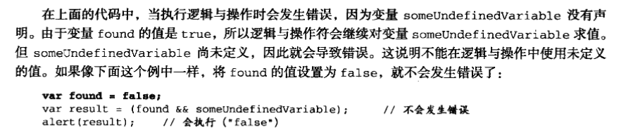
+ 逻辑或（||）
    + 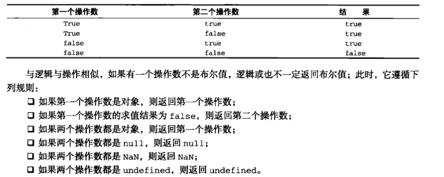
    + 逻辑或也是短路操作符。也就是说，如果第一个操作数的求值位 `true` ，就不会对第二个操作数求值了
    + ```js
        let found = true;
        let result = (found || someUndefinedletiable);  //不会发生错误
        alert(result);  //会执行（true）
        ```
    + 可以利用逻辑或的这一行为来避免变量赋 `null 或 undefined` 值

## 乘性操作符
+ ECMAScript定义了3个乘性操作符：乘法、除法和求模,在操作数为非数值的情况下会执行自动的类型转换
+ 如果参与乘法计算的某个操作数不是数值，后台会先调用 `Number()`转型函数将其转换为数值
+ 乘法（*）
    + 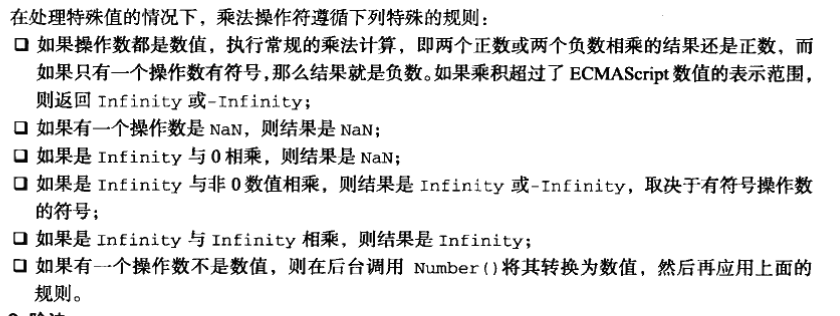
+ 除法（/）
    +  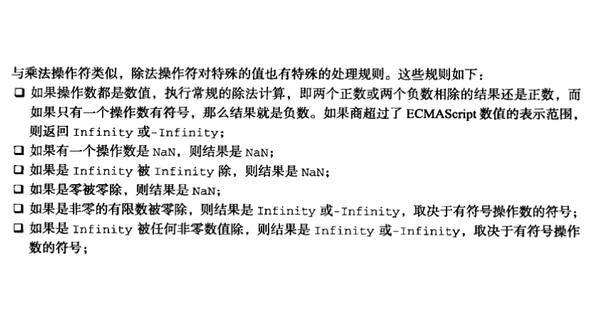
    + 最后一条规则同乘法
+ 求模（%）
    + 余数
    +  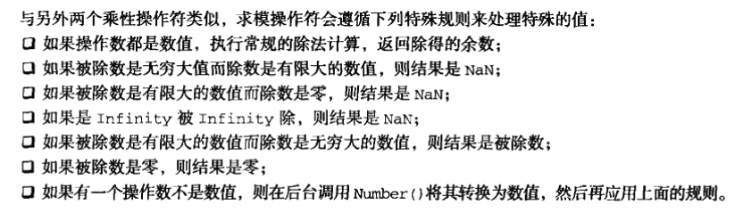
    
## 加性操作符
+ 加法
    +  
+ 减法
    + 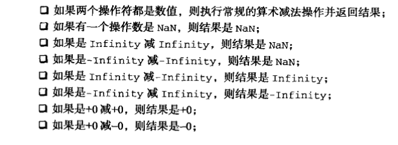
    + 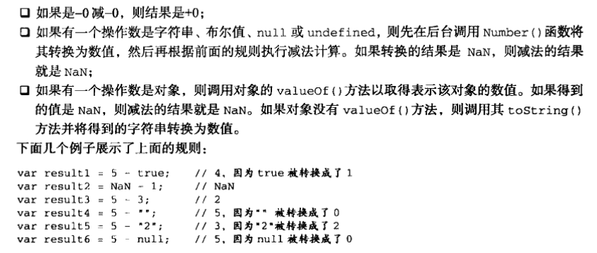

## 关系操作符
+ 小于（<）、大于（>）、小于等于（<=）、大于等于（>=）
+ 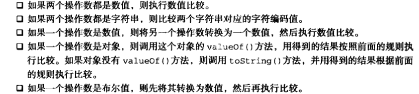

## 相等操作符
+ 相等和不相等 （==） （!=）
    + 先转换在比较
    + 规则
        + 有布尔值则在比较前转换数值
        + 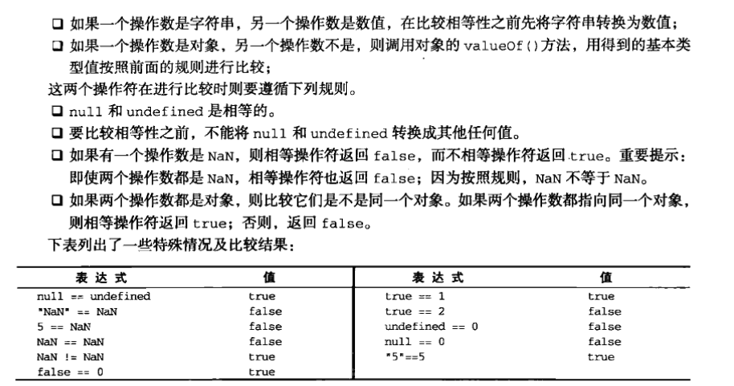
+ 全等和不全等 （===）  （!==）
    + 仅比较而不转换
    
## 赋值操作符 （=）
+ 乘/赋值（*=）
+ 除/赋值（/=）
+ 模/赋值（%=）
+ 加、减、左移、有符号右移、无符号右移

## 逗号操作符
+ 使用逗号除了可以在一条语句执行多个操作外
+ 还能用于赋值 ， 总是会返回表达式中的最后一项
+ `let num = (5, 1 ,4 ,8 ,0);  //num 的值为0`

# 函数
+ 在ECMAScript中函数在定义时不必指定是否返回值
+ 函数在执行完 return 语句后会立刻停止退出 ， 位于之后的代码都不会被执行
+ 严格模式对函数有一些限制
    + 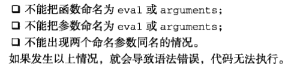

## 理解参数

+ ECMAScript函数不介意传递的参数有多少个，或是什么类型
+ 即便定义的函数只接收两个参数，在调用时未必一定要传两个参数，可以传递一个、三个甚至不传，而不会出现解析错误
+ 因为在ECMAScript中的参数在内部是用一个数组来表示的，函数接收的始终都是这个数组，而不关心数组中包含哪些参数
+ 在函数内部可以通过 `arguments`对象来访问这个数组，从而获取传递给函数的每一个参数
+ `arguments`对象只是与数组类似,并不是`array`的实例,因为可以使用方括号语法访问它的每一个元素,使用`length`属性来确定传进来多少个参数
+ `arguments`可以和命名参数一起使用
  + 值永远同对应的命名参数保持一致
  + 但是对应的内存空间是独立的,并不是同一个内存空间
  + 如果只传入一个参数,`arguments[1]`设置的值并不会反应到命名参数中,因为`arguments`对象的长度是由传入参数个数决定的,不是由定义函数时的命名参数的个数决定的
  + 没有传递值的命名参数将自动被赋予`undefined`值
+ 严格模式对`arguments`对象做出了限制
  + 赋值无效
  + 重写值会导致语法错误

## 没有重载

+ 在两个函数名相同参数不同的情况下并不会有重载
+ 而是后定义的函数覆盖先前定义的函数


# 变量、作用域和内存的问题

## 基本类型和引用类型的值

+ 变量可能包含两种不同数据类型	
  + 基本类型指的是简单的数据段
  + 引用类型指的是那些可能有多个值构成的对象
+ 在将一个值给变量时,解析器必需确定这个值是基本类型值还是引用类型值
  + 基本数据类型`Undefined、Null、Boolean、Number 和 String` 这5中数据类型是按值访问的，因为可以操作保存在变量中的实际值
  + 引用类型的值保存在内存中的对象，js不允许直接访问内存中的位置，也就是说不能直接操作对象的内存空间，在操作对象时，实际上操作的是对象的引用而不是实际的对象，为此，引用类型的值是按引用访问的
+ 动态属性
  +  对于引用类型的值，可以为其添加属性和方法，也可以删除其属性和方法
+ 复制变量值
  + 将一个变量基本类型的值赋值给另一个变量时，两个变量虽然值相同，但是是完全独立的，只是创建了一个副本，这两个变量的任何操作都不会相互影响
  + 当从一个变量向另一个变量赋值引用类型的值时，同样也会将储存在变量对象中的值复制一份放到新变量分配的空间中，不同的是，这个值的副本实际上是一个指针，而指针指向储存在堆中的一个对象，两个变量实际上将引用同一个对象，因此改变其中一个变量，就会影响另一个变量
+ 传递参数
  + js中所有函数的参数都是按值传递的，也就是说把函数外部的值赋值给函数内部的参数，就和把值从一个变量复制到另一个变量一样
  + 证明函数的参数是按值传递的，而不是按引用传递的
  + 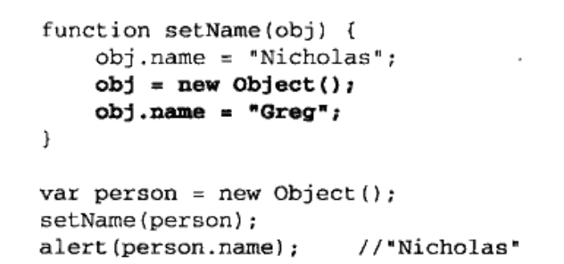
+ 检测类型
  + `typeof` 操作符是确定一个变量是字符串、数值、布尔值，还是`undefined` 的最佳工具
    + 如果变量的值是一个对象或是`null` 则会返回 `"object"`
    + 虽然在检测基本数据类型时很好， 但是在检测引用类型的值时，这个操作符的用处不大
  + `instanceof`操作符
    + `result = letiable instanceof constructor`
    + 如果变量给定引用类型的实例，那么`instanceof`操作符就会返回`true`
    + 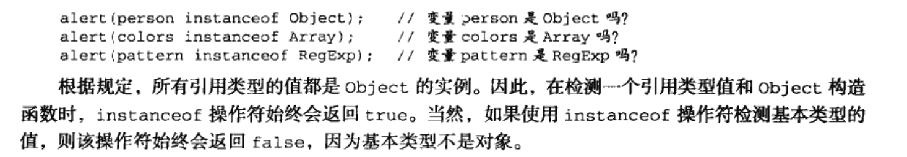

## 执行环境及作用域

+ 执行环境定义了变量或是函数有权访问的其他数据，决定了他们各自的行为，每个执行环境都有一个与之关联的变量对象，环境中定义的所有变量和函数都保存在这个对象中，虽然编写的代码无法访问这个对象，但是解析器在处理数据时会在后台使用它
+ 全局执行环境是最外围的一个执行环境，在Web浏览器中，全局执行环境被认为是`window`对象，因此所有的全局变量和函数都是作为`window`对象的属性和方法创建的。
+ 某个执行环境中的所有代码执行完成后，该环境被销毁，保存在其中的所有变量和函数定义也随之销毁（全局执行环境直到应用程序退出——例如关闭网页或浏览器——时才会被销毁）
+ 每个函数都有自己的执行环境，当执行流进入一个函数时，函数的环境就会被推入一个环境栈中。而在函数执行之后，栈就将其环境弹出，把控制权返回给之前的执行环境
+ 当代码在一个环境中执行时，会创建变量对象的一个作用域链。作用域链的用途，是保证对执行环境有权访问的所有变量和函数的有序访问，作用域链的前端，始终都是当前执行的代码所在环境的变量对象，如果这个环境是函数，则将其活动对象（`activation object`）作为变量对象，活动对象在最开始时只包含一个变量，即`arguments`对象（这个对象在全局环境中是不存在的）。作用域链中的下一个变量对象来至外部作用域，全局执行环境的变量对象始终都是作用域链中的最后一个对象（即作用域的最外层）

+ 延长作用域链
  + 虽然执行环境的类型只有两种——全局和局部（函数），但是还有其他方法来延长作用域链
  + 有些语句可以在作用域链的前端临时增加一个变量对象，该变量会在代码执行后被移除
    + `try-catch 语句的 catch块 `
    + `with`语句
    + 这两个语句都会在作用域链的前端添加一个变量对象对`with`语句来说，会将指定的对象添加到作用域链中。对`catch`语句来说，会创建一个全新的变量对象，其中包含的是被抛出的错误对象的声明
+ ES6前没有块级作用域
  + 也就是`if  或 for `等语句中声明的变量外部也能访问，而不会被销毁
  + 初始化变量没有使用let声明，会自动被添加到全局环境中

## 垃圾搜集

+ js具有自动垃圾收集机制，也就是说，执行环境会负责管理代码执行过程中使用的内存
+ 函数中局部变量的正常生命周期，局部变量只在函数执行的过程中存在，而在这个过程中，会位局部变量在栈或堆内存上分配相应的空间，以便存储它们的值，在函数执行结束后，局部变量也就没有了存在的必要，因此可以释放它们的内存以供将来使用，这种情况下很容易判断变量是否还有存在必要，但并非所有情况度这么容易，垃圾收集必须跟踪哪个变量有用哪个没用，对不再有用的变量打上标记，以备将来收回其占用内存

+ 标记清除
  + js中最常用的垃圾收集方式就是标记清除，当变量进入环境时（例如在函数中声明一个变量时），就将这个变量标记位“进入环境”。从逻辑上将，永远不能释放进入环境的变量所占用的内存，当变量离开环境时，则将其标记位“离开环境”
  + 垃圾收集在运行时会给储存在内存中的所有变量都加上标记，然后会清楚掉环境中的变量以及被环境中的变量引用的变量的标记，之后再被加上标记的变量将被视为准备删除的变量，最后垃圾收集完成内存清除工作，销毁那些带标记的值并回收它们所占用的内存空间
+ 引用计数（垃圾收集策略之一）
+ 性能问题（垃圾收集的触发条件会影响性能）
+ 管理内存
  + 确保占用最少的内存可以让页面获得更好的性能
  + 而优化内存在最佳方式，就是为执行中的代码只保存必要的数据，一旦有数据不再有用，最好通过将其值设置为`null`来释放其引用——这个做法叫做解除引用
  + 解除引用的真正作用是让值脱离执行环境，以便垃圾收集器下次运行时将其回收

## 小结

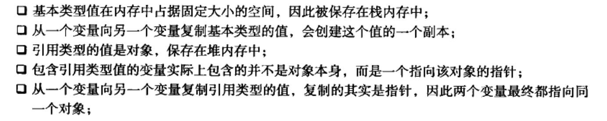

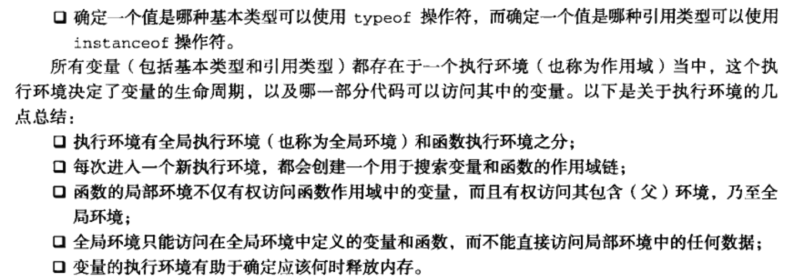

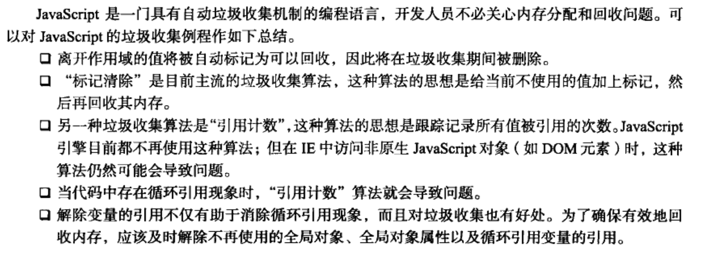


# 引用类型
## object类型
+ 创建方法
    + `let person = new Object();`  使用new关键字   Object的构造函数
    + `let person = { };`       使用对象字面量
        + 括号里不写属性方法，可以定义包含默认属性和方法的对象
        + 在使用字面量创建时不会调用object构造函数
        
## Array
+ ECMAScript中数组是动态可调的，可以随着数据的添加自动增长以容纳新增数据
+ 创建方法
    + `let colors = new Array()`  也可省略new关键字
    + `let colors = ["red","blue","green"]` 使用数组字面量表示法
        + 在使用字面量创建时不会调用Array构造函数
+ 特点
    + 使用超过数组长度的索引时数组会自动增加到对应的长度
    + length属性不是只读的，可以向数组末尾移除向或添加新项
        + `arr.length = 4;` 设置数组的长度会把多的项删除，少的话就会新增空项undefined值
    + 数组最多可以包含4294967295个项
+ 检测数组
    + 对于一个网页或者一个全局作用域， `instanceof`操作符就能得到结果
        + 但对于2个或以上，因为存在不同版本的Array构造函数就得不到想要的结果
    + ES5 提供了 `Array.isArray()`方法检测某个值到底是不是数组，而不管是在那个全局环境创建的
        + `Array.isArray(value)`
+ 转化方法
    + 所有对象都具有 `toLocaleString()、toString()、valueOf()`方法
        + 数组的 `toString()`方法会返回由数组中每个值的字符串拼接而成的一个以逗号分隔的字符串
        + `valueOf()` 方法返回的还是数组
        + `toLocaleString()`方法返回类似
        + `join( " | " )` 方法可以设置分隔符
+ 栈方法
    + ECMAScript为数组提供了 `push() 和 pop()`方法
    + 栈的访问规则是LIFO(Last-In-First-Out,后进先出)的数据结构，也就是最新添加的项最早被移除
    + 栈中项的插入（叫做推入）和移除（叫做弹出），只发生在一个位置——栈的顶部
    + `push()` 可以接受任意数量的参数，把他们添加到数组结尾，并返回修改后数组的长度
    + `pop()` 方法则从数组末尾移除最后一项，减少数组的length值，返回返回移除的项
+ 队列方法
    + 队列的数据结构访问规则是FIFO(First-In-First-Out,先进先出)。队列在列表的末端添加项，从列表的前端移除项
    + `push()`方法还是完成添加的工作
    + `shift()` 方法移除数组的第一个项并返回该项
    + `unshift()` 方法能在数组前端添加任意个项并返回数组长度。
    + 同时使用`unshift() 和 pop()` 方法可以从相反的方向来模拟队列
+ 重排序方法
    + `reverse() 和 sort()`
      
        + `reverse()`可以反转数组项的顺序
        
        + `sort()` 方法按升序排列数组项——即最小的值位于最前面,最大值排在后面
          
            + ```js
                升序排列
                arr.sort(function(a,b){return a - b});
                降序排列
                arr.sort(function(a,b){return b - a});
                ```
                
                
                
            + `sort()` 方法会调用每个数组项的 `toString()`转型方法，然后比较得到的字符串，即使数组的每一项都是数值，该方法比较的也是字符串
            
            + 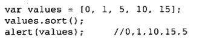
            
            + 因此`sort()`方法可以接受一个比较函数作为参数
            
            + 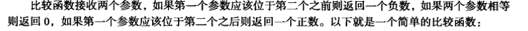
            
            + 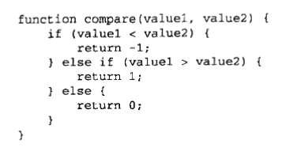
            
            + 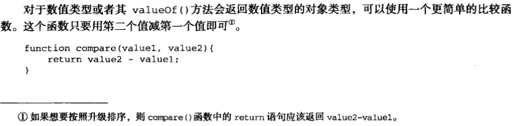
+ 操作方法
    + `concat()` 方法在数组的基础上创建一个副本，
        + 连接一个或多个数组
        + 如果传递参数，就会将参数加在数组末尾，不影响原数组
    + `slice()`方法数组截取，数组位数同样从0开始计数
        + 不会修改原数组
        + 一个参数，返回起始位置到数组末尾的项组成新的数组
        + 两个参数，返回起始位置到结束位置**前**的项
        + `arr.slice(1,4);` 截取1到4位，但不包括4，也就是说返回1-3；
    + `splice()`方法
        + 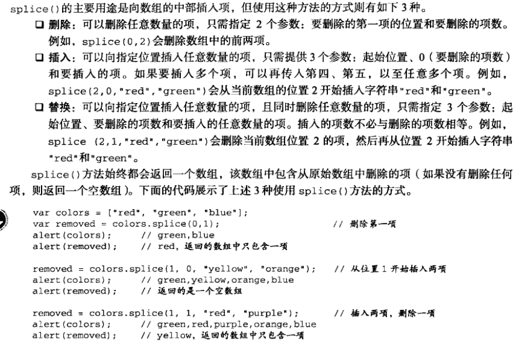
+ 位置方法
    + ES5 为数组实例添加了两个位置方法：`indexOf()`和 `lastIndexOf()`
        + 两个方法都接收两个参数：要查找的项和（可选的）查找的起点位置
+ 迭代方法
    + 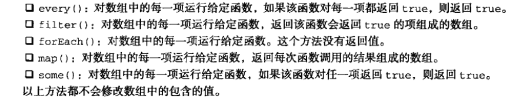
    + `array.forEach(function(item,index,array){ });`
+ 缩小方法
    + ES5 中新增了两个缩小数组的方法： `reduce()`和 `reduceRight()`.这两个方法都会迭代数组的所有项
    + 一个从头开始迭代，一个从末尾开始迭代
    + 都接收4个参数：前一个值，当前值，项的索引，和数组对象
    + 第一次的前一个值为索引0的值   当前值为索引 1 的值
    + 往后的迭代前一个值为上次的返回值,如无返则为`undefined`
    + 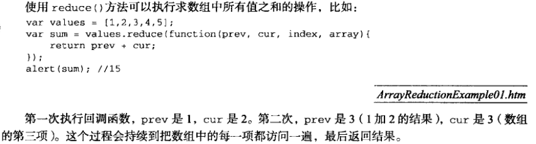
    
## Date类型
+ Date类型使用UTC 1970年1月1日午夜（零时）开始经过的毫秒数来保存日期
+ Date类型保存的日期能精确到1970年1月1日之前或之后的285616年
+ `let now = new Date()`
+ `Date.parse()`接受表示日期的字符串,如果字符串不能表示日期则返回`NaN`
  + `let someDate = new Date(Date.parse("2015-5-5"))`
  + 直接像`Date()`构造函数传递参数,也会在后台调用`Date.parse()`方法
+ `Date.UTC()` 方法同样返回毫秒数,但是月份、每月中的日期、小时数都是从0开始计数
  + 同样的`2015-5-5` 用`Date.UTC`表示为`new Date(2015,4,4)` 小时分秒都用逗号隔开向后输入
+ `Date.now()`返回调用这个方法时的日期时间的毫秒数
  + 可以在脚本运行时取一次，脚本结束时取一次，相减就可以得出脚本的运行消耗时间

### 继承的方法

+ 与其他引用类型一样，Date类型也重写了`toLocaleString()、toString()和valueOf()`方法
  + `toLocaleString()` 方法会按照与浏览器设置的地区相适应的格式返回日期和时间
  + `toString()` 方法通常返回带有时区信息的日期和时间
  + `valueOf()` 返回日期的毫秒表示，因此可以方便使用比较操作符来比较日期值

### 日期格式化

+ 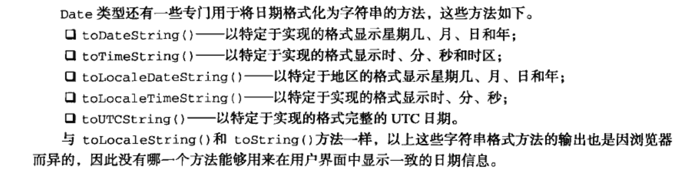

### 日期/时间组件方法

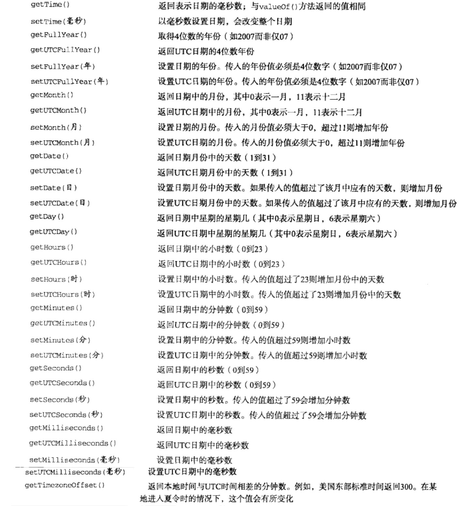

## Reg Exp 类型

+ ECMAScript 通过 RegExp类型来支持正则表达式
  + `let expression = / pattern / flags;`
  + 每个正则表达式都可带有一个或多个标指（`flags`）
    + 表达式的匹配支持下列3个标指
    + g : 表示全局（global）模式，即模式将被应用于所有字符串，而非在发现第一个匹配项时立刻停止
    + i : 表示不区分大小写（case-insensitive）模式
    + m : 表示多行（multiline）模式 ， 即在到达一行文本末尾时还会继续查找下一行中是否存在于模式匹配的项
  + `let pattern1 = /at/g;`  匹配字符串中所有“at”的实例
  + `let pattern2 = /[bc]at/i;`  匹配第一个“bat”或"cat"，不区分大小写
  + `let pattern3 = /.at/gi;`   匹配所有以“at”结尾的3个字符的组合，不区分大小写
  + 与其他语言中的正则表达式类似，模式中使用的所有元字符都必须转义，元字符包括：
  + `( [ { \ ^ $ | ) ? * + . ] }`
  + 如果想匹配字符串中包含的这些字符，就必需对它们进行转义
  + `let pattern2 = /\[bc\]at/i;` 匹配第一个“[bc]at”,不区分大小写
  + `let pattern3 = /\.at/gi;` 匹配所有以“.at”，不区分大小写
+ 以RegExp构造函数创建正则表达式，它接受两个参数，一个是要匹配的字符串模式，另一个是可选的标志字符串
  + `let pattern2 = new RegExp("[bc]at","i");` 因为参数是字符串，所以在转义元字符时需要双重转义
  + 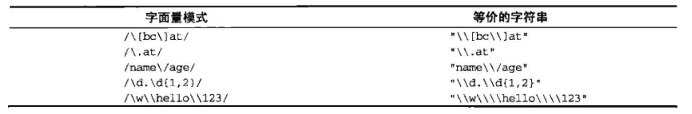

### RegExp实例属性

+ 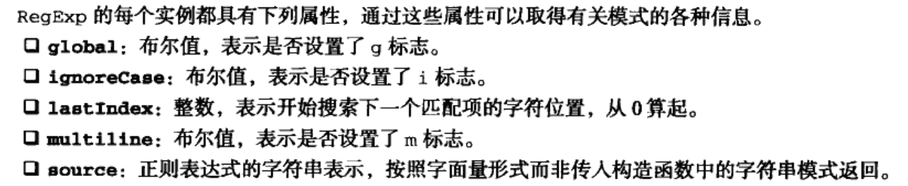

### RegExp 实例方法

+ RegExp对象的主要方法是`exec()`   返回匹配到的字符
+ 正则表达式的第二个方法是`test()` 接受一个字符串参数
  + 在模式与参数匹配的情况下返回`true` 否则就返回 `false`
+ RegExp实例继承的`toLocaleString() 和 toString()` 方法都会返回正则表达式的字面量，与创建的方式无关
+ search() 方法使用表达式来搜索匹配，然后返回匹配的位置。
+ replace() 方法返回模式被替换处修改后的字符串。
+ search() 方法也接受字符串作为搜索参数。
+ match()  找到一个或多个正则表达式的匹配。
+ split()   把字符串分割为字符串数组。

### RegExp 构造函数属性

### 模式的局限性

+ 不支持的特性：
  + 匹配字符串开始和结尾的\A 和\Z 但是支持以插入符号（^）和美元符号（$)来匹配字符串的开始和结尾
  + 向后查找（lookbehind） 但支持向前查找（lookahead）
  + 并集和交集类
  + 原子组（atomic grouping）
  + Unicode 支持 （单个支付除外，如\uFFFF）
  + 命名的捕获组   但支持编号的捕获组
  + S(single, 单行) 和 x(free-spacing,无间隔) 匹配模式
  + 条件匹配
  + 正则表达式注释


## Function类型
+ 每个函数都是Function类型的实例，和其他引用类型一样都具有属性和方法
+ 由于函数是对象，因此函数名实际上也是一个指向函数对象的指针
+ 通过函数表达式生命函数，要像声明变量一样以分号结尾  `let func = function(){};`
+ 函数声明，还能通过`Function`的构造函数声明  但是不推荐
  + `let func = new Function("num1","num2","return num1 + num2");`
+ 没有重载，同名函数会被覆盖，相当于给变量函数名重新赋值

### 函数声明与函数表达式
+ 函数声明会提升
+ 函数表达式不会

### 作为值的函数
+ 因为ECMAScript中的函数名本身就是变量，所以函数也可以作为值来使用，
  + 不仅可以将函数作为参数传递，还能作为返回结果

### 函数内部属性
+ 函数内部有两个特殊对象： `arguments 和 this`
  + `arguments` 是一个类数组对象，里面包含传入函数的参数
    + 对象还有一个callee的属性，是一个指针，指向拥有这个`arguments`对象的函数
    + 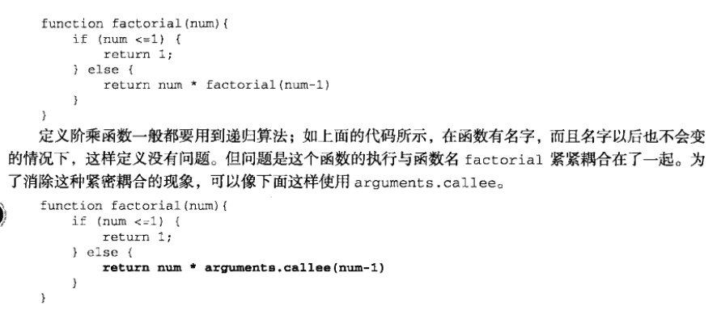
    + 这样做可以使无论引用函数时使用的什么名字，都可以完成递归操作
  + `this` 引用的是函数-据以执行的环境对象，——this的值（当在网页的全局作用域中调用函数this对象引用的就是window）
    + 函数调用位置的环境对象
    + 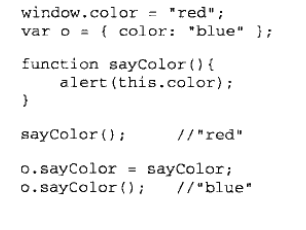
    + 因为函数名仅仅是一个指针，所以尽管如此调用，仍然用的是同一个函数
+ ES5 规范的函数对象属性： caller  保存着调用当前函数的函数的引用，在全局作用域中调用当前函数，他的值为null

### 函数属性和方法
+ 每个函数都包含两个属性： `length 和 prototype`
  + `length` 表示希望接收的命名参数的个数  `function sum(sum1,sum2){}   // sum.length  的值为2`
  + `prototype` 属性对于ES中的引用类型而言，是保存他们所有实例方法的真正所在
    + 该属性不可枚举的  ， 因此无法使用 for-in 发现
  + 每个函数都包含两个非继承而来的方法：`apply()  和  call()`
    + 这两个方法的用途都是在特定的作用域中调用函数，实际上等于设置函数体内this对象的值
    + `apply()` 方法接收两个参数：一个是在其中运行函数的作用域，另一个是参数数组，可以是`Array`的实例也可以是`arguments`对象
    + 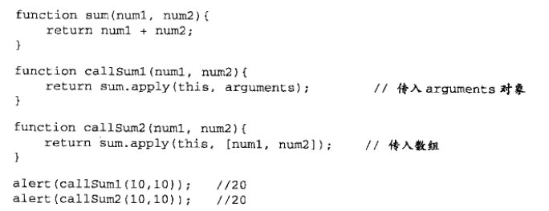
    + 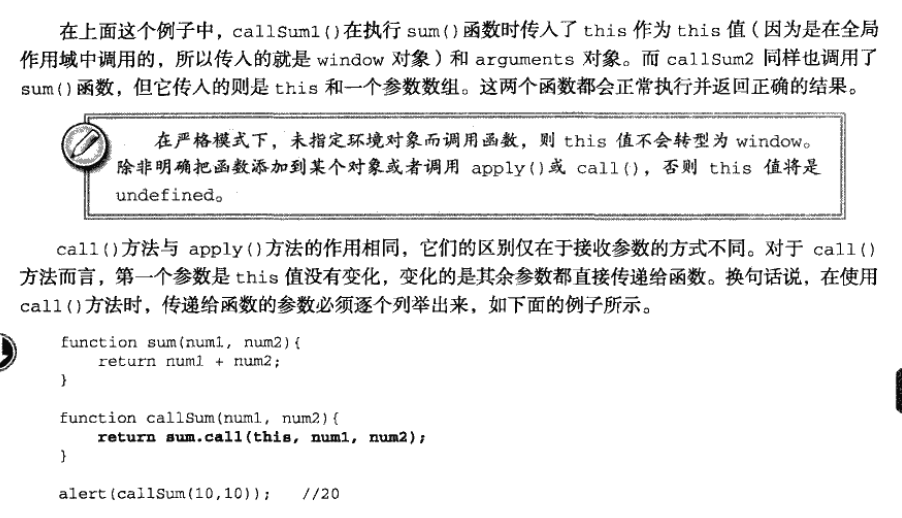
    + 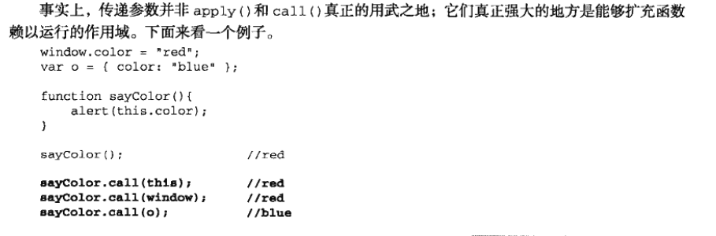
    + 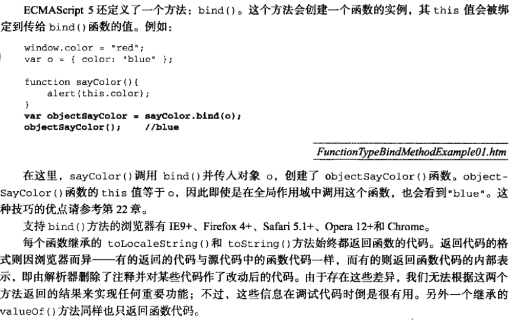

## 基本包装类型
+ 特殊的引用类型：`Boolean、Number、String`
  + 每读取一个基本类型值的时候，后台就创建一个对应的基本类型的包装类型的对象，从而能够调用一些方法来操作这些数据
  + ```js
    let s1 = "some text";
    let s2 = "s1.substring(2)"
    /*在第二行访问s1时，是一种读取模式，也就是从内存中读取这个字符串的值，在读取模式访问字符串是，后台都会自动完成下列读取模式
    * 1.创建String类型的一个实例；
    * 2.在实例上调用指定方法
    * 3.销毁这个实例
    * let s1 = new String("some text");
    * let s2 = s1.substring(2);
    * s1 = null;
    * 以上三个步骤也适用与 Boolean 和 Number 类型对应的数字值和布尔值
    */
    ```
+ 引用类型和基本包装类型的主要区别就是生存期
  + 使用new操作符创建的引用类型的实例，在执行流离开当前作用域之前都一直保存在内存中
  + 而基本包装类型只存在于一行代码执行的瞬间，然后立即被销毁，  不能在运行时为基本类型添加属性和方法， 因为就算添加，也会在添加完后被立即销毁
+ 

### Boolean 类型
+ 不建议使用
### Number 类型
+ 数值格式化字符串方法`let num = 10; num.toFixed(2); //"10.00" ` 转化为有两位小数的字符串，  小数位多时能自动舍入
+ 格式化数值的方法： `toExponential()`,(e表示法，或科学计数)
+ 自动确认格式： `toPrecision()` 方法
+ 同样不建议使用
### String 类型
+ String类型的实例，都有一个length属性，表示字符串中包含多少个字符
+ 字符方法
  + 访问字符串中特定字符的方法：`charAt() 和 charCodeAt()` 都接收一个参数
    + `charAt(0)` 返回指定位置的那个字符
    + `charCodeAt(0)` 返回指定位置字符的字符编码
+ 字符串操作方法
  + `concat()` 用于将一个或多个字符串拼接起来，返回新字符串
    + `let str = "hello ";   let result = str.concat("world","!");`
  + `slice() 、 substr() 、 substring()` 第一个参数都是起始位置    返回新字符串    没传第二个参数默认到字符串末尾
    + slice() 截取 第二个参数  结束位置
    + substring() 同上
    + substr()  第二个参数   截取长度
    + 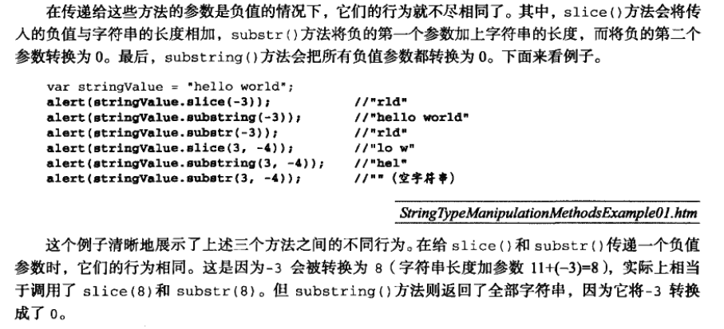
+ 字符串位置方法
  + `indexOf() 和 lastIndexOf()`  查找指定字符串，返回索引位置，没找到返回`-1`
    + 都接收可以接收2个参数，开始查找位置，查找字符
    + 找到第一个目标后就会返回
+ `trim()` 方法
  + 创建以个字符串副本，删除前置及后缀的所有空格
+ 字符串大小写转换
  + `toLowerCase()`         小写
  + `toLocaleLowerCase()`   针对特定地区实现
  + `toUpperCase()`         大写
  + `toLocaleUpperCase()`   针对特定地区实现
+ 字符串的模式匹配方法
  + `match()` 本质上与RegExp的exec()方法相同
  + `search()` 参数正则表达式，同match一样， 没查找到就返回-1， 找到则返回第一次匹配出现的位置
  + `replace()` 替换子字符串；两个参数，第一个参数是正则或是一个字符串，（这个字符串不会被转换成正则），第二个参数可以是一个字符串或是一个函数，，想替换全局，只能用正则而且需要指定全局（g）标志
+ `localeCompare()` 方法
  + 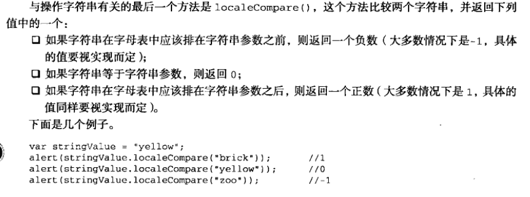
+ `fromCharCode()` 方法
  + 接收一个或多个字符编码，转换为一个字符串

## 单体内置对象
### Global对象
+ URI 编码方法
+ `eval()` 方法
  + 接收一个参数： 要执行的js代码字符串
  + `eval("alert('hi')");`
+ Global 对象的属性
  + 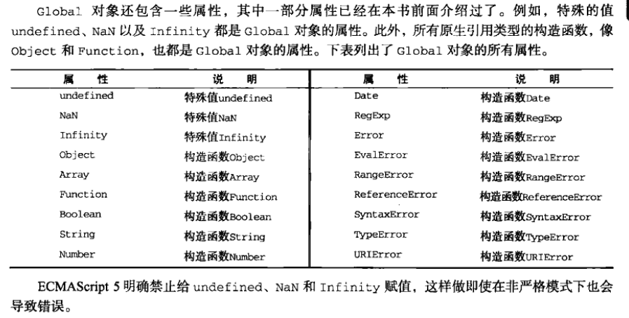
+ window 对象
### Math 对象
+ Math对象的属性
  
  + 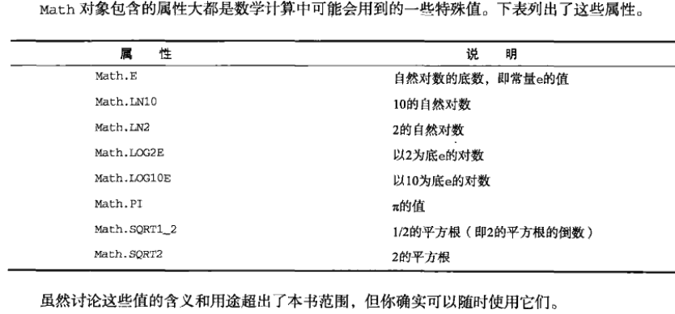
+ `min() 和 max()` 方法
  
  + 取出一组数值的最大值或最小值
+ 舍入方法

  + `Math.ceil() 、Math.floor() 、 Math.round()`
  + `Math.ceil()` 向上舍入
  + `Math.floor()` 向下舍入
  + `Math.round()` 四舍五入

+ `random()` 方法

  + 返回介于0和1之间一个随机数，不包括0和1
  + 随机值 `值 = Math.floor(Math.random() * 可能的值总数 + 第一个可能的值);`
  + `值 = Math.floor(Math.random() * 96 + 5);` 取5到100的数
  + 封装
  ```js
    function selextFrom(lowerValue,upperVlaue){
      let choices = upperValue - lowerValue + 1;
      return Math,floor(Math.random() * choices + lowerValue);
    }
  ```
+ 其他方法
  
  + 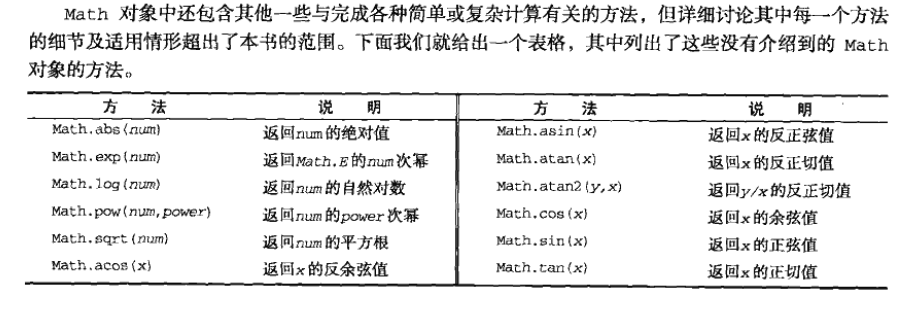

# 面向对象的程序设计

+ 理解对象
+ 属性类型 ES5
  + 数据属性
  + 访问器属性
  + 读取属性特性

## 创建对象

### 工厂模式（设计模式）
### 构造函数模式 构造函数名始终都应该第一个字母大写，而其他函数则小写
  + 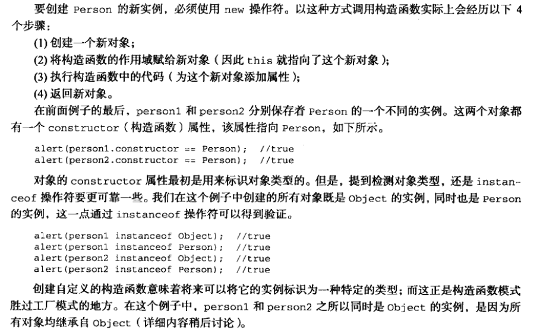
  + 将构造函数当作函数
    + 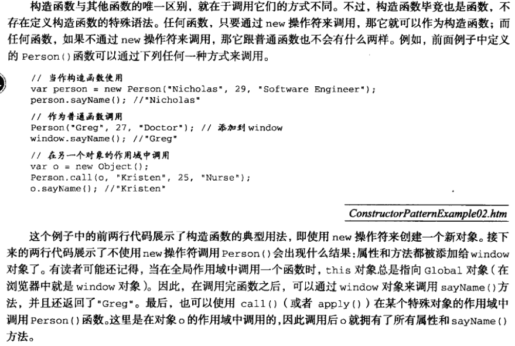
  + 构造函数的问题
    + 同一个构造函数的两个实例，两个实例继承到的同一个方法并不是同一个Function的实例
    + 因为js中函数是对象，每定义一个函数都是实例化了一个对象
    + 因此在构造函数内定义方法反而浪费，还不如定义在外面，然后赋值给函数内的属性，这样会出现新问题，会定义多个全局函数然后由对象来调用，导致自定义的引用类型没有封装性可言了
    + 但是这样还是有问题，可以用原型的方式来解决

### 原型模式

+ 每一个函数都有 `prototype(原型)属性`，这个属性是一个指针，指向一个对象，而这个对象的用途就是包含可以由特定类型的所有实例共享的属性和方法

+ `function Person(){}     Person.prototype = { constructor:Person，  name:"name"}`
  
  + 重写`constructor`属性是因为这样构建相当于重新创建了构造函数的`prototype`原型对象，默认自动获取的`constructor`属性指向的构造函数也变成了指向`Object`构造函数，所以需要重新给`constructor`属性赋值为，原来的构造函数
  
+ 理解原型对象

  + 每创建一个新函数，就会为该函数创建一个 `prototype`属性，指向函数的原型对象，所有原型对象都会获取一个 `constructor` （构造函数）属性，这个属性包含一个指向 `prototype` 属性所在函数的指针
  + 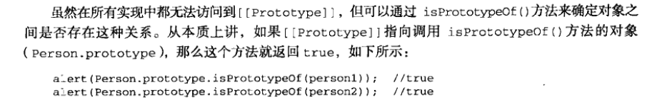
  + 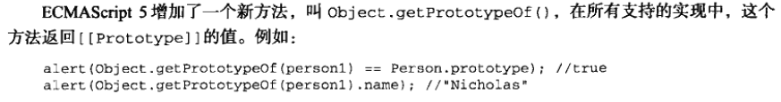
  + `delete` 操作符可以删除实例属性，使实例可以重新访问原型中的属性
  + `hasOwnProperty()` 方法可以检测属性是存在于实例中，还是存在于原型中，这个方法（继承自Object）只在给定属性存在于对象实例中时才会返回true
  
+ 原型与 in 操作符

  + 两种使用方式：单独使用和在for-in循环中使用，in操作符会在通过对象能够访问给定属性时返回true
  + 通过`hasOwnProperty() 方法和 in 操作符` 就可以确定该属性到底是存在于对象中，还是存在于原型中
  + ```js
    function hasPrototypeProperty(object, name){
      return !object.hasOwnProperty(name) && (name in object);
    }
    ```
  + `for-in`循环返回所有能够通过对象访问的、可枚举的属性
  
+ 原型的动态性 

  + 在原型中查找值的过程是一次搜索,因此对原型所做的任何修改都能立刻从实例上反映出来——即便式是先创建了实例后修改也照样如此
  + 重写整个原型对象除外，重写原型对象应该在声明后立刻重写

+ 原生对象的原型

  + 原型模式的重要性不仅体现在创建自定义类型方面，就连所有原生的引用类型，都是采用这种模式创建的
  + 所有原生引用类型（Object、Array、String,等等）都在在其构造函数的原型上定义了方法。
  + `Array.prototype`中可以找到`sort()`方法
  + `alert(typeof Array.prototype.sort);  //"function" `  
  + 通过原生对象的原型，不仅可以获取所有默认方法的引用，而且也可以定义新方法，可以像修改自定义对象的原型一样修改原生对象的原型，因此可以随时添加方法

+ 原型对象的问题

  + 缺点：
  + 省略了为构造函数传递初始化参数这一环节，结果所有实例在默认情况下都将取得相同的属性值。
  + 所有实例修改属性的值会共享，修改一个实例继承的原型属性，所有实例继承的原型属性都会改变

### 组合使用构造函数模式和原型模式

+ 创建自定义类最常见的方式，就是组合使用构造函数模式和原型模式，构造函数模式用于定义实例属性，原型模式用于定义方法和共享属性，结果每个实例都会有自己的一份实例属性的副本，但同时又共享着对方法的引用，最大限度地节省了内存
+ ```js
  function Person(name, age, job){
    this.name = name;
    this.age = age;
    this.job = job;
    this.friends = ["shelby", "Court"];
  }

  Person.prototype = {
    constructor : Person,
    sayName : function(){
      alert(this.name);
    }
  }

  let person1 = new Person("Nicholas", 29, "Software Engineer");
  let person2 = new Person("Greg", 27, "Doctor");
  person1.friends.push("Van");
  alert(person1.friends);       //"Shelby,Count,Van"
  alert(person2.friends);       //"Shelby,Count"
  alert(person1.friends === person2.friends);       //false
  alert(person1.sayName === person2.sayName);       //true

  //这中方法使属性不共用，但方法公用，还能传入参数
  ```

### 动态原型模式
+ 通过检查某个应该存在的方法是否有效，来决定是否需要初始化
+ ```js
  function Person(name, age, job){
    //属性
    this.name = name;
    this.age = age;
    this.job = job;
    //方法
    if(typeof this.sayName != "function"){
      person.prototype.sayName = function(){
        alert(this.name);
      };
    }
  }
  let friend = new Person("Nicholas", 29, "Software Engineer");
  friend.sayName();

  //对于采用这种方式创建的对象，还可以用 instanceof 操作符确定它 类型
  ```
### 寄生构造函数模式

+ 这种模式的基本思想是创建一个函数，该函数的作用仅仅是封装创建对象的代码，然后再返回新创建的对象
+ ```js
  function Person(name, age, job){
    let o = new Object();
    o.name = name;
    o.age = age;
    o.job = job;
    o.sayName = function(){
      alert(this.name);
    };
    return o;
  }
  let friend = new Person("Nicholas" 29, "Software Engineer");
  friend.sayName();   //Nicholas

  /*这个模式可以在特殊的情况下用来对对象创建构造函数。
  * 假设要创建一个具有额外方法的特殊数组。
  * 由于不能直接修改Array构造函数，因此可以使用这个模式
  */
  function SpecialArray(){
    //创建数组
    let values = new Array();
    values.push.apply(values, arguments);

    //添加方法
    values.toPipedString = function(){
      return this.join("|");
    };

    //返回数组
    return values;
  }

  let colors = new SpecialArray("red", "blue", "green");
  alert(colors.toPipedString());    //"red|bule|green"
  alert(colors instanceof SpecialArray);
  ```
+ 这种模式返回的对象与构造函数或者构造函数的原型属性之间没有关系 ， 也就是说构造函数返回的对象与在构造函数外部创建的对象没有什么不同，
+ 所以不能依赖 `instanceof` 操作符来确定对象类型

### 稳妥构造函数模式

+ 指的是没有公共属性， 而且其方法也不引用`this`的对象
  
  + 适合在安全环境中（这些环境会禁止使用 `this` 和 `new`），或者在防止数据被其他应用程序改动时使用，
+ 该模式和寄生构造函数类似，但有两点不同
  + 一是新创建对象的实例方法不引用`this`
  + 二是不使用`new`操作符调用构造函数
+ ```js
  function Person(name, age, job){
    //创建要返回的对象
    let o = new Object();
    //可以在这里定义私有变量和函数

    //添加方法
    o.sayName = function (){
      alert(name);
    };

    //返回对象
    return o;
  }

  let friend = Person("Nicholas", 29, "Software Engineer");
  friend.sayName();   //Nicholas
  ```

## 继承

### 原型链

+ 原型链作为实现继承的主要方法。基本思想是利用原型让一个引用类型继承另一个引用类型的属性和方法
+ 每个构造函数都有一个原型对象，原型对象中都包含一个指向构造函数的指针，每一个实例都包含一个指向原型对象的内部指针
```js
  function SuperType(){
    this.property = true;
  }
  SuperType.prototype.getSuperValue = function(){
    return this.property;
  }

  function SubType(){
    this.subproperty = false;
  }

  //继承了 SuperType
  SubType.prototype = new SuperType();

  SubType.prototype.getSubValue = function(){
    return this.subproperty;
  }

  let instance = new SubType();
  alert(instance.getSuperValue());  //true

  /*以上代码定义了两个类型：SuperType 和 SubType，
  * 实现的本质是重写了原型对象，代之以一个新类型的实例
  * SubType原型对象的内部构造函数（consrtuctor）指针也发生了变化  原因是原型被重写了
  * instance.consrtuctor 现在指向 SuperType
  */
  通过实现原型链，原型搜索机制，当以读取模式访问一个实例属性时，会首先在实例中搜索该属性
  ，如果没找到，则会继续搜索实例的原型，在通过原型链实现继承的情况下，搜索过程就得以沿着
  原型链继续向上搜索。
  上面的例子 调用 instance.getSuperValue() 会历经三个搜索步骤：
  1.搜索实例
  2.搜索 SubType.prototype
  3.搜索 SuperType.prototype 最后一步才会找到该方法
  在找不到的情况，搜索过程要一环一环的前行到原型链末端才会停下来
```
+ 别忘记默认的原型
    + 所有的引用类型默认都继承了`Object`，而这个继承也是通过原型链实现的， 所有函数的默认原型都是`Object`，
    + 因此默认原型都会有一个内部指针指向 `Object.prototype` 这也是所有自定义类型都会继承`toString() 、 valueOf()`等默认方法的原因
    + 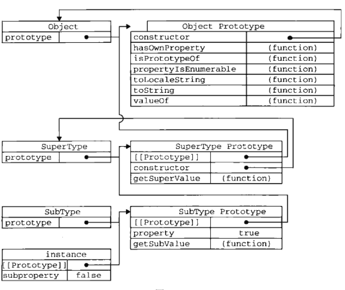
    + 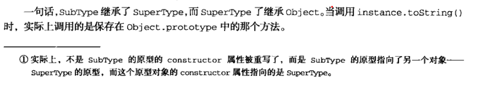

+ 确定原型和实例的关系
    + 这两种方法来确认原型和实例之间的关系 
    + `instanceof`
        + `instance instanceof Object   // true`
    + `isPrototypeOf()`
        + `Object.prototype.isprototypeOf(insrance)  //true`

+ 谨慎地定义方法
    + 在实例替换原型之后再定义方法
    + 在实现继承时不能使用对象字面量创建原型方法
    + ```js
        //继承
        SubType.prototype = new SuperType();
        //再次使用对象字面量添加新方法，  会使继承无效
        SubType.prototype = {
          getSubValue : function() {
              return this.subproperty;
          }
        }
        ```

+ 原型链的问题
    + 继承后的属性共享问题，
    + 在创建子类型的实例时，不能向超类型的构造函数中传递参数，实际上应该说是没有办法在不影响所有对象实例的情况下，给超类型的构造函数传递参数。
    + 所以基本上不会单独使用原型链
    
### 借用构造函数

+ 在子类型构造函数的内部调用超类型构造函数，通过 `apply() 和 call()` 方法
+ ```js
   function SuperType() {
       this.colors = ["red", "blue", "green"];
     }
     function SubType() {
       //继承
       SuperType.call(this);
     }
   
     let instance1 = new SubType();
     instance1.colors.push("black");
     alert(instance1.colors);      // "red,blue,green,black"
     let instance2 = new SubType();
     alert(instance2.colors);      //"red,blue,green"
     
     //解决了属性共享的问题
   ```
+ 传递参数
    + ```js
        function SuperType(name) {
         this.name = name;
        }
        function SubType() {
         //继承
          SuperType.call(this,"Nicholas");
          this.age = 29;
        }
        
        let instance = new SubType();
        alert(instance.name);      // "Nicholas"
        alert(instance.age);      //29
        
        //为了确保子类型的属性不被重写，可以在调用超类型构造函数后，在添加子类型的属性
        ```
        
### 组合继承

+ 也叫做伪经典继承
+ 指的是将原型链和借用构造函数的技术组合到一起，从而发挥二者之长的一种继承模式。
+ 使用原型链实现对原型属性和方法的继承，而又借用构造函数来实现对实例属性的继承
+ 这样，即通过在原型上定义方法实现了函数复用，有能够保证每个实例都有它自己的属性
+ ```js
    function SuperType(name){
      this.name = name;
      this.colors = ["red", "blue", "green"];
    }
    
    SuperType.prototype.sayName = function() {
      alert(this.name);
    };
    function SubType(name, age) {
      SuperType.call(this,name);            //第二次调用SuperType()
      this.age = age;  
    }
    SubType.prototype = new SuperType();    //第一次调用SuperType()
    SubType.prototype.sayAge = function() {
      alert(this.age);
    }
    
    let instance1 = new SubType("Nicholas", 29);
    instance1.colors.push("black");
    alert(instance1.colors);      //"red,blue,green,black"
    instance1.sayName();      //"Nicholas"
    instance1.sayAge();       //29
    
    let instance2 = new SubType("Greg", 27);
    alert(instance2.colors);       //"red,blue,green"
    instance2.sayName();      //"Greg"
    instance2.sayAge();       //27
    ```
+ 组合继承最大的问题就是无论什么情况下,都会调用两次超类型构造函数:
  + 一次是在创建子类型原型的时候,一次是在子类型构造函数内部
  + 子类型最终会包含超类型的全部实例属性,但我们不得不在调用子类型构造函数时重写这些属性
  + 两次的调用使SubType有了两组一样的属性,一组的实例上,一组在SubType原型中
    

### 原型式继承

+ ```js
    function object(o) {
      function F(){}
      F.prototype = o;
      return new F();
    }
      /* 在函数内部创建一个临时的构造函数，然后将传入的对象作为这个构造函数的原型，
       * 最后返回这个临时类型的一个新实例，从本质上讲object()对传入其中的对象执行了一次浅复制
       */
    
    let person = {
      name:"Nicholas",
      friends:["Shelby", "Court", "Van"]
    };
    
    let anotherPerson = object(person);
    anotherPerson.name = "Greg";
    anotherPerson.friends.push("Rob");
    
    let yetAnotherPerson = object(person);
    yetAnotherPerson.name = "Linda";
    yetAnotherPerson.friends.push("Barbie");
    
    alert(person.friends);    //"Shelby,Court,Van,Rob,Barbie"
    
    /* 这种原型继承模式，要求必须有一个对象可以作为另一个对象的基础
     * ES5 新增的Object.create()方法规范了原型式继承，接受两个参数，
     * 一个作为新对象的原型，一个为新对象定义额外属性的对象
     * 在传入一个参数情况下，Object.create()与Object()方法的行为相同
     */
    ```

### 寄生式继承

+ 寄生式继承是与原型式继承紧密相关的一种思路,寄生式继承思路与寄生构造函数和工厂模式类似,
+ 即创建一个仅用于封装继承过程的函数
+ ```js
    function createAnother(original){
      let clone = object(original);   //通过调用函数创建一个新对象
      clone.sayHi = function(){       //以某种方式来增强这个对象
        alert("hi");
      };
      return clone;                   //返回这个对象
    }
    //在这个例子中,createAnother()函数接收了一个参数,也就是将要作为新对象基础的对象.
    let person = {
      name : "Niceholas",
      friends : ["shelby", "Court", "Van"]
    };
    let anotherPerson = createAnother(person);
    anotherPerson.sayHi();  //"hi"
    ```
+ 不能做到函数复用而降低效率

### 寄生组合式继承

+ 寄生式继承解决了组合式继承的缺点
  + 寄生组合继承,即通过借用构造函数来继承属性,通过原型链的混成形式来继承方法.
  + 不必伪类指定子类型的原型而调用超类型的构造函数
+ ```js
    function inheritPrototype(subType, superType){
      let prototype = Object(superType.prototype);     //创建对象
      prototype.constructor = subType;                //增强对象
      subType.prototype = prototype;          //指定对象
    }
    //inheritPrototype() 函数实现了寄生组合式继承的最简单形式,这个函数接收两个参数
    //子类型构造函数和超类型构造函数,

    function SuperType(name){
      this.name = name;
      this.colors = ["red", "blue", "green"];
    }
    
    SuperType.prototype.sayName = function() {
      alert(this.name);
    };
    function SubType(name, age) {
      SuperType.call(this,name);
      this.age = age;  
    }
    inheritPrototype(SubType, SuperType);
    SubType.prototype.say.Age = function(){
      alert(this.age);
    }
    //这个例子的高效率体现在它只调用了一次 SuperType 构造函数,
    //因此避免了在 SubType.prototype上面创建不必要的、多余的属性。同时还能让原型链保持不变
    //还能够正常使用instanceof 和 isPrototypeOf()
    ```
+ 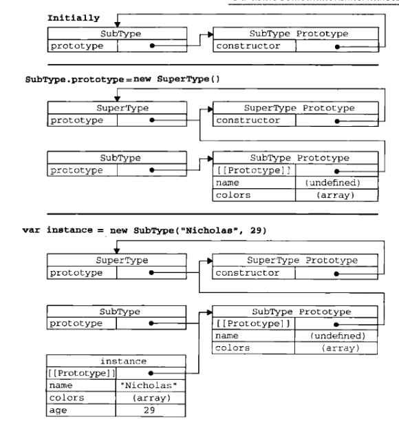

### 小结
+ 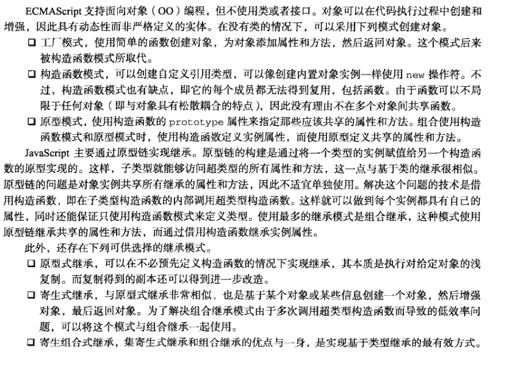

# 函数表达式

+ `let func = function(){}`
+ 通过赋值创建的函数也叫匿名函数，因为function关键字后面没有标识符
+ 匿名函数有时也叫拉姆达函数，匿名函数的name属性是空字符串
+ 把函数当作返回值时，可以使用匿名函数

## 递归

+ 递归是在一个函数通过名字调用自身的情况下构成的
+ ```js
    function factorial(num){
      if(num <= 1){
        return 1;
      }else{
        return num * arguments.callee(num - 1); //通过内部指向自身的指针调用自己，避免函数名改变后报错
      }
    }
    //在严格模式下，不能通过脚本访问 arguments.callee  可以通过匿名函数的方式达成同样的效果
    let factorial = (function f(num){
      if(num <= 1){
        return 1;
      }else{
        return num * f(num - 1);
      }
    });
    //这种方式把函数f()赋值给了factorial但是函数名仍然有效，所以递归能正确完成
    ```

## 闭包

+ 闭包是指由权访问另一个函数作用域中的变量的函数
+ 在一个作用域访问另一个函数作用域中的变量
+ 创建闭包的常见方式，就是在一个函数内部创建另一个函数
+ 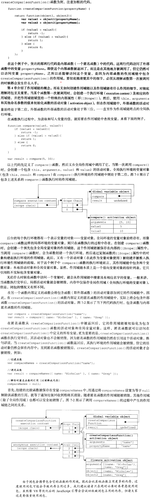

### 闭包与变量

+ 闭包只能取得包含函数中任何变量的最后一个值，闭包所保存的是整个变量对象，而不是某个特殊的变量
+ 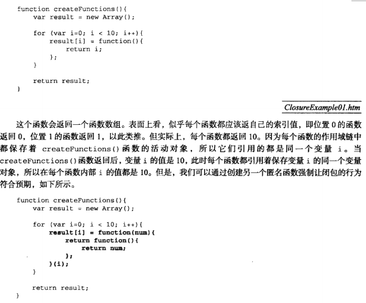
+ 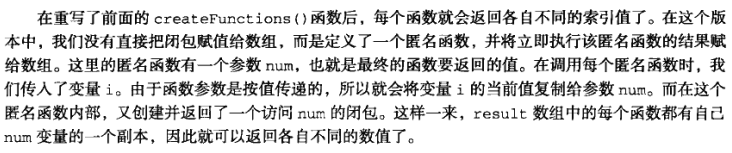

### 关于this对象

+ this对象通常是在运行时基于函数的执行环境绑定的
+ 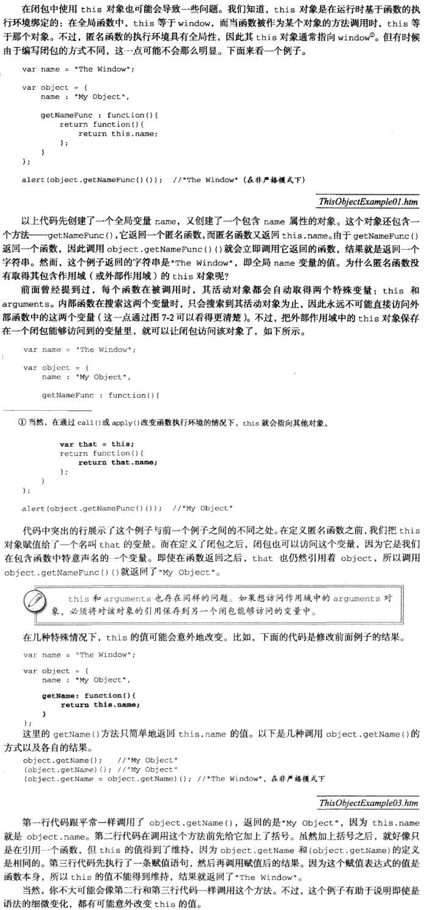

### 内存泄漏

+ 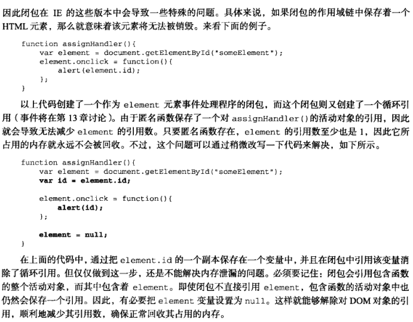

## 模仿块级作用域

+ `(function(){ //块级作用域 })();` 双括号的这种语法表示函数创建后立即调用该函数，后面的括号传入参数
+ 用括号将函数包裹是为了将函数声明转换为函数表达式，函数表达式function后面可以跟括号
+ 而函数声明function后直接跟括号会导致语法错误
+ ```js
    function outputNumbers(count){
      (function(){
        for(var i = 0; i < count; i++){
          alert(i);
        }
      })();
      alert(i);   //报错
    }
    //通过这种方式模仿块级作用域
    //ES6因为有let 变量声明方式所以不用
    ```

## 私有变量

+ 严格来说js中没有私有成员的概念，所有对象属性都是公有的。
+ 但是有私有变量的概念，在任何函数中定义的变量，都可以认为是私有变量，不能在函数外部访问这些变量
+ 私有变量包含函数的参数、局部变量、和在函数内部定义的其他函数
+ 利用闭包可以，可以通过闭包的作用域链访问到私有变量，
+ 把有权访问私有变量和私有函数的公有方法称为特权方法(privileged method)，有两种在对象上创建特权方法的方式，
+ 第一种是在构造函数中定义特权方法
  + ```js
      function MyObject(){
        //私有变量加私有函数
        let privateVariable = 10;

        function PrivateFunction(){
          return false;
        }

        //特权方法
        this.publicMethod = function(){
          privateVariable++;
          return PrivateFunction();
        };
      }
      ```
+ 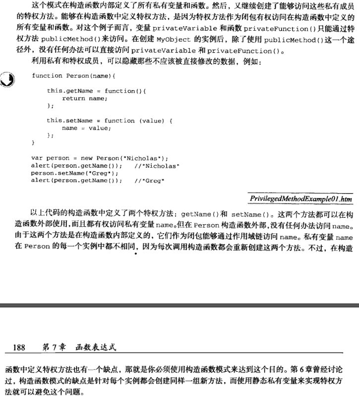

### 静态私有变量

+ 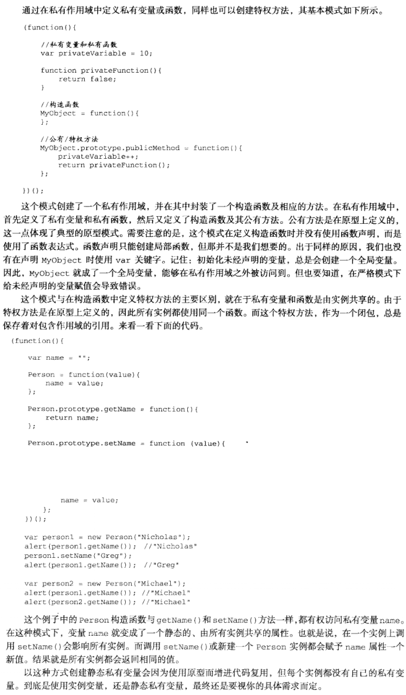
+ 多查找作用域链中的一个层次,就会在一定程度上影响查找速度.而这正是使用闭包和私有变量的一个明显的不足之处

### 模块模式

+ 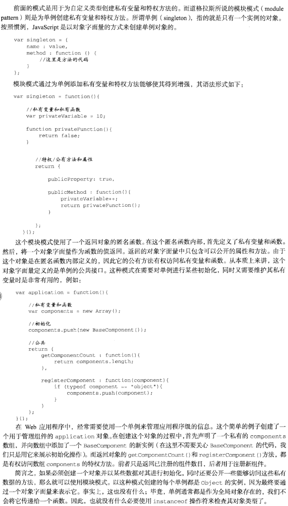

### 增强的模块模式

+ 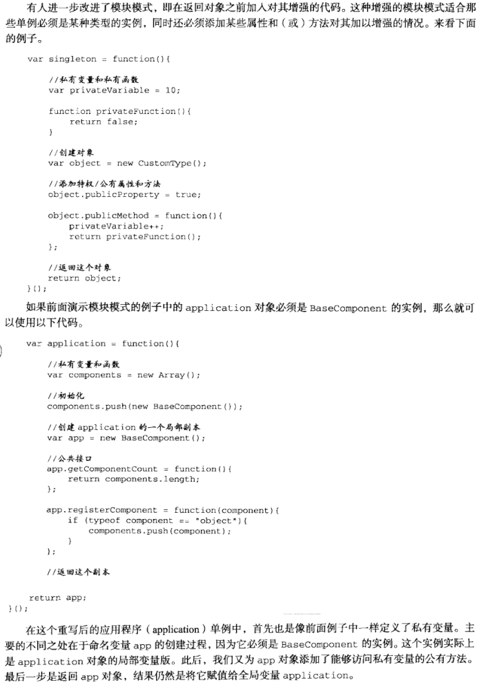

## 小结

+ 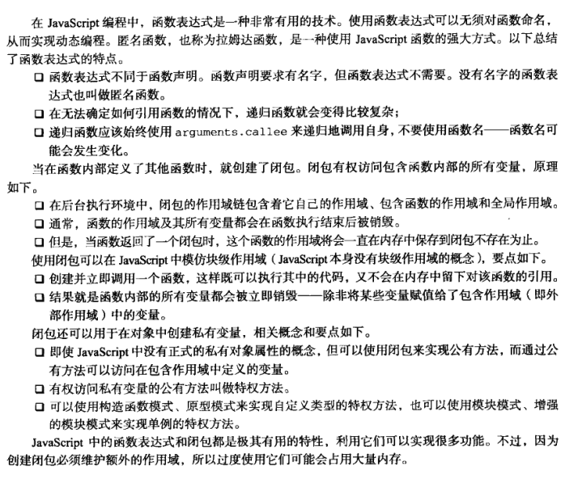

# BOM

## Window对象

+ window对象表示浏览器的一个实例,在浏览器中window既是通过js访问浏览器窗口的一个接口,又是ECMAScript规定的Global对象,这意味着网页中定义任何一个对象,变量和函数,都以window作为其global对象,因此有权访问parseInt()等方法

+ 全局作用域

  + 在全局作用域中声明的变量,函数都会成为window对象的属性和方法
  + 全局变量不能通过delete删除,而直接在window对象上定义的属性可以

+ 窗口关系及框架

  + 如果页面中包含框架,则每个框架都有自己的window对象,并且保存在frames集合中,
  + 通过索引或框架名称访问相应的window对象,每个window对象都有一个name属性,其中包含框架的名称

+ 窗口位置

  + `window.moveTo(x,y);`

+ 窗口大小

  + ```js
    innerWidth		视口大小
    innerHeight
    outerWidth		窗口本身大小
    outerHeight
    document.documentElement.clientWidth		可见区域大小
    
    调整浏览器窗口大小
    window.resizeTo(100,100);
    ```

+ 导航和打开窗口

  + `window.open()` 

+ 间歇调用和超时调用

  + `setTimeout()` 超时调用
    + `clearTimeout()` 取消超时调用
  + `setInterval()` 间歇调用
    + `clearInterval()` 取消间歇调用

+ 系统对话框

  + `alert()、confirm()、prompt()`
    + `alert()` 提示包含一个展示字符串，和确认按钮
    + `confirm()` 包含字符串提示，确认和取消按钮，返回true和false
    + `prompt()` 提示框，确认和取消按钮，输入框，返回输入内容或null

## location 对象

+ 不仅是window对象的属性还是document对象的属性

  + 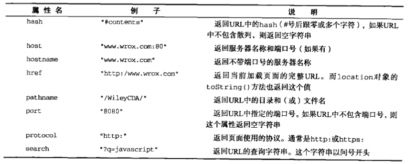

+ 查询字符串参数

+ ```js
  function getQueryStringArgs(){
      //取得查询字符串并去掉开头的问号
      let qs = (location.search.length > 0 ? location.search.substring(1) : ""),
          //保存数据对象
          args = {},
          //取得每一项
          items = qs.length ? qs.split("&") : [],
          item = null,
          name = null,
          value = null,
          //在for循环中使用
          i = 0,
          len = items.length;
      //逐个将每一项添加到args对象中
      for(i = 0 ; i < len ; i++){
          item = item[i].split("=");
          name = decodeURIComponent(item[0]);
          value = decodeURIComponent(item[1]);
          if(name.length){
              args[name] = value;
          }
      }
      return args;
  }
  
  //假设查询字符串是？q=javascript&num=10
  let args = getQueryStringArgs();
  alert(args["q"]); //"javascript"
  alert(args["num"]); // "10"
  ```

+ 位置操作

  + `location.assign("https://www.wrox.com");`

  + 打开一个新URL并在浏览器的历史记录中生成一条记录，

  + ```js
    //效果一样
    window.location = "https://www.wrox.com";
    location.href = "https://www.wrox.com";
    
    还有location的属性可以修改URL
    location.hash = "#section1";  //除修改此属性其他的都会以新的URL重新加载页面
    search
    hostname
    pathname
    port
    ```

  + 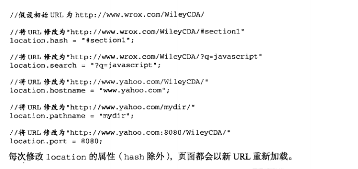

  + `location.replace("url");` 以这种方法跳转的页面会禁用浏览器的后退

  + `reload()` 重新加载当前页面，如果不传递任何参数，页面就会以最有效的方式重新加载

  + 传递true从服务器从新加载

## navigator 对象

+ 识别客户端浏览器的名称版本等属性
+ 检测插件
  + 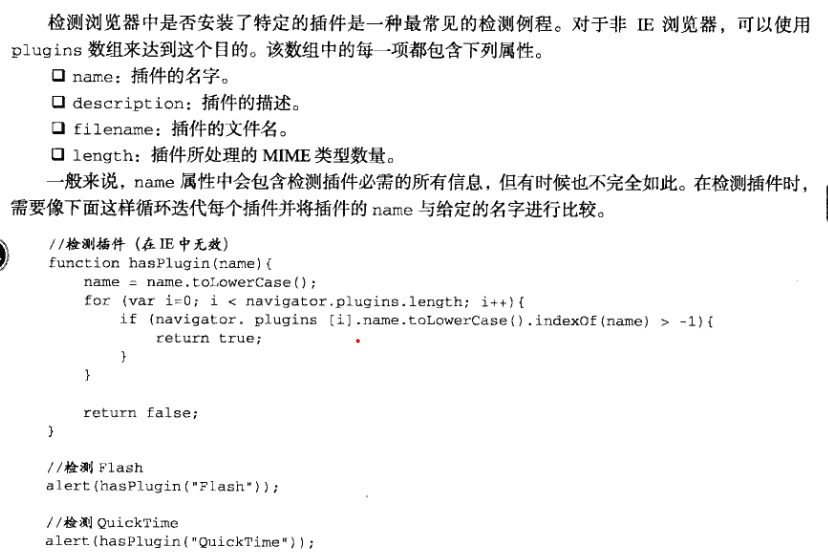
+ 注册处理程序
  + `registerContentHandler()`
  + `registerProtocolHandler()`

## screen 对象

+ 用来表明客户端的能力

## history 对象

+ 保存着用户上网的历史记录

# 客户端检测

## 能力检测

+ 客户端的能力检测（特性检测），目的不是识别特定的浏览器，而是识别浏览器的能力

+ ```js
  if(object.propertyInQuestion){
      //使用 object.propertyInQuestion
  }
  
  function getElement(id){
      if(document.getElementById){
          return document.getElementById(id);
      }else if(document.all){
          return document.all[id];
      }else{
          throw new Error("No way to retrieve element!")
      }
  }
  ```

+ 更可靠的能力检测
  + ```js
    function isHostMethod(object, property){
        var t = typeof object[property];
        return t == "function" || (!!(t == "object" && object[property])) || t == "unknown"
    }
    
    result = isHostMethod(xhr, "open");		//true
    result = isHostMethod(xhr, "foo");		//false
    ```

  + 能力检测，不是浏览器检测

    + 不能通过检测特定的对象确认是什么浏览器

## 怪癖检测

+ 目标是识别浏览器的特殊行为，

## 用户代理检测

+ 用户代理字符串的历史
+ 用户代理字符串检测技术
+ 完整的代码
+ 使用方法

# DOM

## 节点层次

### node 类型

+ nodeType
+ nodeName
+ NodeValue

### Document 类型

+ nodeType 值为9
+ nodeName 值为"#document"
+ nodeValue 值为 null
+ parentNode 值为 null
+ ownerDocument 值为 null
+ 其子节点可能是一个DocumentType（最多一个）、Elements（最多一个）、ProcessingInstruction 或 Comment

+ 文档的子节点

  + 可以是 `DocumentType、Element、ProcessingIn-strutior、Ccomment`

  + 内置访问其子节点的快捷方式

    + `doccument.documentElement`属性  指向 `<html>` 元素 `document.body` 属性指向 `<body>` 元素

    + `childNodes` 列表访问文档元素

    + ```js
      document.childNodes[0]  和 document.firstChild  同等与 document.documentElement
      ```

+ 文档信息

  + `document.title` 取得标题 可读写
  + `document.URL` 取得完整的URL
  + `document.domain` 取得域名 可设置，但是只能设置已包含的域名
  + `document.referrer` 取得来源页面的URL

+ 查找元素

  + `getElementByTsgName("*")` 会返回一个 `HTMLCollection` 动态集合对象
    + 该对象与`NodeList`相似
    + 该对象有一个叫做 `nameditem()` 方法， 这个方法可以通过元素的name属性(特性)取得集合中的项
    + 也可通过方括号语法来访问

+ 特殊集合

  + `document.anchors`  包含文档中所有带 name 特性的<a>元素
  + `doucment.forms` 包含文档中所有的<from> 元素
  + `document.images` 包含文档中所有的 元素
  + `document.links` 包含文档中所有带`href`属性的<a>元素

+ DOM一致性检测

  + 检测DOM功能的名称及版本号   支持则返回true
  + `let hasXmldom = document.implementation.hasFeature("XML","1.0");`

+ 文档写入

  + `write()、writeln()、open()、close()`

### Element

+ nodeType  值为 1
+ nodeName 值为 元素标签名字
+ 访问元素标签名可以用`nodeName` 和 `tagName`

+ HTML 元素
+ lang   元素内容的语言代码
+ dir    语言的方向

### Text 类型

+ nodeType 值为 3
+ nodeName 值为 "#text"
+ nodeValue 值为包含的文本
+ 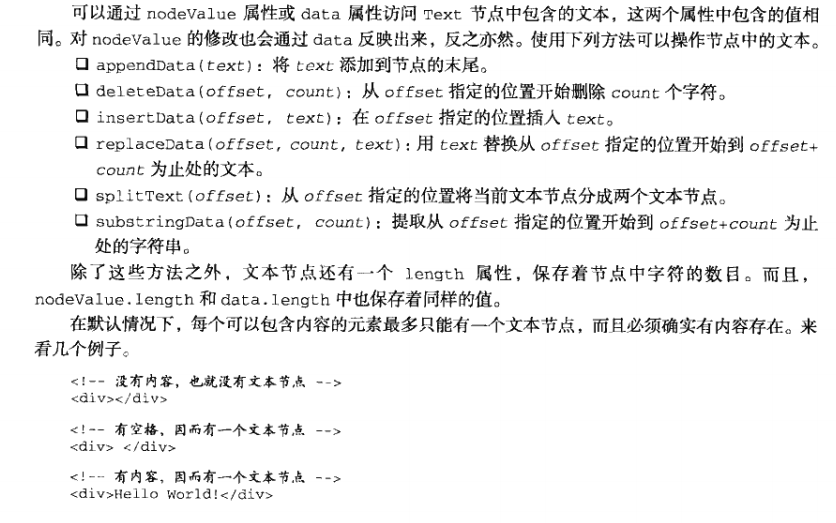

### Comment 类型

+ 注释
+ nodeType 值为 8
+ nodeName 值为 "#comment"
+ nodeValue 值为 注释内容

### CDATASection 类型

+ 针对基于XML的文档，表示CDATA区域
+ nodeType 值为 4
+ nodeName 值为 "#cdata-section"
+ nodeValue 值为 CDATA区域的内容

### DocumentType 类型

+ nodeType 值为 10
+ nodeName 值为 doctype的名称
+ nodeValue 值为 null

### DocumentFargment 类型

+ nodeType 值为 11
+ nodeName 值为 "#document-fragment"
+ nodeValue 值为 null

### Attr 类型

+ nodeType 值为 11
+ nodeName 值为 属性的名称
+ nodeValue 值为 属性的值

## DOM操作技术

+ 动态加载脚本

+ ```js
  function loadScript(url){
      let script = document.createElement("script");
      script.src = url;
      document.body.appendChild(script);
  }
  ```

+ 动态样式

+ ```js
  function loadStyle(url){
      let link = document.createElement("link");
      link.rel = "stylesheet";
      link.href = url;
      let head = document.getElementsByTagName("head")[0];
      head.appendChild(link);
  }
  ```

+ NodeList

  + `NodeList 和 NameNodeMap 和 HTMLCollection` 这三个集合都是动态的，每当文档结构发生变化时，它们都会得到更新，因此它们始终保存着最新、最准确的信息

  + ```js
    //下列代码会导致无限循环
    let divs = document.getElementsByTagName("div"),
        i,
        div;
    for(i= 0 ; i < divs.length; i++){
        div = document.createElement("div");
        document.body.appendChild(div);
    }
    //每次循环都会查询一次divs.length，但是divs.length的值一直在动态的增加所以会导致无限循环
    
    let divs = document.getElementsByTagName("div"),
        i,
        len,
        div;
    for(i= 0,len = divs.length; i < len; i++){
        div = document.createElement("div");
        document.body.appendChild(div);
    }
    ```


# Dom扩展

## 选择符API

+ `querySelecctor()`
+ `querySelecctorAll()`
+ `matchesSelector()`
  + 方法接收CSS选择符
  + 如果调用元素与该选择符匹配返回true

## 元素遍历

+ `childElementCount` 返回子元素（不包括文本节点和注释）的个数
+ `firstElementChild` 指向第一个子元素：`firstChild`的元素版
+ `lastElementChild` 指向最后一个子元素：`lastChild`的元素版
+ `previousElementChild` 指向前一个同辈元素：`previousSibling`的元素版
+ `nextElementChild` 指向后一个同辈元素：`nextSibling`的元素版
+ 利用这些属性不用担心空白文本节点

## HTML5

+ `classList`属性
  + `add()`
  + `contains()` 检测是否存在给定值的类名
  + `remove()`
  + `toggle()`
+ 焦点管理
  + `document.activeElement` 属性，始终会引用DOM中当前获得焦点的元素
  + `focus()` 使元素获得焦点
  + `document.hasFocus()` 确定文档是否获取了焦点
+ HTMLDocument 的变化
  + `readsState` 属性
    + 值 ： loading 正在加载文档。
    + 值 ： complete 已经加载完文档。
  + head 属性
  + 字符集属性
    + `document.charset`
  + 自定义数据属性
    + `data-` 开头 `date-name`
    + 取得或设置自定义属性
    + `div.dataset.name`
  + 插入标记
    + `innerHTML` 属性    所有子节点
    + `outerrHTML` 属性
      + 读取调用它的元素及所有子节点的HTML标签
      + 写入，会根据指定的HTML字符串创建新的DOM子树
    + `insertAdjacentHTML()` 方法 接收两个参数
      + 第一个参数
        + `beforebegin` 在当前元素之前插入一个紧邻的同辈元素
        + `afterbegin` 在当前元素之下插入一个新的子元素，或在第一个子元素之前再插入新的子元素
        + `beforeend` 在当前元素之下插入一个新的子元素或在最后一个子元素之后再插入新的子元素
        + `afterend` 当前元素之后插入一个紧邻的同辈元素
      + 第二个参数    即插入的字符串（可以是<div>元素</div>）
  + 内存与性能问题
    + 在删除元素时应该先删除与之绑定的事件
    + 尽量减少插入语句的访问次数
  + `scrollIntoView()` 方法
    + 传入true或不传入参数，窗口会滚动到调用元素的顶部与视口尽可能齐平
    + 传入false 调用元素会尽可能全部出现在视口中

## 专有扩展

+ 文档模式
+ children 属性
  +  这个属性是`HTMLcollection` 的实例，只包含元素中同样还是元素的子节点
+ `contains()` 方法
  + 节点调用，传入节点参数
  + 返回 1 无关
  + 2 在调用节点之前
  + 4 在调用节点之后
  + 8 包含指定节点
  + 16 被指定节点包含
+ 插入文本
  + innerText 属性
    + 返回元素中包含的所有文本，包括子元素包含的文本
  + outerText 属性
+ 滚动
  + `scrollIntoViewIfNeeded(可选参数true)` 
    + 滚动到调用元素可见，已经可见则不操作
    + true 尽量在视口垂直中部显示
  + `scrollByLines(可以是正值也可以是负值)` 将元素内容滚动指定的行高
  + `scrollByPages(pageCount)` 将元素的内容滚动到指定的页面高度，具体高度有元素的高度决定

## 偏移

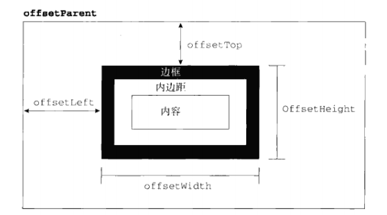

## 客户区大小

+ `clientWidth`
+ `clicentHeight`

## 滚动大小

+ `scrollHeight` 在没有滚动条的情况下，元素内容的总高度
+ `scrollWidth` 在没有滚动条的情况下，元素内容的总宽度
+ `scrollLeft` 被隐藏在内容区域左侧的像素数，设置可改变滚动位置
+ `scrollTop` 被隐藏在内容区域上方的像素数，设置可改变滚动位置

## 遍历

+ NodeIterator
+ TreeWalker

# 事件

+ 交互

## 事件流

+ 点击一个按钮也相当于点击了包含按钮的元素，一直到最外层，相当于也点击了整个页面

### 事件冒泡

+ 即事件开始有最具体的元素接收，然后逐级向上传播到较为不具体的节点（文档）

### 事件捕获

+ 即事件发生后捕获到，先由最外层触发，然后逐渐向内传播，最后由事件发生的元素触发

### DOM事件流

+ 事件流包括三个阶段：事件捕获——处于目标阶段——事件冒泡
+ 单击div
  + 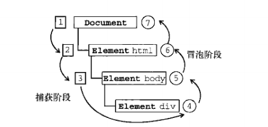
+ 在捕获阶段，实际的目标不会接收到事件

## 事件处理程序

+ 事件处理程序的名字以 “on”开头

### HTML事件处理程序

+ 每种事件都可以用一个与相应事件处理程序同名的HTML属性来指定
+ 事件处理程序会封装一个装着元素属性的函数，这个函数中有一个局部变量event，事件对象
+ 在事件中this指向事件的目标元素

### DOM0级事件处理程序

```js
div.onclick = function(){
    //以这种方式添加的事件会在事件流的冒泡阶段被处理掉
};
div.onclick = null；
//删除事件
```

### DOM2 级事件处理程序

+ 处理指定和删除事件处理程序的操作：
  + `addEventListener()`
  + `removeEventListener`
  + 所有dom节点都包含这两个方法，并且它们都接收三个参数
  + 一 ： 要处理的事件名
  + 二 ： 作为事件处理的函数 
  + 三 ： 一个布尔值
  + 布尔值参数如果是true，表示在捕获阶段调用事件处理程序，false，表示在冒泡阶段调用事件处理程序，一般使用false，最大限度的兼容各种浏览器
  + 通过add添加的事件只能通过remove来移除，移除事件时与添加时传入的参数相同
  + 所以通过匿名函数添加的事件将无法移除

### 跨浏览器的事件处理程序


## 事件对象

+ 在触发DOM上的某个事件时，会产生一个事件对象(event)，这个对象中包含着所有与事件有关的信息，包括导致事件的元素，事件的类型，以及其他与特定事件相关的信息，
+ 例如鼠标导致的事件对象中，会包含鼠标的位置信息，键盘也一样
+ 事件执行完毕，event对象就会被销毁

### DOM中的事件对象

+ event的属性和方法
  + 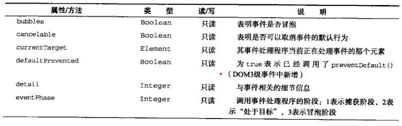
  + 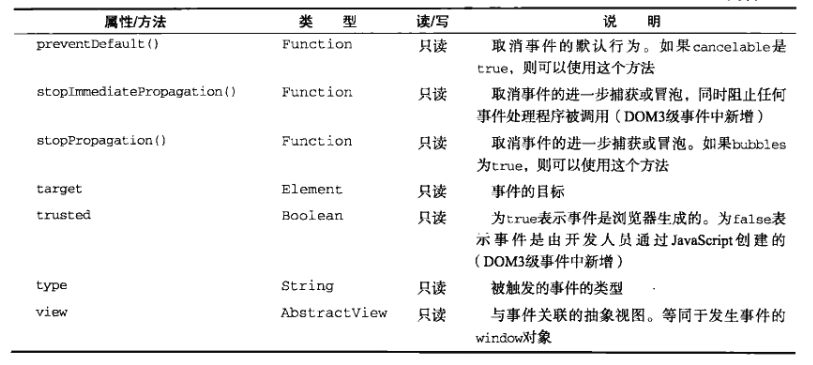
  + 在事件处理程序内部，对象this始终等于currentTarget

## 事件类型

+ UI（Userrr Interface,用户界面）事件，当用户与页面上的元素交互时发生；
+ 焦点事件，当元素获得或失去焦点时触发；
+ 鼠标事件，当用户通过鼠标在页面上执行操作时触发；
+ 滚轮事件，
+ 文本事件，在文档中输入文本时触发
+ 键盘事件，
+ 合成事件，当为IME（input Method Editor,输入法编辑器）输入字符时触发；
+ 变动（mutation）事件，当底层DOM结构发生变化时触发

### UI事件

+ load ： 当页面完全加载后在window上触发，在框架都加载完毕时在框架上面触发，图片加载完毕时在\元素上触发，当嵌入内容加载完毕时\<object>元素上面触发
+ unload ： 当页面完全卸载后在window上面触发，同load事件
+ 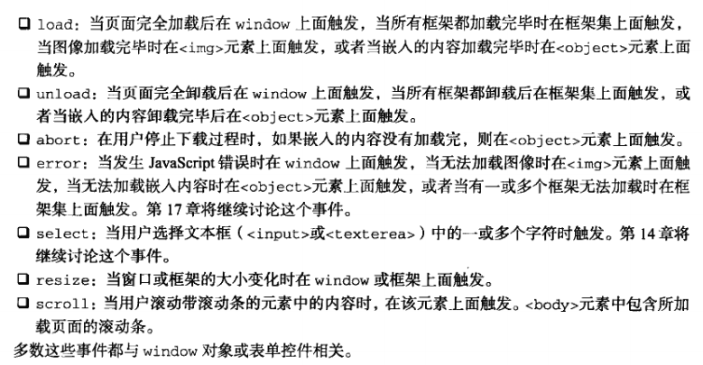
+ load事件
+ unload 事件 ， 用户从一个页面切换到另一个页面就会触发，多用来清除引用，避免内存泄漏

### 焦点事件

+ 可以利用这些事件与document.hasFocus()方法及document.activeElement属性配合
+ blur ： 失去焦点时触发。这个事件不会冒泡
+ focus ： 获取焦点时触发。不会冒泡
+ focusin ： 支持冒泡
+ focusout ： 支持冒泡

### 鼠标与滚轮事件

+ 事件
  + click ： 一般为鼠标左键单机，或键盘回车触发
  + dblclick ： 一般为鼠标左键双击
  + mousedown ： 按下任意鼠标按钮时触发，不能通过键盘触发
  + mouseenter ：鼠标悬浮事件,不冒泡,且移动到后代元素不触发，鼠标移入
  + mouseleave ：鼠标移出事件，不冒泡
  + mousemove ：鼠标在元素内部移动时重复触发，不能通过键盘触发
  + mouseout ：鼠标指针位于一个元素上方，然后将其移入另一个元素时触发，另一个元素可能位于前一个元素外部，也可能是子元素
  + mouseover ： 鼠标位于一个元素外部，然后用户将其首次移入另一个元素边界内时触发
  + mouseup ： 释放鼠标按钮时触发

+ 注意

  + 页面上的所有元素都支持鼠标事件

  + 除了mouseenter 和 mouseleave 所有鼠标事件都会冒泡

  + 在同一个元素上相继触发mousedown 和 mouseup事件，才会触发click事件，如果其中一个被取消就不会触发click事件

  + dblclick双击事件需要触发两次click后才会触发

  + 触发顺序

  + ```js
    mousedomw
    mouseup
    click
    mousedown
    mouseup
    click
    dalclick
    ```

+ 客户端坐标位置

  + 保存在事件对象的`clientX 和 clientY` 属性中
  + 值为鼠标相对于视口的位置
  + 通过滚动条也可计算出鼠标相对于页面的位置
  + `event.clientY + (document.body.scrollTop || document.documentElement.scrollTop);`

+ 页面坐标位置

  + 保存在事件对象的 `pageX 和 pageY` 属性中
  + 值为事件在页面中发生的位置，也就是鼠标相对页面中的位置

+ 屏幕坐标位置

  + 保存在事件对象的 `screenX 和 screenY` 属性中
  + 鼠标相对于电脑屏幕的位置

+ 修改键

  + 判断按下鼠标的时候是否有按键被按下

  + meta（相当于window的window键，苹果的cmd键）

  + 按下的键会为true，否者为false

  + ```js
    let div = document.querySelector(".c");
    div.addEventListener("click",function(){
        let keys = new Array();
        if(event.shiftKey){
            keys.push("shift");
        }
        if(event.ctrlKey){
            keys.push("ctrl");
        }
        if(event.altKey){
            keys.push("alt");
        }
        if(event.metaKey){
            keys.push("meta");
        }
        alert("Keys:" + keys.join(","));
    ```

+ 相关元素

  + 在发生mouseover 和 mouseout，还会涉及更多元素
  + 对于mouseover 事件而言，事件的主目标是获得光标的元素，而相关元素就是失去光标的元素
  + 对面mouseout刚好相反
  + event对象的relatedTarget属性提供了相关元素的信息

+ 鼠标按钮

  + 只有在主鼠标被单击（或回车键被按下）是才会触发click事件，因此检测按钮的信息并不是必要的，
  + which属性对应鼠标按键`[1,2,3,4,5] 分别对应 [左键,中键,右键,侧键,侧键]`
  + 但对于mousedown 和 mouseup 事件来说，在其event对象存在一个button属性
  + 属性值有三个
    + 0 ：表示鼠标主键（左键）
    + 1 ： 表示鼠标中间 （滚轮）
    + 2 ： 表示鼠标次键 （右键）

+ 更多事件信息

  + event 对象还提供了 detail 属性
  + 对于鼠标事件来说， detail 中包含了一个值，表示在给定位置上发生了多少次单击
  + 在同一个元素上相继发生一次 mousedown 和 mouseup 事件算一次单击 ，detail 属性从 1 开始计数，如果鼠标在 mousedown 和 mouseup 之间移动了位置，则会重置为0
  + `offsetX 和 offsetY` 光标相对于目标元素边界的位置

+ 鼠标滚轮事件

  + mousewheel 事件，页面垂直方向（向上或向下）都会触发，在任何元素上触发冒泡到document或window对象，
  + event对象中包含特殊的 wheelDelta 属性，当滚动滚轮时，该属性是120的倍数
  + 先前滚动为 120    向后滚动为  -120

+ 触摸设备

  + 不支持dblclick事件
  + 轻击元素会触发mousemove事件，如果此事件导致内容变化，将不再有其他事件发生，如果无变化，依次发生 mousedown 、mouseup、click事件
  + mousemove 事件也会触发 mouseover 、 mouseout事件
  + 两个手指放在屏幕上且页面随手指移动而滚动时会触发mousewheel、scroll事件

+ 无障碍

### 键盘于文本事件

+ keydown ： 按下键盘任意按键 ，按住不放会重复触发
+ keypress ： 按下键盘字符键，按住不放同样会重复触发   ，有字符输入时发生
+ keyup ： 释放键盘按键
+ 事件对象event的 key 、char属性
  + key为按下键的名称
  + char为按下的字符名称，非字符时为null，
+ 发生keydown 和 keyup事件时，event对象的keyCode 属性会包含一个代码，于键盘上的一个特定键对应
+ 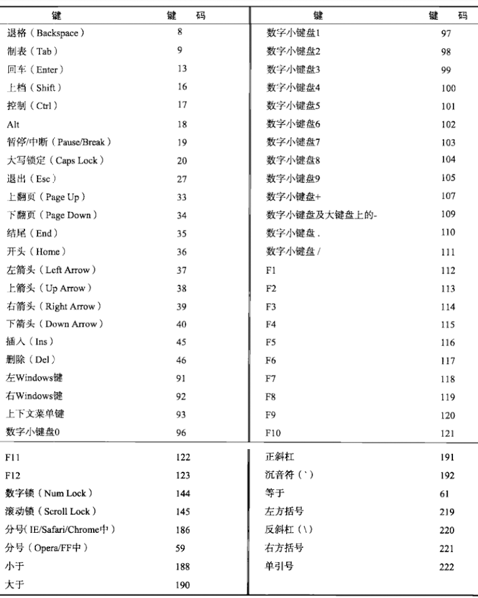
+ event对象的location

+ textInput 事件
  + 在可编辑区域输入时就会触发
  + 且只有能够实际输入字符的键才会触发
  + event对象包含data属性，为用户输入的字符
  + event对象还有inputMethod 属性 表示把文本输入到文本框中的方法
    + 0 ： 表示浏览器不确定输入方式
    + 1 ：键盘输入
    + 2 ：粘贴
    + 3 ：拖放
    + 4 ： 使用IME输入
    + 5 ： 通过表单选择某一项输入
    + 6 ： 手写
    + 7 ： 语音
    + 8 ： 几种方式组合输入
    + 9 ： 脚本输入

### 复合事件

+ 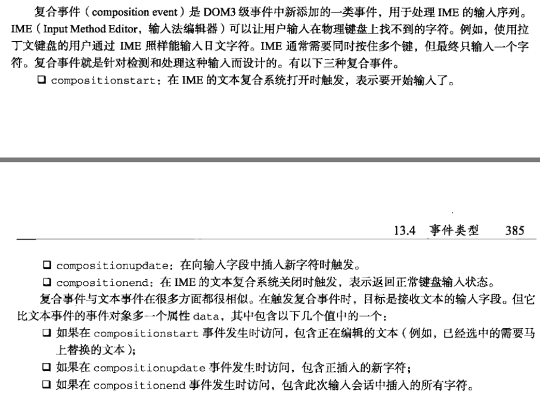


### 变动事件

+ 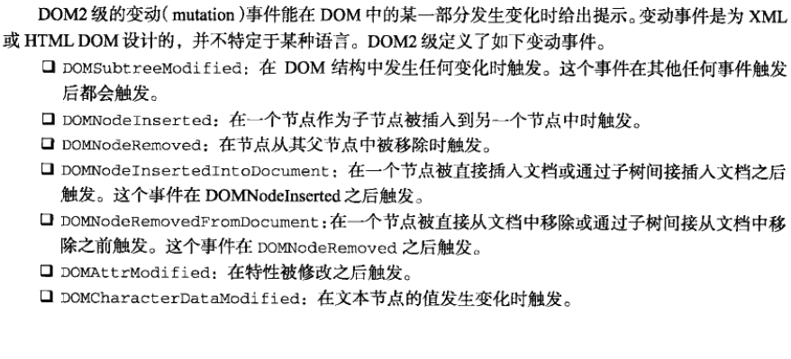

### HTML5 事件

+ contextmenu 事件
  + 鼠标右键上下文菜单
  + 属于鼠标事件，所以事件对象包含于光标有关的属性
  + 事件对象event的 `event.preventDefalut()` 方法用于取消默认的上下文菜单
+ beforunload 事件
  + 在浏览器卸载页面之前触发，通过它来取消卸载并继续使用原有页面，不能彻底取消这个事件，因为那相当于让用户无法离开当前页面了
  + 通过将 event.returnValue 设置为要显示给用户看的字符串，在离开页面前给用户提示
+ DOMContentLoaded 事件
  + 不同于load事件在加载完成后触发，该事件只要DOM树完整形成就会触发，不管图像、脚本、样式是否加载完成
+ readystatechange 事件
  + 提供文档或元素的加载状态信息
  + 事件对象的readyState属性
    + `uninitialized` ：对象存在但未初始化
    + loading ：对象数据加载中
    + loaded ：对象数据加载完成
    + interactive ：可以操作对象了，但还没有完全加载
    + complete ：对象已经加载完毕
+ pageshow 和 pageghide  事件
+ hashchange 事件
  + 在URL的参数列表（URL中#号后面的）发生改变时触发
  + 该事件必需添加给window对象
  + event中包含额外的两个属性
    + oldURL 改变前完整的URL
    + newURL


### 设备事件

+ deviceorientation 事件  移动设备
  + 在window对象上触发
  + 设备的摆放方向，X、Y、Z 轴来表示 水平放置时都为0
  + 事件对象中包含以下属性
    + alpha ：围绕Z轴旋转时（即左右旋转时），Y轴的度数差，介于0~360之间的浮点数
    + beta ：围绕X轴（前后翻转），Z轴的度数差，介于-180 ~180 之间的浮点数
    + gamma ：围绕Y轴（扭转设备时），Z轴的度数差，介于-90~90之间的浮点数
    + absolute ：布尔值，表示设备是否返回一个绝对值
    + compassCalibrated ：布尔值，表示设备的指南针是否校准过
+ devicemotion 事件
  + 该事件告诉开发人员设备什么时候移动，不仅仅是设备方向如何改变，能够检测到设备是不是在往下掉，或者是不是被走着的人拿在手上
  + 事件对象中包含
    + acceleration ：包含X、Y、Z、属性的对象，在不考虑重力的情况下，告诉你每个方向上的加速度

### 触摸与手势事件

+ 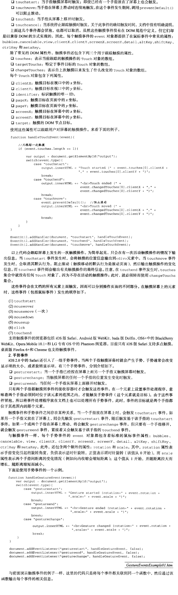

## 内存和性能

+ 事件处理程序添加太多会占用内存影响性能

### 事件委托

+ 解决"事件处理程序过多" 问题的方法就是事件委托,事件委托利用了事件冒泡,只指定一个事件处理程序,就可以管理某一个类型的所有事件,例如.click事件会一直冒泡到document层次,也就是说可以为整个页面指定一个onclick事件处理程序,而不必给每个可单击的元素分别添加事件处理程序,
+ ```js
    <ul id="myLinks">
      <li data-id="1"> 需添加点击事件</li>
      <li data-id="2"> 需添加点击事件</li>
      <li data-id="3"> 需添加点击事件</li>
    </ul>
    //利用事件委托
    //将子元素的事件都通过冒泡委托给父元素处理
    let list = document.querySelector("#myLinks");
    list.addEventListener("click",function(){
      //获取被点击的目标元素的自定义属性ID
      let elementID = parseInt(event.target.dataset.id);
      //判断是哪个子元素被点击了,处理该元素的对应触发事件
      switch(elementID){
        case 1:{
          //触发事件的功能代码
        }
          break;
        case 2:{
          //触发事件的功能代码
        }
          break;
        case 3:{
          //触发事件的功能代码
        }
          break;
        default:
          alert("没有委托");
          break;
      }
    },false);
    ```
+ document 添加一个事件处理程序,将特定的事件委托给它,
  + 由于document 对象很快就可以访问,而且可以在页面的生命周期的任何时间点为它添加事件处理程序,也就是说只要可单击的元素呈现在页面上,就可以立刻具备适当的功能
  + 在页面中设置事件处理程序所需的时间更少,只添加一个时间处理程序所需的DOM引用更少,所花时间也更短
  + 整个页面占用内存空间更少,能够提升整体性能

### 移除时间处理程序
+ 在带有事件处理程序的元素被删除时,先移除该元素的事件处理程序,
+ 删除按钮也能阻止事件冒泡,目标元素在文档中是事件冒泡的前提
+ 在页面卸载前通过,onunload事件移除所有事件处理程序

## 模拟事件

### DOM中的事件模拟
+ 在document对象上使用createEvent()方法创建event对象,这个方法接收一个参数,即表示要创建的事件类型的字符串
+ 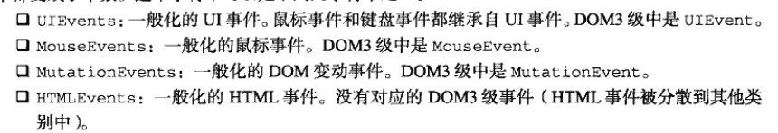
+ 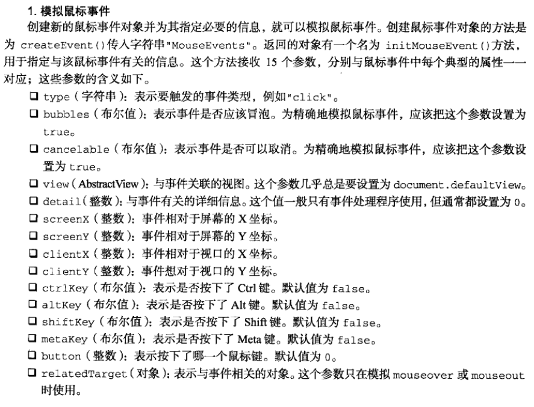
+ 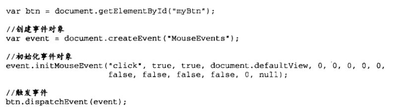
+ 其他事件模拟大致相同


# 需注意

+ 运算优先级以及转译
  
    + `(!(~+[])+{})[--[~+""][+[]]*[~+[]]+~~!+[]]+({}+[])[[~!+[]]*~+[]]`
+ 内嵌js
  + 不能把</script>嵌入在代码的任何位置, 但可以通过将之分隔为两个部分解决 <\  /script>
    + 因为一旦浏览器解析倒</script>就会认为那是结束代码的标签
+ 外链js
  + 不能在外链JS的script标签中写代码,  应为检测倒外链JS标签中的代码会被忽略