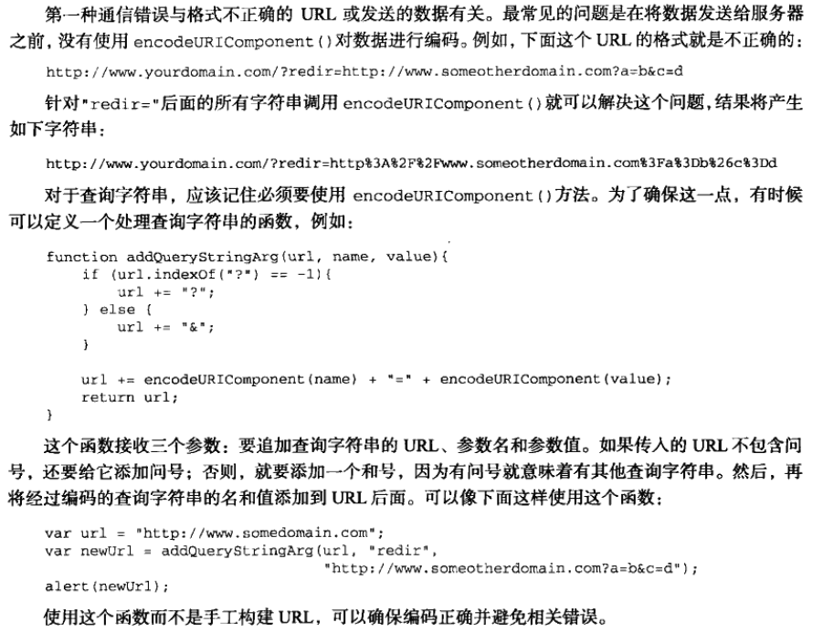
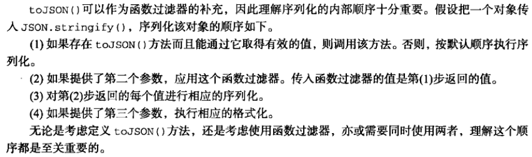
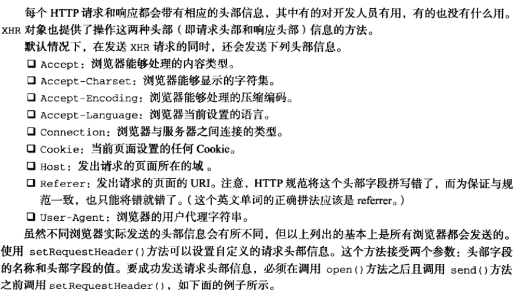

# 表单脚本

## 表单的基础知识

+ 

+ 提交表单
  + 在触发submit提交表单的事件时
  + 可以通过form表单的submit事件的`prevetnDefault()`方法取消默认的提交行为
  + form表单直接通过`form.submit()`事件也能提交表单
+ 重置表单也是如此
+ 表单字段
  + 表单都有elements属性,该属性是表单中所有元素的集合,可以通过索引和name属性来访问所有表单元素,如果多个表单同名,则返回一个NodeList
  + 
  + 除了form外都可以动态设置
  + 在第一次submit事件提交表单后禁用提交按钮可以防止反复提交
  + 不能通过click事件来防止反复提交,应为有些浏览器可能在提交前触发clcik事件,导致表单无法提交
  + 
  + input和button的type属性是可以动态修改的
+ 表单字段的共有方法
  + focus()
  + blur()
  + html 中的 autofocus
+ 共有的表单字段事件
  + blur ：失去焦点
  + change ：对于input 和 textarea 元素，在失去焦点且value发生改变时触发，select则是选项发生改变时触发
  + focus ：获得焦点时触发

## 文本框脚本

+ ```html
  <input type="text" size="25" maxlength="50" value="initial value">
  <!-- 最多显示25个字符，输入不能超过50个字符-->
  <textarea rows="25" cols="5">initial value</textarea>
  <!-- 25行   5列-->
  输入的文本值都保存在value中
  ```

+ 选择文本

  + 以上两种文本框都支持`select()` 方法，用于选择文本框中的所有文本
  + 任何时候都可以调用，一般调用后会聚焦到文本框中
  + 与select() 方法对应的是 select事件 在选择了文本框中的文本时，就会触发select事件

+ 取得选择的文本

  + `selectionStart 和 selectionEnd` 这两个属性中保存的是基于0的数值，表示选择文本的范围（即文本选区开头和结尾的偏移量），

  + ```js
    function getSelectedText(textbox){
        return textbox.value.substring(textbox.selectionStart, textbox.selectionEnd)
        //通过偏移量截取获得选中的文本
    }
    ```

+ 选择部分文本

  + 所有文本框都有一个`setSelectionRange()` 方法，接收两个参数，要选择第一个字符的索引和最后一个字符之后的索引

  + ```js
    textbox.value = "Hello world!";
    textbox.setSelectionRange(0,textbox.value.legth);//选择所有文本
    textbox.setSelectionRange(0 , 3); //选择前三个字符    "Hel"
    textbox.setSelectionRange(4 , 7); //选择第4到第6个字符   "o w"
    //要看到选中的文本需要在调用前或后将焦点设置到文本框上
    ```

+ 过滤输入

  + 屏蔽字符

    + 响应向文本框中插入字符操作的是keypress事件

    + 可以通过阻止这个事件的默认行为来阻止输入字符，达到屏蔽效果

    + ```js
      let text = document.querySelector("#text");
      text.addEventListener("keypress",function(){
          if(!/\d/.test(event.key) && !event.ctrlKey){//阻止用户输入数字以外的字符
              event.preventDefault();
          }
      },false);
      ```

  + 操作剪切板

    + beforecopy ：在发生复制操作前触发
    + copy ：在发生复制操作时触发
    + beforecut ：在发生剪切操作前触发
    + cut ：在发生剪切操作时触发
    + beforepaste ：在发生粘贴操作前触发
    + paste ：在发生粘贴操作时触发
    + 在事件发生前可以修改数据
    + 在事件发生时可以阻止默认的操作，阻止默认操作后可修改复制到剪切版的内容
    + 通过event对象中的`clipboardData`对象可以操作数据
    + `clipboardData`对象有三个方法
      + getData()   接收一个参数，取得数据的格式，只有在粘贴事件中才能取得数据
      + setData()   第一个参数为数据类型，第二个参数为要放在剪切版中的文本
      + clearData()

  + 自动切换焦点

    + ```js
      //给文本框添加keyup事件
      function tabForward(event){
          //在键盘按键谈起时，判断目标输入框内容长度是否等于最大值
          if(target.value.length == target.maxLength){
              //获取目标输入框所在的form表单
              let form = target.form;
              //遍历表单元素
              for(let i =0,len = form.elements.length; i < len; i++){
                  //找到表单中的当前目标元素
                  if(form.elements[i] == target){
                      //判断当前目标元素后是否还有表单元素
                      if(form.elements[i+1]){
                          //使切换的元素获得焦点
                          form.elements[i+1].focus();
                      }
                      return;
                  }
              }
          }
      }
      ```

### HTML5约束验证API

+ required  必填字段   html5 表单属性
+ pattern   正则表达式 html5 表单属性
+ `checkValidity()`  检测表单中的某个字段是否有效  布尔值
  + 要验证整个表单是否有效，可以在表单自身调用
+ `validity` 属性 取得字段为什么有效或无效
  + 
+ 禁用验证
  + 通过html5表单属性 `novalidate` 告诉表单不进行验证
  + `document.forms[0].elements["btnNoValidate"].formNoValidate = true;`

## 选择框脚本

+ 
+ option选项属性
  + index ：当前选项在options集合中的索引
  + label ：当前选项的标签，等价于HTML中的lable特性
  + selected ：布尔值，表示当前选项是否被选中 ，设置为true可选中当前项
  + text ：选项的文本
  + value ：选项的值

+ 选择选项
  + 访问选中选项
    + `let secletedOption = selectbox.options[selectbox.selectedIndex];`
  + 通过遍历选项的selected属性
    + 可以获得所有被选中的项

+ 添加选项

  + ```js
    //通过Option构造函数添加选项
    let newOption = new Option("Option text", "Option value");
    slectbox.appendChild(newOption);
    
    //通过选择框的add()方法添加
    let newOption = new Option("Option text", "Option value");
    selectbox.add(newOption,null);
    //第二个参数为将位于新选项之后的选项
    ```

+ 移除选项

  + ```js
    //可以用removeChild()方法
    selectbox.removeChild(selectbos.option[0]);
    //可以用remove()方法
    selectbox.remove(0);//移除选项的索引
    //将对应选项设置为null
    selectbox.options[0] = null;
    ```

+ 移动和重排选项

  + 可以通过`appendChild()` 移动选项

  + `insertBefore()` 方法将选项移动到不同位置 

    + ```js
      let optionToMove = selectbox.option[1];
      selectbox.insertBefore(optionToMove, selection.option[optionToMove.index-1]);
      //将选项向前移动了一位
      ```

## 表单序列化

+ 

+ ```js
  //表单序列化
  function serialize(form){
      let parts = [],
          field = null,
          i,
          len,
          optLen,
          option,
          optValue;
      for(i = 0, len = form.elements.length; i < len; i++){
          field = form.elements[i];
          switch(field.type){
              case "select-one":
              case "select-multiple":
                  if(field.name.length){
                      for(j = 0, optLen = field.options.length; j < optLen; j++){
                          option = field.option[j];
                          if(option.selected){
                              optValue = "";
                              if(option.hasAttribute){
                                  optVlaue = (option.hasAttribute("value") ? option.value : option.text);
                              }else{
                                  optValue = (option.attributes["value"].specified ? option.value : option.text);
                              }
                              parts.push(encodeURIComponent(field.name) + "=" + encodeURIComponent(optValue));
                          }
                      }
                  }
                  break;
              case undefined:	//字段集
              case "file":	//文件输入
              case "submit":	//提交按钮
              case "reset":	//重置按钮
              case "button":	//自定义按钮
                  break;
  
              case "radio":	//单选按钮
              case "checkbox"://复选框
                  if(!field.checked){
                      break;
                  }
                  //执行默认操作
              default:
                  //不包含没有名字的表单字段
                  if(field.name.length){
                      parts.push(encodeURIComponent(field.name) + "=" + encodeURIComponent(field.value));
                  }
          }
      }
      return parts.join("&");
  }
  ```


## 富文本编辑

+ 在页面中嵌入一个空的`iframe`  通过设置designMode属性为on，让整个文档可以编辑
  + `frames["richedit"].document.dseignMode = "on";`
+ 给元素使用 `contenteditable` 也可以使元素能够编辑

+ 操作富文本
  + `document.execCommand()` 方法
+ 富文本选区
  + `使用iframe框架的getSelection() 方法`


# HTML5脚本编程

## 跨文档消息传递

## 原生拖放

+ 拖放事件
  + 拖动某元素时将依次触发以下事件
    + dragstart
    + drag
    + dragend
  + 开始拖动时会触发dragstart事件
  + 拖动过程中会持续触发drag事件鼠标的mousemove事件也会持续发生
  + 当停止拖动会触发dragend事件
  + 当拖动元素被放置到有效的放置目标上时，会依次触发以下事件
    + dragenter
    + dragover
    + dragleave 或 drop
  + 只要元素被拖动到放置目标上就会触发dragenter事件
  + 在放置目标内移动时会持续触发dragover事件
  + 当元素被拖出放置目标时会触发dragleave事件
  + 如果元素被放置到了放置目标中，则会触发drop事件，而不会触发dragleaver事件
+ 自定义放置目标
  + 重写元素的dragenter和dragover事件的默认行为（取消默认行为），可以使元素变成可以放置的目标
+ dataTransfer对象
  + getData()
  + setData()
  + setData 方法的第一个参数也是 getData 方法的唯一参数是一个字符串，表示保存类型，取值为”text/plain“或”uri-list“  MIME类型
  + 保存在dataTransfer对象中的数据只能在drop事件中读取
+ `dropEffect 与effectAllowed`
  + dataTransfer对象的两个属性
  + 通过dropEffect属性可以知道被拖放的元素能够执行那种放置行为
    + "none" ：不能把拖动的元素放在这里，这是出文本框之外所有元素的默认值
    + "move" ：应该将拖动元素放置到目标位置
    + "copy" ：应该把拖动元素复制到放置目标
    + "link" ：表示放置目标会打开拖动的元素（拖动元素必需是一个链接）  
    + 操作必需自己实现，浏览器只改变图标
    + 要使用必需在ondragenter事件中针对放置目标来设置
  +  dropEffect属性只有搭配effectAllowwwed属性才有用
    + 
    + 必需在ondragstart事件中设置effectAllowed属性
  + 可拖动
    + html的draggable属性表示元素是否可以拖动

## 媒体元素

+ audio 和 video
+ 共有属性
  + 
  + 
+ 事件
  + 
+ 自定义媒体播放器
  + 媒体元素的 paly() 和 pause()放啊可以控制播放
+ 检测编解码器的支持情况
  + 通过媒体元素的 canPlayType() 方法  接收一种格式/编解码器字符串
  + 返回"probably"、"maybe" 或空字符串


# 错误处理与调试

+ try-catch 与 throw 语句

## 错误处理

### try-catch 语句

+ ```js
  try{
      //可能导致错误的代码
  }catch(error){
      //在错误发生时怎么处理
      console.log(error.message);
      console.log(error.name);
  }finally{
      
  }
  //try语句块中的任何代码发生错误，就会立刻退出代码执行
  //接着运行catch语句块
  //catch块会接收到一个包含错误信息的对象，必需给错误对象取名字
  //错误对象中保存着错误信息的message属性
  //保存错误类型的name属性
  ```

+ `finally` 子句

  + 在try-catch语句中，该子句一经使用，其代码无论如何都会执行
  + 在用该子句时，try 与 catch 中的 return 语句会被忽略

+ 错误类型

  + Error
    + 基类型，所有错误共享了一组相同的属性
  + EvalError
    + 没有把eval()当初函数调用
  + RangeError
    + 数值超出相应范围
  + ReferenceError
    + 找不到对象
  + SyntaxError
    + 把语法错误的字符串传入eval()函数时
  + TypeError
    + 变量的类型不符合要求
  + URIErroe
    + URI格式不正确
  + 通过`if`语句和`instanceof` 操作符可以得出错误类型

+ 当try-catch语句发生错误时，浏览器会认为错误已经被处理了

  + 在明明白白知道自己代码会发生错误时，不应该使用该语句

### 抛出错误

+ 与try-catch语句相配的还有 throw 操作符 用于抛出自定义错误，在抛出错误时，必需给throw 操作符指定一个值

+ ```js
  throw 12345;
  throw "Hello world";
  throw true;
  throw {name:"javaScript"};
  //当使用 throw 操作符时 代码会立即停止执行  仅当有 try-catch 语句捕获到被抛出的值时，代码才会继续执行
  //通过使用某种内置错误类型，可以模拟浏览器错误
  throw new Error("Something bad happened");
  //抛出一个通用错误，带有一条自定义错误消息
  //使用其他错误类型效果同样如此
  
  //通过原型链继承Error来自定义错误类型
  function CustomError(message){
      this.name = "CustomError";
      this.message = message;
  }
  CustomError.prototype = new Error();
  throw new CustomError("My message");
  ```

+ 抛出错误的时机

+ ```js
  function process(values){
      if(!(values instanceof Array)){
          throw new Error("process(): Argument must be an array.");
      }
      values.sort();
      for(let i = 0, len = values.length; i < len; i++){
          if(values[i] > 100){
              return values[i];
          }
      }
      return -1;
  }
  //判断values不是数组后将错误抛出
  ```

+ 捕获错误，目的是避免浏览器以默认方式处理错误

+ 抛出错误，目的在于提供错误发生的具体原因

### 错误（error）事件

+ ```js
  //取消浏览器默认错误事件
  window.onerror = function(message, url, line){
      alert(message);
      return false;//取消默认行为
  }
  //该函数可以捕获文档中所有的错误
  ```

+ 图片也支持error事件,当src中的URL不能返回可以识别的图像格式,就会触发

### 常见的错误类型

+ 类型转换错误
  + 使用某个操作符,或使用其他可能自动转换值的数据类型的语言结构时发生错误
  + 使用`全等(===) 和不全等 ( !==)` 避免类型的转换
  + `if for while`  等语句更要注意     if语句的自动转换布尔值
+ 数据类型错误
  + 检测数据类型,确保类型正确
  + 可以通过 `instanceof` 来检测数据类型
+ 通信错误
  + 最常见的错误是没有使用`encodeURIComponent()` 对数据进行编码
  + 
  + 服务器响应的数据不正确

### 区分致命错误和非致命错误

+ 非致命错误
  + 不影响用户的主要任务
  + 只影响页面的一部分
  + 可以恢复
  + 重复相同操作可以消除错误
+ 致命错误
  + 应用程序根本无法继续运行
  + 错误明显影响到了用户的主要操作
  + 会导致其他连带错误
+ 可以用try-catch语句拦截非致命错误,使程序能够继续运行

### 把错误记录到服务器

+ 将错误记录日志传入服务器集中管理

## 调试技术

+ 通过 console 对象向控制台写入消息
  + error	将错误记录到控制台
  + info      将信息性消息记录到控制台
  + log
  + warn     警告消息


# JSON

+ 语法
  + 简单值
    + 使用与js相同的语法,可以在JSON中表示字符串、数值、布尔值、和null
  + 对象
    + 表示一种复杂数据类型，一组有序的键值对
    + 可以包含对象和简单值，也能包含数组
  + 数组
    + 可以包含对象和简单值，也能包含数组

+ 对象

  + 同一个对象中不应该出现两个同名属性

  + ```json
    {
        "name":"Nicholas",
        "age":29,
        "school":{
            "schoolName":"Merrimack College",
            "location":"North Andover, MA"
        }
    }
    ```


## 序列化选项

+ JSON对象
  + 早期解析JSON对象用的是  eval() 函数
  + ES5 中定义了JSON对象
  + JSON对象中有两个方法 `stringify() 和 parse()`
  + 分别用于将 js 对象序列化为JSON字符串 , 把JSON字符串解析成原生的 JS 值
  + 用`JSON.stringify()` 输出的JSON字符串不包含任何空格或缩进,undefined 值会被跳过
  + 传给`JSON.parse()` 的字符串不是有效的JSON,该方法会抛出错误
+ 序列化选项
  + `JSON.stringify()` 方法除了要序列化的JS对象外还可以接收另外两个参数
    + 第一个为 : 过滤器,可以是一个数组,也可以是一个函数
    + 第二个为 : 选项, 是否在JSON字符串中保留缩进
    + 过滤器参数是数组
      + 那么方法返回的结果将只包含数组中列出的属性
    + 过滤器参数是函数
      + 函数接收两个参数 :  属性(键)名和属性值, 键只能是字符串,非键值对结构的值,键可以是空字符串
      + 函数返回的值就是相应键的值,如果返回 undefined ,那么相应属性将会被忽略
    + 缩进选项
      + 为数值,表示要缩进的空格数
      + 只要传入有效的缩进控制参数值,结果字符串就会包含换行符
      + 如果传入字符,就会被当作缩进字符使用,不在使用空格缩进
      + 缩进字符不能超过10个字符
    + toJSON() 方法
      + 自定义的方法,Date对象中有该方法
      + 
+ 解析选项
  + `JSON.parse()` 方法也可以接收另一个参数
  + 该参数是一个函数,将在每个键值对上调用,该函数接收两个参数,同样是键与值
  + 如果返回undefined 则删除相应的键


# AJax 与 Comet  ---> fetch

+ XMLHtppRequest 对象
+ XMLHttpRequest  事件
+ 跨域Ajax通信的限制

## XMLHtppRequest 对象

+ 创建对象
  + `let xhr = new XMLHttpRequest();`
+ XHR 的用法
  + 使用时调用的第一个方法就是 `XHR.open("get", "test.html",false);`
    + 第一个参数为请求方式,  get  或 post
    + 第二个参数   请求链接
    + 第三个参数    是否异步发送请求
    + 调用open() 方法并不会真正发送请求,而是启动一个请求以备发送
    + 只能向同一个域中使用相同端口和协议的URL发送请求,否则就会发生安全错误
  + 要发送特定请求,需要调用`XHR.send(null);` 方法
    + 接收一个参数 ,作为请求主体发送的数据,如果不需要通过请求发送数据,必需传入null
    + 由于请求是同步的,JavaScript代码会等到服务器响应之后再继续执行,收到响应后,响应的数据会自动填充XHR对象的属性
    + responseText  :  作为响应主体被返回的文本
    + responseXML  :  如果响应内容是`text/xml` 或 `application/xml` 这个属性将保存着响应数据的XML DOM文档
    + status  :  响应的HTTP状态
    + statusText  :  HTPP状态的说明
  + 收到响应后第一步是检测 status 属性 以确定响应已经成功
    + 响应码为 200 代表成功
      + responseText 属性内容准备就绪可以访问
      + responseXML  也应该能够访问
    + 304
      + 表示请求的资源并没有被修改,可以直接使用浏览器中缓存的版本
  + 发送异步请求
    + 可以检测`XHR对象的readyState属性` 该属性表示请求响应过程的当前活动阶段
      + 0 : 未初始化, 尚未调用open()方法
      + 1 : 启动, 已经调用open() 方法,但尚未调用 send()方法
      + 2 : 发送, 已经调用send() 方法 , 但尚未接收到响应
      + 3 : 接收, 已经接收到部分响应数据
      + 4 : 完成, 已经接收到全部响应数据,  而且已经可以在客户端使用了
    + readyState属性的值由一个值编程另一个值,都会触发一次`readystatechange` 事件
      + 可以利用这个事件来检测每次状态变化后的readyState的值
      + 必需在调用open() 之前指定 `onreadystatechange` 事件处理程序才能确保跨浏览器兼容性
    + 在接收到响应之前还可以调用 `XHR.abort()` 方法取消异步请求

### HTTP 头部信息

+ 

+ ```js
  let xhr = new XMLHttpRequest();
  xhr.onreadystatechange = function(){
  	if(xhr.readyState == 4){
  		if((xhr.status >= 200 && xhr.status < 300) || xhr.status == 304){
  			alert(xhr.responseText);
  		}else{
  			alert('Request was nusuccessful:' + xhr.status);
  		}
  	}
  };
  xhr.open('GET', 'example.php', true);
  xhr.setRequestHeader('MyHeader', 'MyValue');
  xhr.send(null);
  //服务器在接收到这种自定义的头部信息之后,可以执行相应的后续操作。我们建议读者使用自定义的头部字段名称，不要使用浏览器正常发送的字段名称,否则有可能会影响服务器的响应。有的浏览器允许开发人员重写默认的头部信息，但有的浏览器则不允许这样做。
  //
  ```

+ 调用XHR对象的`getResponseHeader ()`方法并传人头部字段名称，可以取得相应的响应头部信息。而调用`getAllResponseHeaders ()`方法则可以取得一个包含所有头部信息的长字符串。

### GET 请求

+ GET是最常见的请求类型，最常用于向服务器查询某些信息。必要时，可以将查询字符串参数追加到URL的末尾，以便将信息发送给服务器。对XHR而言，位于传入open()方法的URL末尾的查询字符串必须经过正确的编码才行。

+ 使用GET请求经常会发生的-一个错误,就是查询字符串的格式有问题。查询字符串中每个参数的名称和值都必须使用`encodeURIComponent ()`进行编码，然后才能放到URL的末尾;而且所有名值对儿都必须由和号(&)分隔，如下面的例子所示。

+ ```js
  xhr.open("get", "example.php?name1=value1&name2=value2", true) ;
  
  //下面这个函数可以辅助向现有URL的末尾添加查询字符串参数:
  funct ion addURLParam(url, name, value) {
      url += (url.indexof("?") == -1 ? "?" : "&") ;
      url += encodeURIComponent(name) + "=" + encodeURIComponent(value);
      return url;
  }
  ```

### POST 请求

+ 使用频率仅次于GET的是POST请求，通常用于向服务器发送应该被保存的数据。

+ PosT 请求应该把数据作为请求的主体提交，而GET请求传统上不是这样。

+ POST 请求的主体可以包含非常多的数据，而且格式不限。

+ 在open()方法第-一个参数的位置传人”post",就可以初始化-一个POST请求

+ `xhr . open("post". "examp1e. php". true) ;`

+ 发送POST请求的第二步就是向`send ()`方法中传人某些数据。由于XHR最初的设计主要是为了处理XML，因此可以在此传入XML DOM文档,传人的文档经序列化之后将作为请求主体被提交到服务器。

+ 当然，也可以在此传入任何想发送到服务器的字符串。默认情况下，服务器对POsT请求和提交Web表单的请求并不会一-视同仁。 因此,服务器端必须有程序来读取发送过来的原始数据,并从中解析出有用的部分。

+ 不过，我们可以使用XHR来模仿表单提交:首先将Content -Type头部信息设置为`application/x-www- form-urlencoded,`

+ 也就是表单提交时的内容类型，其次是以适当的格式创建一-个字符串。

+ POST 数据的格式与查询字符串格式相同。如果需要将页面中表单的数据进行序列化，然后再通过XHR发送到服务器，那么就可以使用表单序列化方法serialize()函数来创建这个字符串:

+ ```js
  xhr.open('POST', 'postexample.php', true);
  xhr.setRequestHeader('Content-Type', 'application/x-www-form-urlencoded');
  let form = document.querySelector('#form');
  xhr.send(serializer(form));
  ```

## XMLHttpRequest 2级

+ FormData

  + FormData 为序列化表单已经创建于表单格式相同的数据

  + ```js
    let data = new FormData();
    data.append("name","Nicholas");
    //append() 方法接收键值对
    //也可以直接
    let form = document.querySelector('#form');
    xhr.send(new FormData(form));
    ```

+ 超时设定

  + `xhr.timeout = 1000;`  请求超过一秒后
  + 触发 `ontimeout` 事件

+ `overrideMimeType()` 方法

  + 重写响应的MIME类型
  + 必需在send()方法前调用

## 进度事件

+ 事件
  + loadstart : 在接收到响应数据的第一个字节时触发。
  + progress : 在接收响应期间持续不断地触发。
  + error  :  在请求发生错误时触发。
  + abort  :  在因为调用`abort ()`方法而终止连接时触发。
  + load  :  在接收到完整的响应数据时触发。
  + loadend  :  在通信完成或者触发error、abort 或load事件后触发。
+ 每个请求都从触发loadstart事件开始，接下来是一或多个progress事件，然后触发error、abort或load事件中的一个，最后以触发loadend事件结束。


+ load事件
  + `xhr.onload` 用于替代 `readystatechange` 事件
+ progress 事件
  + progress事件,这个事件会在浏览器接收新数据期间周期性地触发。而onprogress事件处理程序会接收到一个event对象,其target属性是XHR对象,
  + 但包含着三个额外的属性: `lengthComputable , position  和  totalSize`。
  + 其中, lengthComputable是一个表示进度信息是否可用的布尔值，
  + position 表示已经接收的字节数，
  + totalSize 表示根据Content-Length响应头部确定的预期字节数。
  + 可创建进度指示器
  + 必需在open() 方法前添加 该事件

## 跨源资源共享

+ 跨域直接用标准的XHR对象open方法中使用绝对URL路径即可
+ 安全限制
  + 不能使用`setRequestHeader()` 设置自定义头部
  + 不能发送cookie
  + 调用`getAllRequestHeaders()` 方法总返回空字符串


+ Predlighted Reqeusts

  + CORS 通过一种叫做Predlighted Reqeusts 的透明服务器验证机制支持开发人员使用自定义的头部 \ GET 或 POST 之外的方法，以及不同类型的主体内容。在使用下列高级选项来发送请求时,就会向服务器发送一一个Preflight请求。这种请求使用OPTIONS方法，发送下列头部。

    + Origin  : 与简单的请求相同。
    + Access-Control- Request -Method  :  请求自身使用的方法。
    + Access-Control -Request -Headers  :   ( 可选)自定义的头部信息，多个头部以逗号分隔。

  + 以下是一个带有自定义头部NCZ的使用POST方法发送的请求。

    + ```js
      Origin: http://www . nczon1 ine .net
      Access -Control -Request -Method: POST
      Access-Control -Request -Headers: NCZ ,
      ```

  + 发送这个请求后，服务器可以决定是否允许这种类型的请求。服务器通过在响应中发送如下头部与浏览器进行沟通。

    + Access-Control-Allow-Origin  :  与简单的请求相同。
    + Access-Contro1- A1low - Methods  :  允许的方法，多个方法以逗号分隔。
    + Access - Control-Al low Headers  :  允许的头部，多个头部以逗号分隔。
    +  Access -Control -Max- Age  :   应该将这个Preflight请求缓存多长时间(以秒表示)。

  + 例如:

    + ```js
      Access -Control -Al1ow-Origin: http://www . nczon1 ine . net
      Access -Control -Allow-Methods: POST, GET
      Access -Cont rol -A11ow-Headers: NCZ
      Access -Control -Max-Age: 1728000
      
      Preflight 请求结束后，结果将按照响应中指定的时间缓存起来。而为此付出的代价只是第一次发送这种请求时会多一次HTTP请求。
      ```


### 带凭据的请求

+ 通过将 withCredentials 属性设置为true
+ `Access-Control-Allow-Credentials:true`

### 跨域技术

+ 图像 PING

  + 上述第-种跨域请求技术是使用标签。我们知道，一个网页可以从任何网页中加载图像，不用担心跨域不跨域。这也是在线广告跟踪浏览量的主要方式。也可以动态地创建图像，使用它们的onload和onerror事件处理程序来确定是否接收到了响应。

  + 动态创建图像经常用于图像Ping。 图像Ping是与服务器进行简单、单向的跨域通信的一种方式。请求的数据是通过查询字符串形式发送的，而响应可以是任意内容，但通常是像素图或204响应。通过图像Ping, 浏览器得不到任何具体的数据，但通过侦听load和error事件，它能知道响应是什么时候接收到的。来看下面的例子。

  + ```js
    let img = new Image() ;
    img.on1oad = img.onerror = function(){
    	alert ("Done!") ;
    };
    img.src = "http://www.example.com/test?name=Nicholas"; 
    
    //这里创建了一个Image的实例，然后将onload和onerror事件处理程序指定为同一个函数。 这样无论是什么响应，只要请求完成，就能得到通知。请求从设置src属性那一刻开始， 而这个例子在请求中发送了一个name参数。
    //图像Ping最常用于跟踪用户点击页面或动态广告曝光次数。图像Ping有两个主要的缺点，一是只能发送GET请求，二是无法访问服务器的响应文本。因此，图像Ping只能用于浏览器与服务器间的单向通信。
    ```

+ JSONP

  + JSONP是JSON with padding (填充式JSON或参数式JSON )的简写,是应用JSON的一种新方法

  + `callback( {'name' : 'Nicholas'} );`

  + JSONP由两部分组成:回调函数和数据。回调函数是当响应到来时应该在页面中调用的函数。回调函数的名字一般是在请求中指定的。而数据就是传人回调函数中的JSON数据。下面是一个典型的JSONP请求

  + `http://freegeoip.net/json/?callback=hand1eResponse`

  + 这个URL是在请求一个JSONP地理定位服务。通过查询字符串来指定JSONP服务的回调参数是很常见的，就像上:面的URL所示，这里指定的回调函数的名字叫handl eResponse()。

  + JSONP是通过动态<script>元素来使用的，使用时可以为.src属性指定一个跨域URL。这里的<script>元素与元素类似，都有能力不受限制地从其他域加载资源。因为JSONP是有效的JavaScript代码，所以在请求完成后，即在JSONP响应加载到页面中以后，就会立即执行。来看-一个例子。

  + ```js
    function handl eResponse (response) {
        alert("You’re at IP address " + response.ip + "， which is in " + response.city + "，"+ response. region_ name) ;
    }
    var script = document.createElement ("script") ;
    script.src = "http://freegeoip.net/json/?callback=handleResponse";
    document.body.insertBefore(script,document.body.firstChild);
    ```

+ Comet

  + 服务器推送, 服务器向叶面推送数据的技术
  + 实现方式

+ 服务器发送事件

  + SEE

+ Web Sockets

  + 提供全双工,双向通信, 需要服务器支持 WebSocket协议

  + Web Sockets API

  + ```js
    //先创建一个 WebSocket对象并传入要连接的URL
    let socket = new WebSocket(URL);
    //实例化对象后,浏览器会马上尝试创建连接,WebSocket也有表示状态的readyState属性:
    WebSocket.OPENING(0) : 正在建立连接
    WebSocket.OPEN(1)  : 已经建立连接
    WebSocket.CLOSING(2)  :  正在关闭连接
    WebSocket.CLOSE(3)  :  已经关闭连接
    
    //要关闭连接时 跨域在任何时候调用
    socket.close(); //方法
    
    ```

  + 发送和接收数据

  + ```js
    //使用
    socket.send( 'Hello World' );  //方法传入任意字符串
    //只能发送字符串,复杂数据需要先序列化为JSON字符串发送
    
    //当服务器向客户端发来消息时,就会触发WebSocket对象的message事件,这个事件于其他传递消息的协议类似,也是把返回的数据保存在event.data属性中
    socket.onmessage = function(event){
        let data = event.data;//返回的也是字符串数据
    }
    ```

  + 其他事件

    + WebSocket对象还有三个事件 ,  在连接生命周期的不同阶段触发.
      + open : 成功建立连接时触发
      + error : 在发生错误时触发
      + close : 在连接关闭时触发
        + event对象中保存额外信息,三个属性
        + wasClean   布尔值, 表示连接是否已经明确地关闭
        + code     服务器返回的数组状态码
        + reason      字符串, 包含服务器发回的消息


### 安全

+ 为确保通过XHR网文的URL安全,通行的做法就是验证发送请求者是否有权限访问相应的资源.
  + 要求以SSL连接来访问可以通过XHR请求的资源.
  + 要求每一次请求都要附带经过相应算法计算得到的验证码


# 高级技巧

+ 使用高级函数
+ 防篡改对象
+ YieldingTimers

## 高级函数

+ 安全的类型检测

  + javaScript 内置的类型检测机制并非完全靠谱

  + typeof  和 instanceof  都会由检测错误的情况发生

  + ```js
    /* 在任何值上调用Object 原生的 toString() 方法都会返回一个
    *  [object NativeConstructorName] 格式的字符串,每个类在内部都有一个
    *  [[CLass]]属性,这个属性中就指定了上述字符串中的构造函数名
    */
    alert(Object.prototype.toString.call(value));   // "[objecct Array]"
    
    //利用者一点可以检测是否属于原生
    function isArray(value){
    	return Object.prototype.toString.call(value) === "[object Array]";
    }
    function isFunction(value){
    	return Object.prototype.toString.call(value) === "[object Function]";
    }
    
    function isRegExp(value){
    	return Object.prototype.toString.call(value) === "[object RegExp]";
    }
    
    let isNativeJSON = window.JOSN && Object.prototype.toString.call(JSON) === "[object JSON]";
    ```

+ 作用域安全的构造函数

  + 使用 new 关键字创建的实例, this会指向该实例

  + 如果不适用 new 关键字创建实例,  使用 this 赋值的属性在全局作用域中调用,会把属性添加在window对象上

  + ```js
    //使用这个模式就锁定了可以调用构造函数的环境,不会应为忘记new关键字导致的赋值错误
    function Person(name, age, job) {
    	if (this instanceof Person) {
    		this.name = name;
    		this.age = age;
    		this.jon = job;
    	} else {
    		return new Person(name, age, job);
    	}
    }
    //使用构造函数窃取模式的继承且不适用原型链,那么这个继承很可能被破坏;例如:
    function Polygon(sides) {
    	if (this instanceof Polygon) {
    		this.sides = sides;
    		this.getArea = function () {
    			return 0;
    		};
    	} else {
    		return new Polygon(sides);
    	}
    }
    function Rectangle(width, height) {
    	Polygon.call(this, 2);
    	this.width = width;
    	this.height = height;
    	this.getArea = function () {
    		return this.width * this.height;
    	};
    }
    
    let rect = new Rectangle(5, 10);
    alert(rect.sides);		//undefined
    //因为Polygon的作用域是安全的,所以利用Polygon.call();获取到的并不是属性,而是Polygon的实例,    所以在Rectangle的实例中并没有sides属性
    //Rectangle构造函数中的this并没有得到增长,Polygon.call();返回的值也没有用到
    
    //配合使用原型链或寄生组合可以解决这个问题   在创建构造函数前使用
    Rectangle.prototype = new Polygon();
    
    let rect = new Rectangle(5, 10);
    alert(rect.sides);		//2
    //但是此时rect的constructor属性指向 Polygon 而不是 Rectangle
    ```

+ 惰性载入函数