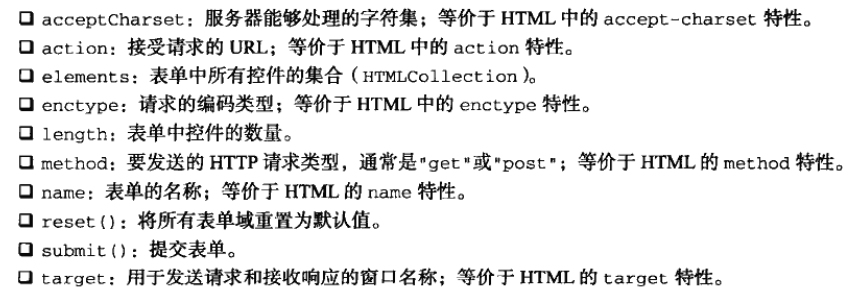
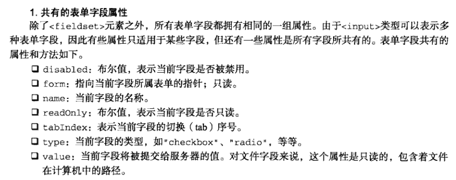
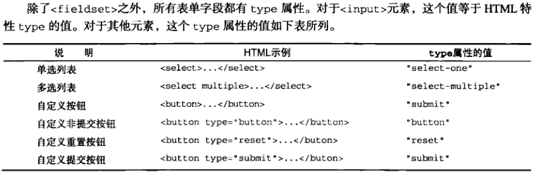
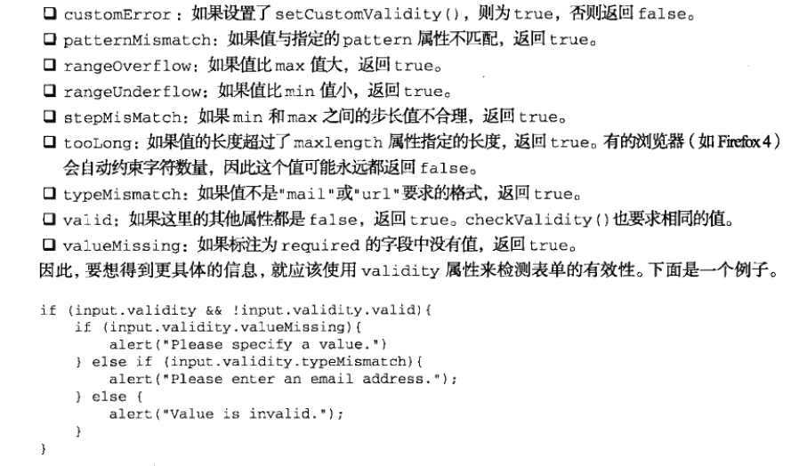
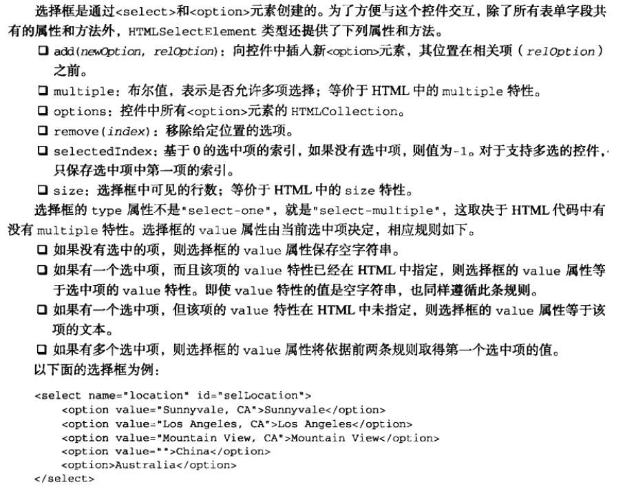
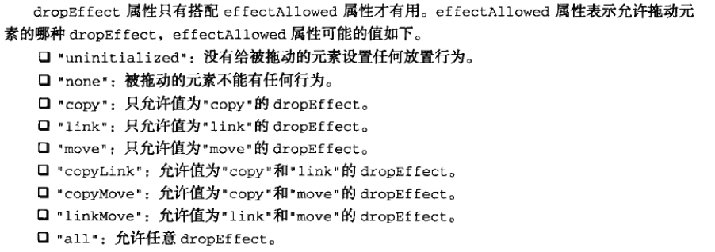
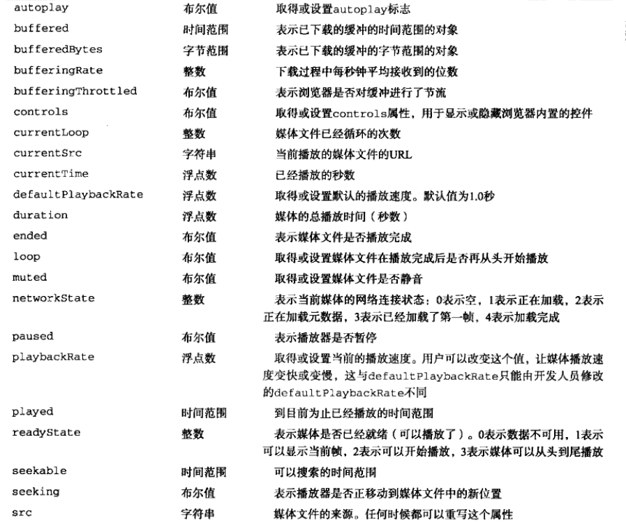
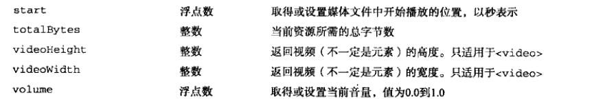
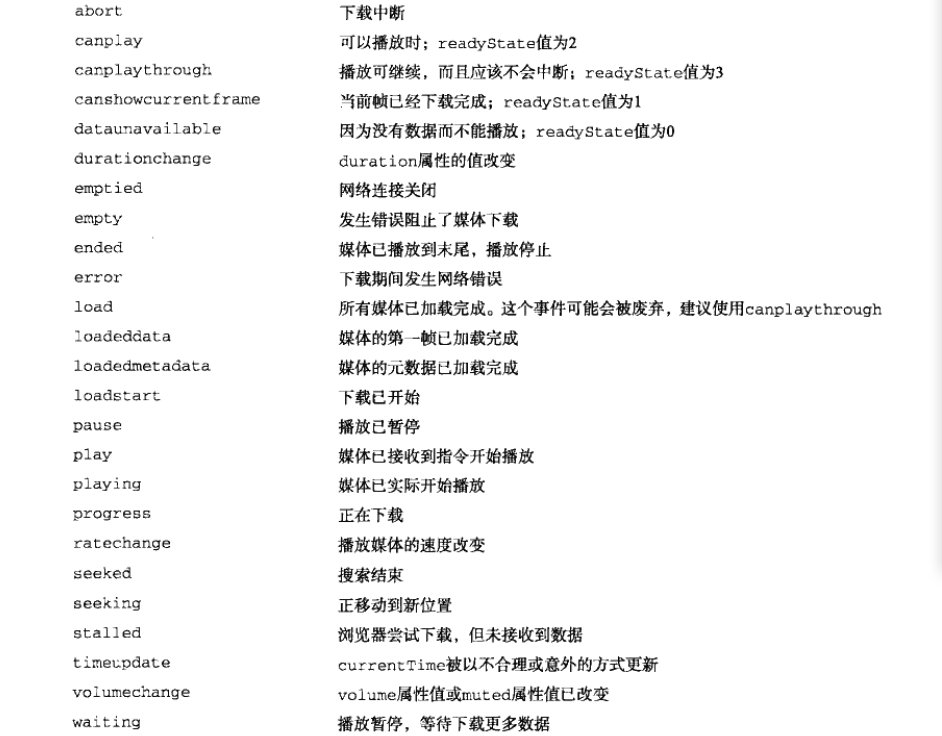

# 表单脚本

## 表单的基础知识

+ 

+ 提交表单
  + 在触发submit提交表单的事件时
  + 可以通过form表单的submit事件的`prevetnDefault()`方法取消默认的提交行为
  + form表单直接通过`form.submit()`事件也能提交表单
+ 重置表单也是如此
+ 表单字段
  + 表单都有elements属性,该属性是表单中所有元素的集合,可以通过索引和name属性来访问所有表单元素,如果多个表单同名,则返回一个NodeList
  + 
  + 除了form外都可以动态设置
  + 在第一次submit事件提交表单后禁用提交按钮可以防止反复提交
  + 不能通过click事件来防止反复提交,应为有些浏览器可能在提交前触发clcik事件,导致表单无法提交
  + 
  + input和button的type属性是可以动态修改的
+ 表单字段的共有方法
  + focus()
  + blur()
  + html 中的 autofocus
+ 共有的表单字段事件
  + blur ：失去焦点
  + change ：对于input 和 textarea 元素，在失去焦点且value发生改变时触发，select则是选项发生改变时触发
  + focus ：获得焦点时触发

## 文本框脚本

+ ```html
  <input type="text" size="25" maxlength="50" value="initial value">
  <!-- 最多显示25个字符，输入不能超过50个字符-->
  <textarea rows="25" cols="5">initial value</textarea>
  <!-- 25行   5列-->
  输入的文本值都保存在value中
  ```

+ 选择文本

  + 以上两种文本框都支持`select()` 方法，用于选择文本框中的所有文本
  + 任何时候都可以调用，一般调用后会聚焦到文本框中
  + 与select() 方法对应的是 select事件 在选择了文本框中的文本时，就会触发select事件

+ 取得选择的文本

  + `selectionStart 和 selectionEnd` 这两个属性中保存的是基于0的数值，表示选择文本的范围（即文本选区开头和结尾的偏移量），

  + ```js
    function getSelectedText(textbox){
        return textbox.value.substring(textbox.selectionStart, textbox.selectionEnd)
        //通过偏移量截取获得选中的文本
    }
    ```

+ 选择部分文本

  + 所有文本框都有一个`setSelectionRange()` 方法，接收两个参数，要选择第一个字符的索引和最后一个字符之后的索引

  + ```js
    textbox.value = "Hello world!";
    textbox.setSelectionRange(0,textbox.value.legth);//选择所有文本
    textbox.setSelectionRange(0 , 3); //选择前三个字符    "Hel"
    textbox.setSelectionRange(4 , 7); //选择第4到第6个字符   "o w"
    //要看到选中的文本需要在调用前或后将焦点设置到文本框上
    ```

+ 过滤输入

  + 屏蔽字符

    + 响应向文本框中插入字符操作的是keypress事件

    + 可以通过阻止这个事件的默认行为来阻止输入字符，达到屏蔽效果

    + ```js
      let text = document.querySelector("#text");
      text.addEventListener("keypress",function(){
          if(!/\d/.test(event.key) && !event.ctrlKey){//阻止用户输入数字以外的字符
              event.preventDefault();
          }
      },false);
      ```

  + 操作剪切板

    + beforecopy ：在发生复制操作前触发
    + copy ：在发生复制操作时触发
    + beforecut ：在发生剪切操作前触发
    + cut ：在发生剪切操作时触发
    + beforepaste ：在发生粘贴操作前触发
    + paste ：在发生粘贴操作时触发
    + 在事件发生前可以修改数据
    + 在事件发生时可以阻止默认的操作，阻止默认操作后可修改复制到剪切版的内容
    + 通过event对象中的`clipboardData`对象可以操作数据
    + `clipboardData`对象有三个方法
      + getData()   接收一个参数，取得数据的格式，只有在粘贴事件中才能取得数据
      + setData()   第一个参数为数据类型，第二个参数为要放在剪切版中的文本
      + clearData()

  + 自动切换焦点

    + ```js
      //给文本框添加keyup事件
      function tabForward(event){
          //在键盘按键谈起时，判断目标输入框内容长度是否等于最大值
          if(target.value.length == target.maxLength){
              //获取目标输入框所在的form表单
              let form = target.form;
              //遍历表单元素
              for(let i =0,len = form.elements.length; i < len; i++){
                  //找到表单中的当前目标元素
                  if(form.elements[i] == target){
                      //判断当前目标元素后是否还有表单元素
                      if(form.elements[i+1]){
                          //使切换的元素获得焦点
                          form.elements[i+1].focus();
                      }
                      return;
                  }
              }
          }
      }
      ```

### HTML5约束验证API

+ required  必填字段   html5 表单属性
+ pattern   正则表达式 html5 表单属性
+ `checkValidity()`  检测表单中的某个字段是否有效  布尔值
  + 要验证整个表单是否有效，可以在表单自身调用
+ `validity` 属性 取得字段为什么有效或无效
  + 
+ 禁用验证
  + 通过html5表单属性 `novalidate` 告诉表单不进行验证
  + `document.forms[0].elements["btnNoValidate"].formNoValidate = true;`

## 选择框脚本

+ 
+ option选项属性
  + index ：当前选项在options集合中的索引
  + label ：当前选项的标签，等价于HTML中的lable特性
  + selected ：布尔值，表示当前选项是否被选中 ，设置为true可选中当前项
  + text ：选项的文本
  + value ：选项的值

+ 选择选项
  + 访问选中选项
    + `let secletedOption = selectbox.options[selectbox.selectedIndex];`
  + 通过遍历选项的selected属性
    + 可以获得所有被选中的项

+ 添加选项

  + ```js
    //通过Option构造函数添加选项
    let newOption = new Option("Option text", "Option value");
    slectbox.appendChild(newOption);
    
    //通过选择框的add()方法添加
    let newOption = new Option("Option text", "Option value");
    selectbox.add(newOption,null);
    //第二个参数为将位于新选项之后的选项
    ```

+ 移除选项

  + ```js
    //可以用removeChild()方法
    selectbox.removeChild(selectbos.option[0]);
    //可以用remove()方法
    selectbox.remove(0);//移除选项的索引
    //将对应选项设置为null
    selectbox.options[0] = null;
    ```

+ 移动和重排选项

  + 可以通过`appendChild()` 移动选项

  + `insertBefore()` 方法将选项移动到不同位置 

    + ```js
      let optionToMove = selectbox.option[1];
      selectbox.insertBefore(optionToMove, selection.option[optionToMove.index-1]);
      //将选项向前移动了一位
      ```

## 表单序列化

+ 

+ ```js
  //表单序列化
  function serialize(form){
      let parts = [],
          field = null,
          i,
          len,
          optLen,
          option,
          optValue;
      for(i = 0, len = form.elements.length; i < len; i++){
          field = form.elements[i];
          switch(field.type){
              case "select-one":
              case "select-multiple":
                  if(field.name.length){
                      for(j = 0, optLen = field.options.length; j < optLen; j++){
                          option = field.option[j];
                          if(option.selected){
                              optValue = "";
                              if(option.hasAttribute){
                                  optVlaue = (option.hasAttribute("value") ? option.value : option.text);
                              }else{
                                  optValue = (option.attributes["value"].specified ? option.value : option.text);
                              }
                              parts.push(encodeURIComponent(field.name) + "=" + encodeURIComponent(optValue));
                          }
                      }
                  }
                  break;
              case undefined:	//字段集
              case "file":	//文件输入
              case "submit":	//提交按钮
              case "reset":	//重置按钮
              case "button":	//自定义按钮
                  break;
  
              case "radio":	//单选按钮
              case "checkbox"://复选框
                  if(!field.checked){
                      break;
                  }
                  //执行默认操作
              default:
                  //不包含没有名字的表单字段
                  if(field.name.length){
                      parts.push(encodeURIComponent(field.name) + "=" + encodeURIComponent(field.value));
                  }
          }
      }
      return parts.join("&");
  }
  ```


## 富文本编辑

+ 在页面中嵌入一个空的`iframe`  通过设置designMode属性为on，让整个文档可以编辑
  + `frames["richedit"].document.dseignMode = "on";`
+ 给元素使用 `contenteditable` 也可以使元素能够编辑

+ 操作富文本
  + `document.execCommand()` 方法
+ 富文本选区
  + `使用iframe框架的getSelection() 方法`


# HTML5脚本编程

## 跨文档消息传递

## 原生拖放

+ 拖放事件
  + 拖动某元素时将依次触发以下事件
    + dragstart
    + drag
    + dragend
  + 开始拖动时会触发dragstart事件
  + 拖动过程中会持续触发drag事件鼠标的mousemove事件也会持续发生
  + 当停止拖动会触发dragend事件
  + 当拖动元素被放置到有效的放置目标上时，会依次触发以下事件
    + dragenter
    + dragover
    + dragleave 或 drop
  + 只要元素被拖动到放置目标上就会触发dragenter事件
  + 在放置目标内移动时会持续触发dragover事件
  + 当元素被拖出放置目标时会触发dragleave事件
  + 如果元素被放置到了放置目标中，则会触发drop事件，而不会触发dragleaver事件
+ 自定义放置目标
  + 重写元素的dragenter和dragover事件的默认行为（取消默认行为），可以使元素变成可以放置的目标
+ dataTransfer对象
  + getData()
  + setData()
  + setData 方法的第一个参数也是 getData 方法的唯一参数是一个字符串，表示保存类型，取值为”text/plain“或”uri-list“  MIME类型
  + 保存在dataTransfer对象中的数据只能在drop事件中读取
+ `dropEffect 与effectAllowed`
  + dataTransfer对象的两个属性
  + 通过dropEffect属性可以知道被拖放的元素能够执行那种放置行为
    + "none" ：不能把拖动的元素放在这里，这是出文本框之外所有元素的默认值
    + "move" ：应该将拖动元素放置到目标位置
    + "copy" ：应该把拖动元素复制到放置目标
    + "link" ：表示放置目标会打开拖动的元素（拖动元素必需是一个链接）  
    + 操作必需自己实现，浏览器只改变图标
    + 要使用必需在ondragenter事件中针对放置目标来设置
  +  dropEffect属性只有搭配effectAllowwwed属性才有用
    + 
    + 必需在ondragstart事件中设置effectAllowed属性
  + 可拖动
    + html的draggable属性表示元素是否可以拖动

## 媒体元素

+ audio 和 video
+ 共有属性
  + 
  + 
+ 事件
  + 
+ 自定义媒体播放器
  + 媒体元素的 paly() 和 pause()放啊可以控制播放
+ 检测编解码器的支持情况
  + 通过媒体元素的 canPlayType() 方法  接收一种格式/编解码器字符串
  + 返回"probably"、"maybe" 或空字符串


# 错误处理与调试

+ try-catch 与 throw 语句

## 错误处理

### try-catch 语句

+ ```js
  try{
      //可能导致错误的代码
  }catch(error){
      //在错误发生时怎么处理
      console.log(error.message);
      console.log(error.name);
  }finally{
      
  }
  //try语句块中的任何代码发生错误，就会立刻退出代码执行
  //接着运行catch语句块
  //catch块会接收到一个包含错误信息的对象，必需给错误对象取名字
  //错误对象中保存着错误信息的message属性
  //保存错误类型的name属性
  ```

+ `finally` 子句

  + 在try-catch语句中，该子句一经使用，其代码无论如何都会执行
  + 在用该子句时，try 与 catch 中的 return 语句会被忽略

+ 错误类型

  + Error
    + 基类型，所有错误共享了一组相同的属性
  + EvalError
    + 没有把eval()当初函数调用
  + RangeError
    + 数值超出相应范围
  + ReferenceError
    + 找不到对象
  + SyntaxError
    + 把语法错误的字符串传入eval()函数时
  + TypeError
    + 变量的类型不符合要求
  + URIErroe
    + URI格式不正确
  + 通过`if`语句和`instanceof` 操作符可以得出错误类型

+ 当try-catch语句发生错误时，浏览器会认为错误已经被处理了

  + 在明明白白知道自己代码会发生错误时，不应该使用该语句

### 抛出错误

+ 与try-catch语句相配的还有 throw 操作符 用于抛出自定义错误，在抛出错误时，必需给throw 操作符指定一个值

+ ```js
  throw 12345;
  throw "Hello world";
  throw true;
  throw {name:"javaScript"};
  //当使用 throw 操作符时 代码会立即停止执行  仅当有 try-catch 语句捕获到被抛出的值时，代码才会继续执行
  //通过使用某种内置错误类型，可以模拟浏览器错误
  throw new Error("Something bad happened");
  //抛出一个通用错误，带有一条自定义错误消息
  //使用其他错误类型效果同样如此
  
  //通过原型链继承Error来自定义错误类型
  function CustomError(message){
      this.name = "CustomError";
      this.message = message;
  }
  CustomError.prototype = new Error();
  throw new CustomError("My message");
  ```

+ 抛出错误的时机

+ ```js
  function process(values){
      if(!(values instanceof Array)){
          throw new Error("process(): Argument must be an array.");
      }
      values.sort();
      for(let i = 0, len = values.length; i < len; i++){
          if(values[i] > 100){
              return values[i];
          }
      }
      return -1;
  }
  //判断values不是数组后将错误抛出
  ```

+ 捕获错误，目的是避免浏览器以默认方式处理错误

+ 抛出错误，目的在于提供错误发生的具体原因

### 错误（error）事件

+ 

